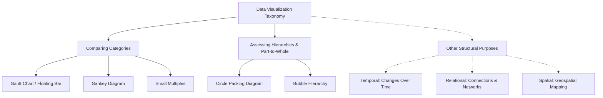

# 1. Taxonomic Framework of Data Visualization Methods

Data visualization taxonomy maps specific mathematical and logical datasets to clear visual representations. The tree diagram below outlines this structural mapping:

### Comprehensive Method Evaluation Matrix

| Visualization Method | Input Data Type | Core Analytical Purpose | Primary Encodings | Structural Paradigm |
| :--- | :--- | :--- | :--- | :--- |
| **Gantt Chart (Floating Bar)** | Categorical + Two continuous range points (Start/End) | Show range spans and overlaps across categories | Floating horizontal bars on a shared axis | Interval-based linear comparison |
| **Sankey Diagram** | Directed graph with categorical stages and link weights | Show flow volumes, divisions, and combinations across stages | Flow bands where width matches volume | Node-link flow network |
| **Small Multiples** | High-dimensional tables with multiple category groupings | Scan across multiple grids to spot trends and anomalies | Synchronized multi-panel chart layout | Grid-based dimensional slicing |
| **Circle Packing Diagram** | Hierarchical tree with categorical groupings and leaf sizes | Show part-to-whole relationships within nested categories | Concentric nested circles scaled by area | Containment-based boundary nesting |
| **Bubble Hierarchy** | Hierarchical tree with parental connections and node weights | Show organization, reporting lines, and relative weights | Linked circles scaled by area and color-coded | Connection-based node-link layout |

### Key Takeaways
* **Clear Purpose Alignment:** Categorical comparison tools focus on relative and absolute sizes, while hierarchical tools show structural composition.
* **Structural Representation:** Hierarchies can be shown through **containment** (grouping elements inside boundaries) or **connection** (drawing lines between related items).
* **Scaling Consistency:** Both methods rely on area-proportional scaling to represent quantitative values accurately, avoiding visual bias.
