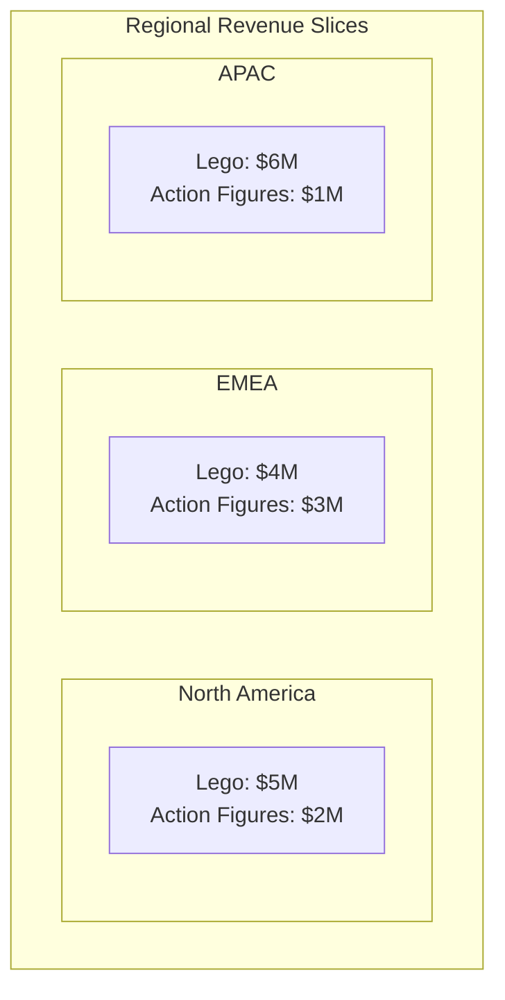

# 2. Comparing Categories: Relative and Absolute Value Comparisons

Categorical comparison visualizations show how relative and absolute variables change across different categories. They help viewers compare the span, flow, or regional distribution of discrete items on a shared scale.

### A. Gantt Chart (Floating Bar)

```mermaid
gantt
    title Commodity Price Spread Analysis
    dateFormat  X
    axisFormat %s
    section Regional Energy Spreads
    US Gulf Coast (Spot Range)           :active, 12, 45
    Rotterdam Hub (Spot Range)           :active, 35, 95
    Singapore Terminal (Spot Range)      :active, 55, 110
```



#### Technical Breakdown
* **Definition:** A horizontal bar chart where each bar floats between minimum and maximum quantitative values, rather than anchoring to a fixed zero baseline.
* **Why It Matters:** Traditional bar charts can only show a single value starting from zero. Floating bars show both the **relative span** (the size of the bar) and the **absolute position** (where the bar sits on the axis) at the same time.
* **Real-World Use Case:** *Commodity Price Volatility.* A global supply-chain dashboard tracks natural gas import prices across regional hubs. Rather than plotting average prices, it uses floating bars to show daily minimum and maximum spreads, revealing both price ranges and absolute market differences.
* **Advantages:**
  * Displays two continuous data points (minimum and maximum limits) on a single horizontal line.
  * Makes it easy to compare overlapping values and ranges across categories.
  * Removes the zero-baseline constraint, preventing visual distortion when values sit far from zero.
* **Limitations:**
  * Cannot show cumulative totals across categories.
  * Becomes cluttered and hard to read if too many overlapping ranges are plotted on the same row.
* **Common Mistakes:**
  * Forcing the chart's axis to start at zero when all data points sit within a narrow, high-value range, which squishes the bars.
  * Arranging categories randomly instead of sorting them by minimum value, maximum value, or span width.
* **Best Practices:**
  * Sort categories by a meaningful metric (such as range width or absolute maximum) to make trends easy to spot.
  * Add vertical reference lines across the grid to help viewers compare absolute values.
* **Practical Implementation Notes:**
  * **Tableau:** Use the `Gantt Bar` mark type, mapping the minimum value to the Columns shelf and the range span (max minus min) to the Size shelf.
  * **Python:** Use `matplotlib.pyplot.barh` and pass the minimum values to the `left` parameter.

### B. Sankey Diagram

```mermaid
graph LR
    subgraph Resource Inputs (Stage 1)
        A[Electricity: 500MW]
        B[Natural Gas: 300MW]
    end
    subgraph Allocations (Stage 2)
        C[Residential: 400MW]
        D[Industrial: 400MW]
    end
    A -->|350MW| C
    A -->|150MW| D
    B -->|50MW| C
    B -->|250MW| D
```

#### Technical Breakdown
* **Definition:** A flow-based diagram where categories (nodes) are connected by bands (links) whose width is directly proportional to the flow volume passing between them.
* **Why It Matters:** Standard charts struggle to show resource changes across multiple stages. Sankey diagrams solve this by visualizing resource paths, showing both source allocations and final destinations in a single view.
* **Real-World Use Case:** *Enterprise Carbon Emissions Tracking.* A manufacturing company maps carbon emissions from its raw material facilities, through production plants, and out to final product lines, highlighting high-emission pathways across the supply chain.
* **Advantages:**
  * Visualizes complex, multi-stage relationships without losing track of total quantities.
  * Preserves balance across the system (the total width entering a stage matches the total width exiting it).
  * Helps viewers spot major pathways and system dependencies at a glance.
* **Limitations:**
  * Crossing flow lines in dense networks can create a tangled, hard-to-read layout.
  * Minor but critical flows can shrink to thin, unreadable lines if the scale is dominated by massive outliers.
  * Standard layout engines can break down if the data contains circular loops.
* **Common Mistakes:**
  * Leaving hundreds of tiny, insignificant transactions in the dataset, which litters the canvas with thin, distracting lines.
  * Failing to use clear directional cues, leaving users confused about which way the data is moving.
* **Best Practices:**
  * Group minor transactions into an "Other" category to keep the visual clean.
  * Use a dynamic layout solver (such as D3's iterative relaxation algorithm) to position nodes in a way that minimizes crossing paths.
* **Practical Implementation Notes:**
  * **JavaScript:** Use the `d3-sankey` library to calculate node and link coordinates.
  * **Python:** Use `plotly.graph_objects.Sankey` to generate interactive, draggable flow networks.

### C. Small Multiples



#### Technical Breakdown
* **Definition:** A grid-based layout where the same basic chart type is repeated across a categorical variable, with every panel sharing identical axes and scales.
* **Why It Matters:** When plotting multiple categories with several series on a single chart, the visual can quickly become cluttered. Small multiples solve this by separating the data into a clean, organized grid of individual charts, making it easy to spot trends and compare patterns across different groups.
* **Real-World Use Case:** *Product Performance Across Global Regions.* A retail company analyzes quarterly product line sales (6 categories) across 8 global regions. Instead of cramming all this data into one giant, hard-to-read grouped bar chart, they create an $8 \times 1$ grid of small bar charts, allowing regional managers to easily spot local sales trends.
* **Advantages:**
  * Spreads data out into a clean grid, making complex datasets easy to read without overlapping elements.
  * Shared axes and scales allow viewers to quickly compare values across charts.
  * Simplifies multivariable analysis by separating complex categories into clean slices.
* **Limitations:**
  * Needs a larger layout canvas to display the grid of charts clearly.
  * Comparing the exact values of elements in separate grid cells is slightly more difficult than comparing them side-by-side on a single chart.
* **Common Mistakes:**
  * Allowing each chart in the grid to calculate its own y-axis limits, which makes visual comparisons highly misleading.
  * Creating a grid with too many cells, which shrinks the individual charts and makes them unreadable.
* **Best Practices:**
  * Always lock the x- and y-axes to the same scales across all charts in the grid.
  * Sort the individual grid cells by a meaningful metric (such as total sales or growth rate) so that key insights bubble up to the top-left of the grid.
* **Practical Implementation Notes:**
  * **R/ggplot2:** Use `facet_wrap(~ region, ncol = 3)`.
  * **Seaborn:** Use `sns.FacetGrid(data, col="region")`.

### Section Summary & Key Takeaways
* **Gantt Charts** compare absolute and relative ranges, removing the zero-baseline constraint.
* **Sankey Diagrams** map continuous, multi-stage resource flows, preserving volume balances across the system.
* **Small Multiples** use a synchronized grid of simple charts to display high-dimensional data clearly, avoiding visual clutter.
