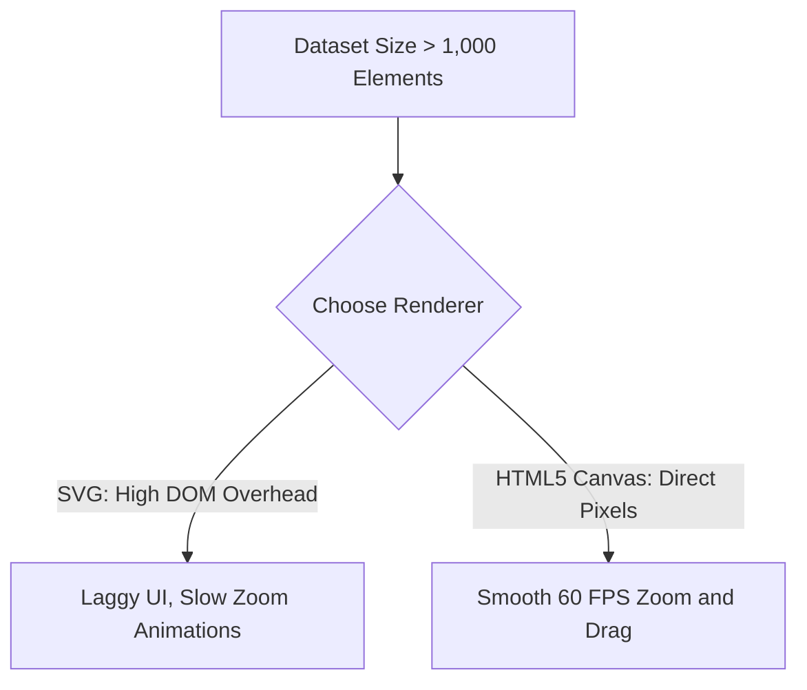
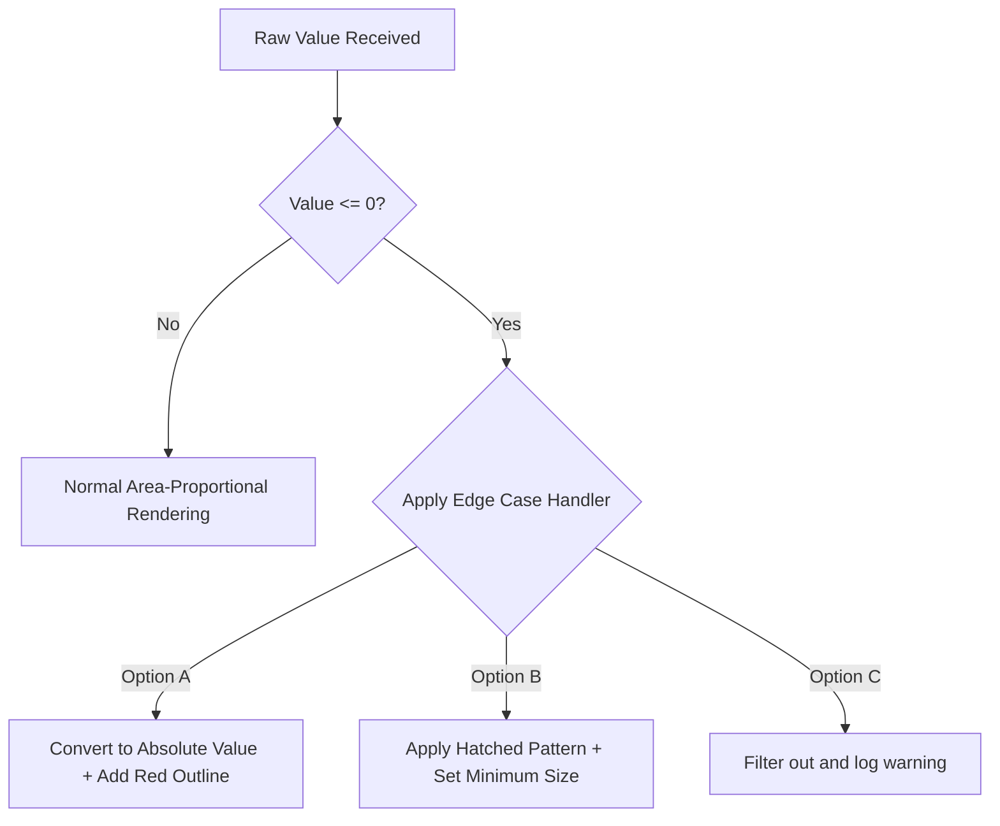

# 5. Edge Cases, Failure Modes, and Production Debugging

### A. Performance Bottlenecks with Large Datasets

#### Issue: DOM Overhead with SVG Renderers
Rendering more than 1,000 interactive nodes or flow bands as SVGs can slow down the browser, leading to sluggish UI performance.



#### Mitigations:
* **Switch to Canvas Rendering:** For large datasets, use HTML5 Canvas instead of SVG. Canvas draws pixels directly to the screen, bypassing the DOM overhead.
* **Level of Detail (LOD) Rendering:** Only render visible elements. Hide deeper nested nodes until the user zooms into their parent category.

### B. Layout Stability in Force-Directed Bubble Hierarchies

#### Issue: Endless Jitter and Jiggling Nodes
Interactive bubble trees can sometimes bounce or wobble endlessly on the screen without settling, which distracts users and drains battery life.

#### Mitigations:
* Set a **cooling parameter threshold** to stop calculating node positions once their movement falls below a specific limit.
* Adjust the gravity and collision parameters to prevent nodes from bouncing back and forth indefinitely.

```javascript
// D3.js Force Simulation Stability Configuration
const simulation = d3.forceSimulation(nodes)
    .force("charge", d3.forceManyBody().strength(-50))
    .force("center", d3.forceCenter(width / 2, height / 2))
    .force("collision", d3.forceCollide().radius(d => d.radius + 2))
    .velocityDecay(0.4) // Increases friction to settle nodes faster
    .alphaMin(0.005);   // Stops calculation frames when movement becomes negligible
```

### C. Outliers and Value Anomalies

#### Issue: Distorted Scale from Extreme Outliers
If one division's budget is \$100M and another is \$10k, scaling their sizes linearly will make the smaller bubble practically invisible.

#### Mitigations:
* **Apply Logarithmic Scaling:** Use log scaling to keep smaller bubbles large enough to remain visible and interactive, while using colors to represent absolute differences.
* **Enforce a Minimum Bubble Size:** Set a minimum size threshold for very small values to ensure they remain clickable on the canvas.

$$
\text{Radius}_{\text{Rendered}} = \max\left(\text{Radius}_{\text{Minimum}}, \sqrt{\frac{\text{Value}}{\pi}}\right)
$$

### D. Zero or Negative Values in Part-to-Whole Diagrams

#### Issue: Negative Areas Break Scaling Mathematics
Since you cannot render a circle with a negative area, negative balances or net losses will break circle packing and bubble hierarchy layout engines.



#### Mitigations:
* **Use Absolute Values with Visual Alerts:** Convert negative numbers to positive values to calculate their size, but add a distinct color (like bright red) or a hatched pattern to flag them as negative balances.
* **Apply Hatched Visual Textures:** Use specific textures to represent divisions with zero budget, keeping them visible on the chart without skewing the scaling math.

Tags: #statistics #machine-learning #data-science #statistical-modelling
