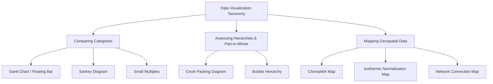

# 1. Taxonomic Framework of Data Visualization Methods

Data visualization taxonomy maps specific mathematical and logical datasets to clear visual representations [1]. The tree diagram below outlines this structural mapping:

### Comprehensive Method Evaluation Matrix

| Visualization Method | Input Data Type | Core Analytical Purpose | Primary Encodings | Structural Paradigm |
| :--- | :--- | :--- | :--- | :--- |
| **Gantt Chart (Floating Bar)** [1, 2] | Categorical + Two continuous range points (Start/End) | Show range spans and overlaps across categories [2] | Floating horizontal bars on a shared axis [2] | Interval-based linear comparison |
| **Sankey Diagram** [2] | Directed graph with categorical stages and link weights | Show flow volumes, divisions, and combinations across stages [1] | Flow bands where width matches volume [1] | Node-link flow network |
| **Small Multiples** [3] | High-dimensional tables with multiple category groupings | Scan across multiple grids to spot trends and anomalies [1, 3] | Synchronized multi-panel chart layout [1] | Grid-based dimensional slicing |
| **Circle Packing Diagram** [1] | Hierarchical tree with categorical groupings and leaf sizes | Show part-to-whole relationships within nested categories [1] | Concentric nested circles scaled by area [1] | Containment-based boundary nesting |
| **Bubble Hierarchy** [1] | Hierarchical tree with parental connections and node weights | Show organization, reporting lines, and relative weights [1, 2] | Linked circles scaled by area and color-coded [1, 2] | Connection-based node-link layout |
| **Choropleth Map** [1] | Geographic shape coordinates + Region-linked quantitative scalars [1] | Display geographic distribution of a metric across boundaries [1, 2] | Regional color shading/saturation levels [1, 2] | Regionally bounded thematic map |
| **Isothermic Normalization Map** [2] | Geographic shape coordinates + Population weight + Metric value [2] | Correct geographic area bias to show true population density [2] | Area-distorted shape polygons or normalization-adjusted color saturation [2] | Algorithmic demographic map |
| **Network Connection Map** [2] | Latitude/Longitude coordinate nodes + Origin-Destination Link pairs [2] | Display flows and physical pathways across regions [2] | Vector lines, curves (Great-Circle arcs), and node markers [2] | Spatial node-link overlay |
