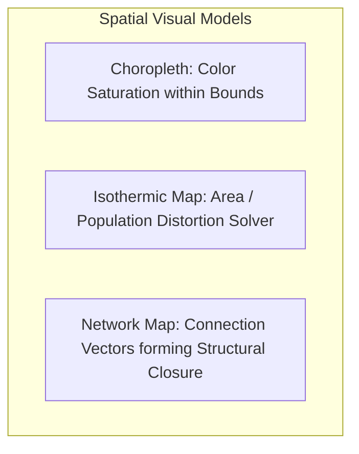

# 4. Mapping Geospatial Data: Spatial Representations and Coordinate Systems

Geospatial mapping overlays quantitative or qualitative datasets onto geographic reference layers [1]. It helps viewers identify spatial clusters, physical routes, and regional patterns directly linked to real-world geography [1, 2].

### A. Choropleth Map

#### Technical Breakdown
* **Definition:** A thematic map where defined geographic boundaries (such as states or counties) are shaded in proportion to a specific quantitative or qualitative metric [1, 2].
* **Why It Matters:** Maps allow viewers to connect abstract data to real-world spaces [1]. Overlaying metrics onto a familiar geographic map makes it easy to identify spatial patterns and regional trends at a glance [1].
* **Real-World Use Case:** *Tracking Regional Economic Shifts.* Visualizing changes in the annual United States unemployment rate [1]. Comparing a 2004 baseline map (5.5% national average) with a September 2009 map (9.8% during the Global Financial Crisis) highlights exactly which industrial regions and states suffered the most job losses [1, 2].
* **Advantages:**
  * Leverages familiar geographic boundaries, making the map easy for general audiences to interpret [1].
  * Effectively highlights clear spatial clusters, such as contiguous states experiencing similar economic challenges [1].
  * Displays complex geographic variations without cluttering the screen [1].
* **Limitations:**
  * **Area Bias:** Large, sparsely populated regions (like Montana or Alaska) dominate the map visually, while small, densely populated areas (like Rhode Island or Washington D.C.) can be hard to see.
  * **Abrupt Transitions:** Color changes occur sharply at state borders, which does not represent how variables actually flow across real-world geography.
* **Common Mistakes:**
  * **Using Raw Counts Instead of Ratios:** Shading a map by total case numbers instead of rates (such as cases per capita), which simply highlights where the most people live.
  * **Poor Color Palette Selection:** Using non-sequential or low-contrast color palettes, making it difficult to distinguish between different values.
* **Best Practices:**
  * Always normalize your data (such as using percentages or per-capita rates) to ensure fair comparisons across regions of different sizes [2].
  * Use perceptually uniform, sequential color palettes (such as Viridis or Single-Hue Blues) to represent quantitative ranges clearly.
* **Practical Implementation Notes:**
  * Bind spatial coordinate boundaries (GeoJSON or TopoJSON) to your dataset using web tools like Leaflet, Mapbox, or Python's `folium` library.

### B. Isothermic Normalization Map (Demographic Area Correction)

#### Technical Breakdown
* **Definition:** An algorithmic cartographic layout that adjusts either the physical area of geographic regions or their color saturation to correct for underlying population density imbalances [2].
* **Why It Matters:** Standard choropleth maps can be misleading because a large, sparsely populated state looks more prominent than a small, densely populated state [1, 2]. Isothermic normalization algorithms adjust the map's visual weight so that colors and areas reflect the actual population density of the metric being measured [2].
* **Real-World Use Case:** *National Public Health Mapping.* When mapping disease outbreaks across a country, an isothermic normalization map adjusts the visual weight of each state based on its population [2]. This ensures that high case rates in small, dense cities are not visually overshadowed by low case rates in large, empty rural regions [2].
* **Advantages:**
  * Corrects the geographic area bias of standard choropleth maps [2].
  * Ensures color saturation accurately represents the metric's true density and impact [2].
  * Provides a more balanced, honest view of demographics and public health trends [2].
* **Limitations:**
  * Distorting geographic shapes can make familiar regions look unrecognizable to some viewers.
  * Calculating these normalized adjustments requires specialized spatial software and complex datasets [2].
* **Common Mistakes:**
  * Distorting shapes so severely that the map loses all geographic context.
  * Failing to explain the normalization algorithm to viewers, leaving them confused by the altered shapes.
* **Best Practices:**
  * Keep distortion levels moderate so that the map's shapes remain recognizable.
  * Provide a clear legend and caption explaining how the areas or colors have been normalized.
* **Practical Implementation Notes:**
  * Use cartogram plugins in QGIS, or the `cartogram` library in R, to calculate distorted boundary coordinates before rendering.

### C. Network Connection Map

#### Technical Breakdown
* **Definition:** A geographic map overlay that draws vector lines (often curved Great-Circle arcs) to represent connections, flows, or relationships between different geographic points [2].
* **Why It Matters:** Visualizing regional relationships requires showing how points connect across space [2]. Drawing these connection lines reveals active routes and logistics pathways [2].
* **Real-World Use Case:** *Global Trade Networks.* A shipping company maps imports and exports between international hubs [2, 3]. By drawing curved connection lines between ports, the density of the routes naturally outlines the continents—a design concept known as **structural closure** [2].
* **Advantages:**
  * Displays origin-destination paths, structural dependencies, and route densities clearly [2].
  * **Structural Closure:** The density of the connection lines can outline the shape of the world map even if the background map layer is completely hidden [2].
  * Helps logistics managers quickly identify key regional hubs and potential bottlenecks [2].
* **Limitations:**
  * Plotting too many intersecting lines can create a cluttered "spaghetti" effect on the map.
  * Flat, straight lines on a 2D projection can distort the actual flight or shipping paths over the Earth's curved surface.
* **Common Mistakes:**
  * Drawing straight 2D lines instead of curved Great-Circle arcs, which distorts the true paths of long-distance routes.
  * Cluttering the map by showing minor routes with the same line thickness as major pathways.
* **Best Practices:**
  * Use curved Great-Circle arcs to represent long-distance paths accurately.
  * Use line thickness and transparency to represent route volume, keeping major paths prominent while keeping minor routes subtle.
* **Practical Implementation Notes:**
  * **Python:** Use `cartopy` or `geopandas` to calculate curved Great-Circle arcs between coordinate points.
  * **JavaScript:** Use WebGL engines like `deck.gl` to render high-performance, interactive connection lines in the browser.
