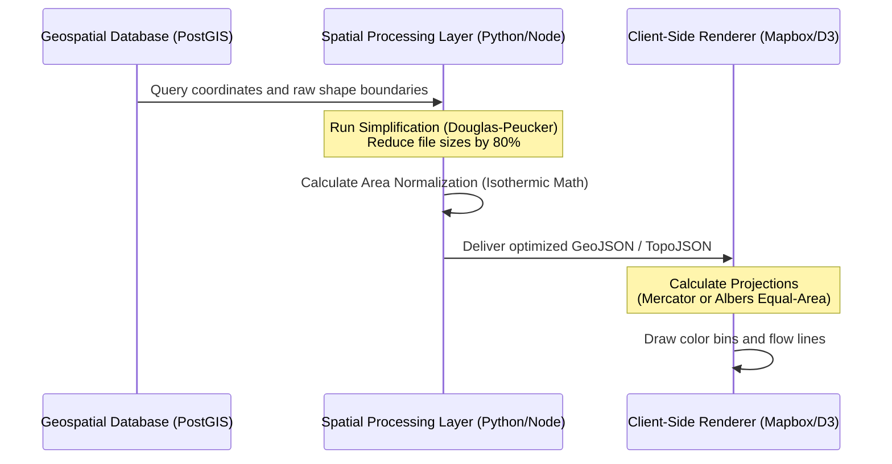

# 5. Technical Geospatial Pipeline & Processing

Mapping spatial data requires a structured pipeline to transform geographic coordinates and shapefiles into performant, interactive web layers.



### TopoJSON Structure for Spatial Rendering
To keep map files small and fast, use the **TopoJSON** format instead of GeoJSON. TopoJSON reduces file sizes by sharing boundary lines (arcs) between adjacent regions, preventing duplicate coordinates:

```json
{
  "type": "Topology",
  "objects": {
    "counties": {
      "type": "GeometryCollection",
      "geometries": [
        {
          "type": "Polygon",
          "arcs": [[0, 1, 2]],
          "properties": {
            "FIPS": "36061",
            "name": "New York County",
            "unemployment_2009": 8.9
          }
        }
      ]
    }
  },
  "arcs": [
    [[1000, 2000], [1010, 2050]],
    [[1010, 2050], [990, 2100]],
    [[990, 2100], [1000, 2000]]
  ]
}
```
