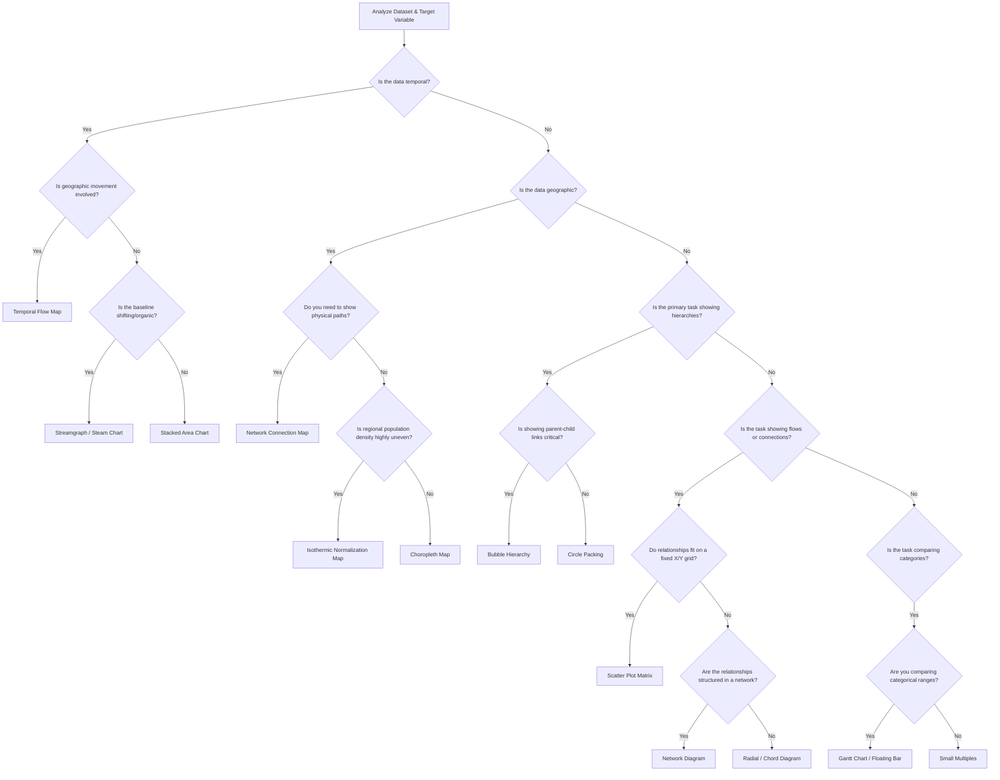
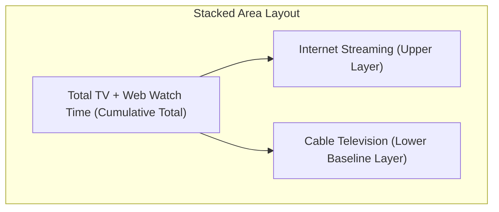
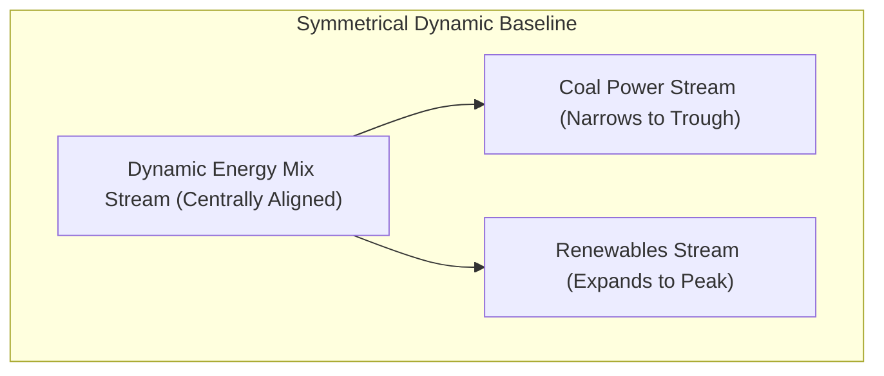
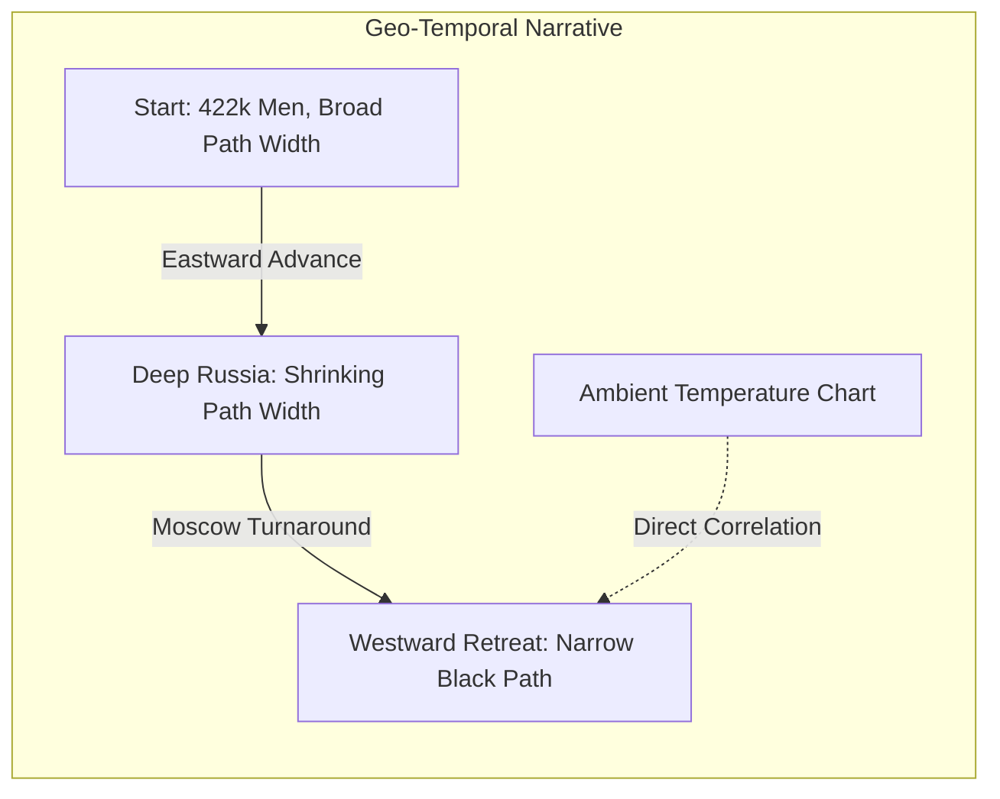

# Enterprise Data Visualization Taxonomy: A Technical Reference Manual

A robust taxonomy organizes data visualization methods by their primary communication purpose, helping engineers and architects select the most effective layout for a given dataset. Choosing the wrong visual can obscure vital insights and lead to incorrect operational decisions. This comprehensive reference manual details the visual paradigms, data architectures, mathematical foundations, and technical trade-offs for five critical communication tasks: comparing categories (Gantt charts, Sankey diagrams, small multiples), assessing hierarchies and part-to-whole relationships (circle packing diagrams, bubble hierarchies), mapping geospatial data (choropleth maps, isothermic maps, network connection maps), plotting connections and relationships (scatter plot matrices, radial/chord diagrams, network diagrams), and showing changes over time (stacked area charts, streamgraphs, temporal flow maps).

Modern enterprise data visualization relies on matching data structures with visual encodings that support specific analytical tasks. The tree diagram below maps out this taxonomy:

```mermaid
graph TD
    Taxonomy[Data Visualization Taxonomy] --> CompCat[Comparing Categories]
    Taxonomy --> Hierarchy[Assessing Hierarchies & Part-to-Whole]
    Taxonomy --> Geospatial[Mapping Geospatial Data]
    Taxonomy --> Connections[Plotting Connections & Relationships]
    Taxonomy --> Temporal[Showing Changes Over Time]

    CompCat --> Gantt[Gantt Chart / Floating Bar]
    CompCat --> Sankey[Sankey Diagram]
    CompCat --> SM[Small Multiples]

    Hierarchy --> CP[Circle Packing Diagram]
    Hierarchy --> BH[Bubble Hierarchy]

    Geospatial --> Choro[Choropleth Map]
    Geospatial --> Isoth[Isothermic Normalization Map]
    Geospatial --> NetConn[Network Connection Map]

    Connections --> SPM[Scatter Plot Matrix & Heatmaps]
    Connections --> Chord[Radial / Chord Diagram]
    Connections --> NetDiag[Network Diagram]

    Temporal --> StackArea[Stacked Area Chart]
    Temporal --> Stream[Streamgraph / Steam Chart]
    Temporal --> TempFlow[Temporal Flow Map]
```



Selecting the correct layout depends on your data structure, dimensionality, and primary analytical goals. The decision tree below guides this selection process:



Each visualization method carries distinct input data requirements, analytical purposes, encoding strategies, and space-efficiency characteristics. Gantt charts accept categorical data with two continuous range points to show spans and overlaps across categories using floating horizontal bars, offering high space efficiency. Sankey diagrams process directed graphs with categorical stages and link weights to display flow volumes and combinations across stages via flow bands where width matches volume, providing moderate space efficiency. Small multiples handle high-dimensional tables with multiple category groupings, allowing users to scan across synchronized multi-panel chart grids to spot trends and anomalies with high space efficiency. Circle packing diagrams and bubble hierarchies both process hierarchical tree data, but the former uses concentric nested circles scaled by area to show part-to-whole relationships within nested categories (moderate space efficiency), while the latter uses linked circles scaled by area and color-coded to show organization reporting lines and relative weights (low space efficiency). Geospatial methods vary significantly: choropleth maps shade geographic regions by quantitative scalars, isothermic maps adjust for population density via area distortion or normalization, and network connection maps draw vector lines between latitude/longitude coordinate nodes. Scatter plot matrices display multi-variable continuous data in high-space-efficiency grids of scatter plots, radial chord diagrams handle N×N adjacency matrices with curved circular bands (moderate efficiency), and network diagrams process unstructured graphs of nodes and edges to analyze complex systems with low space efficiency. Temporal methods include stacked area charts (high efficiency, fixed baseline), streamgraphs (moderate efficiency, shifting central baseline), and temporal flow maps (low efficiency, spatio-temporal path overlays).

## Domain I: Comparing Categories

Categorical comparison visualizations show how relative and absolute variables change across different categories. They help viewers compare the span, flow, or regional distribution of discrete items on a shared scale.

### Gantt Chart (Floating Bar)

A Gantt chart is a horizontal bar chart where each bar floats freely between minimum and maximum quantitative values rather than anchoring to a fixed zero baseline. Traditional bar charts can only show a single value starting from zero, but floating bars show both the relative span (the size of the bar) and the absolute position (where the bar sits on the axis) simultaneously. In a real-world supply-chain dashboard tracking natural gas import prices across regional hubs, rather than plotting average prices, floating bars show daily minimum and maximum spreads, revealing both price ranges and absolute market differences.

This method displays two continuous data points on a single horizontal line, makes it easy to compare overlapping values and ranges across categories, and removes the zero-baseline constraint to prevent visual distortion when values sit far from zero. However, it cannot show cumulative totals across categories and becomes cluttered if too many overlapping ranges are plotted on the same row. Common mistakes include forcing the axis to start at zero when all data points sit within a narrow high-value range (which squishes the bars), and arranging categories randomly instead of sorting them by minimum value, maximum value, or span width. Best practices include sorting categories by a meaningful metric such as range width or absolute maximum, and adding vertical reference lines across the grid to help viewers compare absolute values. For practical implementation, Tableau users should use the `Gantt Bar` mark type mapping the minimum value to the Columns shelf and the range span to the Size shelf, while Python developers can use `matplotlib.pyplot.barh` passing minimum values to the `left` parameter.

### Sankey Diagram

A Sankey diagram is a flow-based visualization where categories (nodes) are connected by bands (links) whose width is directly proportional to the flow volume passing between them. Standard charts struggle to show resource changes across multiple stages, but Sankey diagrams solve this by visualizing resource paths, showing both source allocations and final destinations in a single view. A manufacturing company mapping carbon emissions from raw material facilities through production plants to final product lines exemplifies this, highlighting high-emission pathways across the supply chain.

Sankey diagrams visualize complex multi-stage relationships without losing track of total quantities, preserve balance across the system (the total width entering a stage matches the total width exiting it), and help viewers spot major pathways and system dependencies at a glance. Limitations include crossing flow lines in dense networks creating tangled layouts, minor but critical flows shrinking to unreadable lines if massive outliers dominate the scale, and standard layout engines breaking down when the data contains circular loops. Common mistakes include leaving hundreds of tiny insignificant transactions in the dataset (littering the canvas with thin distracting lines) and failing to use clear directional cues, leaving users confused about data movement direction. Best practices include grouping minor transactions into an "Other" category and using dynamic layout solvers such as D3's iterative relaxation algorithm to position nodes and minimize crossing paths. JavaScript developers can use the `d3-sankey` library to calculate node and link coordinates, while Python developers can use `plotly.graph_objects.Sankey` to generate interactive draggable flow networks.

### Small Multiples

Small multiples employ a grid-based layout where the same basic chart type is repeated across a categorical variable, with every panel sharing identical axes and scales. When plotting multiple categories with several series on a single chart, the visual can quickly become cluttered. Small multiples solve this by separating the data into a clean, organized grid of individual charts, making it easy to spot trends and compare patterns across different groups. A retail company analyzing quarterly product line sales across eight global regions demonstrates this: instead of cramming all data into one giant grouped bar chart, they create an 8×1 grid of small bar charts, allowing regional managers to easily spot local sales trends.

This approach spreads data into a clean grid, making complex datasets easy to read without overlapping elements. Shared axes and scales allow viewers to quickly compare values across charts, and the format simplifies multivariable analysis by separating complex categories into clean slices. However, small multiples need a larger layout canvas to display the grid clearly, and comparing exact values of elements in separate grid cells is slightly more difficult than comparing them side-by-side on a single chart. Common mistakes include allowing each chart in the grid to calculate its own y-axis limits (making visual comparisons highly misleading) and creating grids with too many cells (shrinking individual charts until they become unreadable). Best practices include always locking x- and y-axes to the same scales across all charts in the grid, and sorting individual grid cells by a meaningful metric such as total sales or growth rate so key insights bubble up to the top-left. R/ggplot2 users can implement `facet_wrap(~ region, ncol = 3)`, while Seaborn users can use `sns.FacetGrid(data, col="region")`.

**Key takeaways for categorical comparisons:** Gantt charts compare absolute and relative ranges by removing the zero-baseline constraint. Sankey diagrams map continuous multi-stage resource flows while preserving volume balances across the system. Small multiples use synchronized grids of simple charts to display high-dimensional data clearly while avoiding visual clutter.

## Domain II: Assessing Hierarchies and Part-to-Whole Relationships

Hierarchical visualizations display relationships between nested categories, showing how individual parts combine to form larger systems.

### Circle Packing Diagram

A circle packing diagram is a containment-based visualization where hierarchical nodes are represented as circles, and nested child categories are packed tightly inside their parent circles. This approach shows nested groupings and proportional sizes simultaneously, using natural physical enclosure to define category boundaries. An IT department mapping hardware and software spending illustrates this: the outer circle represents total IT spend, containing nested circles for departments (R&D, Sales), which in turn contain smaller circles for individual software licenses.

Grouping via enclosure is highly intuitive and easy for viewers to understand. Circle packing helps viewers quickly spot massive high-cost nodes nested deep within the system and creates engaging organic visual layouts that stand out on executive dashboards. However, space is lost between the curved boundaries of packed circles, making this method less space-efficient than treemaps. Comparing exact sizes of circles is difficult for the human eye, and deeply nested hierarchies become unreadable without interactive zoom controls. Common mistakes include scaling circle sizes by radius rather than area (which quadratically distorts perceived differences between values) and trying to show deep hierarchies statically (turning small child nodes into unreadable pixel dust). Best practices include always scaling circles using their area (radius = square root of value divided by pi), implementing interactive zoom-on-click features to let users drill down into nested levels, and using high-contrast color strokes to clearly separate parent and child boundaries. For implementation, D3.js developers can use the `d3.pack()` layout engine to compute circle coordinates, while Python developers can use the `circlify` library to calculate nested coordinates then render them using matplotlib.

### Bubble Hierarchy

A bubble hierarchy is a connection-based tree diagram where individual categories are represented as bubbles connected by branch lines, with each bubble sized by its quantitative value. Unlike circle packing, bubble hierarchies draw explicit lines between parents and children, making it easier to track relationship paths across deep or uneven organizational structures. A company mapping divisional budgets across reporting lines demonstrates this: the central bubble represents total corporate budget, branching out to division nodes (sized by spend), which connect to departmental subdivisions, showing both reporting structures and financial weights in a single view.

Bubble hierarchies clearly show parent-child relationships using explicit connecting lines, easily handle unbalanced hierarchies where some branches are much deeper than others, and allow viewers to compare bubble sizes across different branches of the tree. However, force-directed physics engines can cause nodes to wobble, overlap, or drift off the screen. This method needs significant canvas space to prevent connecting lines and bubbles from overlapping, and recalculating physics simulations for more than 500 interactive nodes can cause performance lag. Common mistakes include allowing bubbles to overlap due to weak collision detection in the layout engine and disconnecting parent and child nodes by using low-contrast connecting lines. Best practices include using a layout engine with active collision detection to prevent bubble overlap, allowing users to collapse and expand branches to keep the visual clean, and keeping bubble sizes proportional across the entire diagram to ensure accurate comparisons. D3's `d3-force` engine with `forceCollide` provides one implementation path, while Python developers can use NetworkX to calculate tree structures and Plotly to render interactive layouts.

**Key takeaways for hierarchies:** Circle packing uses nested containment to show group boundaries, making it highly aesthetic but less space-efficient. Bubble hierarchies use explicit connecting lines to map complex, uneven organizational structures, though they require more screen space to prevent clutter.


## Domain III: Mapping Geospatial Data

Geospatial mapping overlays quantitative or qualitative datasets onto geographic reference layers. It helps viewers identify spatial clusters, physical routes, and regional patterns directly linked to real-world geography.

### Choropleth Map

A choropleth map is a thematic map where defined geographic boundaries (such as states or counties) are shaded in proportion to a specific quantitative or qualitative metric. Maps allow viewers to connect abstract data to real-world spaces; overlaying metrics onto a familiar geographic map makes it easy to identify spatial patterns and regional trends at a glance. Visualizing changes in annual United States unemployment rates exemplifies this: comparing a 2004 baseline map (5.5% national average) with a September 2009 map (9.8% during the Global Financial Crisis) highlights exactly which industrial regions and states suffered the most job losses.

Choropleth maps leverage familiar geographic boundaries, making them easy for general audiences to interpret. They effectively highlight clear spatial clusters such as contiguous states experiencing similar economic challenges and display complex geographic variations without cluttering the screen. However, they suffer from area bias: large sparsely populated regions like Montana or Alaska dominate the map visually while small densely populated areas like Rhode Island or Washington D.C. become hard to see. Additionally, color changes occur abruptly at state borders, which does not represent how variables actually flow across real-world geography. Common mistakes include shading by raw counts instead of rates (which simply highlights where the most people live) and using non-sequential or low-contrast color palettes that make it difficult to distinguish between different values. Best practices include always normalizing data using percentages or per-capita rates to ensure fair comparisons across regions of different sizes, and using perceptually uniform sequential color palettes such as Viridis or single-hue blues. Implementation requires binding spatial coordinate boundaries (GeoJSON or TopoJSON) to datasets using web tools like Leaflet, Mapbox, or Python's folium library.

### Isothermic Map (Demographic Area Correction)

An isothermic map is an algorithmic cartographic layout that adjusts either the physical area of geographic regions or their color saturation to correct for underlying population density imbalances. Standard choropleth maps can be misleading because a large sparsely populated state looks more prominent than a small densely populated state. Isothermic normalization algorithms adjust the map's visual weight so that colors and areas reflect the actual population density of the metric being measured. When mapping disease outbreaks across a country, an isothermic map adjusts the visual weight of each state based on its population, ensuring that high case rates in small dense cities are not visually overshadowed by low case rates in large empty rural regions.

This method corrects the geographic area bias of standard choropleth maps, ensures color saturation accurately represents the metric's true density and impact, and provides a more balanced honest view of demographics and public health trends. However, distorting geographic shapes can make familiar regions look unrecognizable to some viewers, and calculating these normalized adjustments requires specialized spatial software and complex datasets. Common mistakes include distorting shapes so severely that the map loses all geographic context and failing to explain the normalization algorithm to viewers, leaving them confused by altered shapes. Best practices include keeping distortion levels moderate so map shapes remain recognizable, and providing clear legends and captions explaining how areas or colors have been normalized. Practitioners can use cartogram plugins in QGIS or the cartogram library in R to calculate distorted boundary coordinates before rendering.

### Network Connection Map

A network connection map is a geographic map overlay that draws vector lines, often curved Great-Circle arcs, to represent connections, flows, or relationships between different geographic points. Visualizing regional relationships requires showing how points connect across space, and drawing these connection lines reveals active routes and logistics pathways. A shipping company mapping imports and exports between international hubs draws curved connection lines between ports, and the density of the routes naturally outlines the continents—a design concept known as structural closure.

Network connection maps display origin-destination paths, structural dependencies, and route densities clearly. Structural closure means the density of connection lines can outline the shape of the world map even if the background map layer is completely hidden, helping logistics managers quickly identify key regional hubs and potential bottlenecks. However, plotting too many intersecting lines can create a cluttered "spaghetti" effect on the map, and flat straight lines on a 2D projection can distort actual flight or shipping paths over the Earth's curved surface. Common mistakes include drawing straight 2D lines instead of curved Great-Circle arcs (distorting true paths of long-distance routes) and cluttering the map by showing minor routes with the same line thickness as major pathways. Best practices include using curved Great-Circle arcs to represent long-distance paths accurately, and using line thickness and transparency to represent route volume, keeping major paths prominent while keeping minor routes subtle. Python developers can use cartopy or geopandas to calculate curved Great-Circle arcs between coordinate points, while JavaScript developers can use WebGL engines like deck.gl to render high-performance interactive connection lines in the browser.

**Key takeaways for geospatial data:** Choropleth maps shade geographic areas to represent regional metrics but suffer from area bias where large empty regions dominate the view. Isothermic maps solve this bias by adjusting colors and areas based on population density, offering a more representative view. Network connection maps draw lines to show routes between locations, often revealing the shapes of landmasses through route density alone.

## Domain IV: Plotting Connections and Relationships

Relational visualizations map correlations and connections between variables, helping engineers and analysts identify patterns and model complex systems.

### Scatter Plot Matrix and Correlation Heatmaps

A scatter plot matrix (or pair plot) is a grid of pairwise scatter plots showing the correlation between every combination of continuous variables in a dataset, often paired with a correlation heatmap that uses color to show the strength of these relationships. When exploring a new dataset, the relationships between variables are often completely unknown. A scatter plot matrix allows analysts to scan all pairwise interactions at once, quickly identifying linear, non-linear, and clustered patterns. A manufacturing plant tracking parameters like furnace temperature, cooling speed, pressure, and tensile strength can run a scatter plot matrix across these variables to instantly highlight optimal combinations for maximum product strength.

This method displays all pairwise interactions across multiple variables in a single view, helps analysts spot correlations, clusters, and outliers early in the modeling process, and can display single-variable density distributions alongside pairwise correlations. However, it is highly resource-intensive to calculate as the number of variables grows (O(M²) complexity), and the visualization becomes cluttered and difficult to read if the dataset contains more than eight to ten variables. Common mistakes include trying to plot high-cardinality categorical variables (which litters the grid with unreadable scatter points) and failing to normalize the scales of different variables (making it difficult to compare correlations). Best practices include color-coding scatter points using a target category such as pass/fail status to add context, and displaying Pearson or Spearman correlation coefficients directly inside each grid cell to make relationship strengths clear. Python developers can use `sns.pairplot(df, hue="class")` in Seaborn or `px.scatter_matrix(df)` in Plotly Express.

### Radial and Chord Diagram

A radial diagram (or chord diagram) arranges variables in a circle, with curved bands (chords) drawn inside the circle to represent the relationships or flows between them. Standard scatter grids restrict relationships to fixed X and Y axes, but a radial diagram removes this limitation, allowing viewers to see how any category connects to any other category without being restricted to a flat grid. A financial dashboard tracking how capital moves between several distinct asset classes arranges currencies in a circle, and the curved chords show both the origin and destination of major capital flows, highlighting central currency nodes.

Radial diagrams remove axis limitations, allowing viewers to see multiple relationships simultaneously. They display bidirectional flows between multiple categories clearly and create engaging memorable visuals that highlight key hubs. However, they are visually complex, requiring more time and mental effort for the viewer to interpret. Plotting too many chords can turn the center of the circle into an unreadable block of color. Best practices include adding interactive hover states that highlight a single category and its connected chords while fading out the rest of the diagram, and sorting categories along the circle chronologically or by size to keep the layout organized. Implementation typically uses D3's `d3.chord()` engine to calculate chord angles and ribbons, or the chorddiag package in R.

### Force-Directed Network Diagram

A force-directed network diagram uses physical force simulations (such as gravity and repulsion) to position nodes (points) and links (lines) based on their relationship strengths. Many datasets represent complex systems rather than simple hierarchies. Network diagrams display these systems by representing entities as nodes and relationships as links, helping analysts map peer groups and social networks. A company mapping internal communications by representing employees as nodes and emails as links can size nodes by their connection volume to highlight key communicators and peripheral employees, showing the informal structure of the organization.

Force-directed network diagrams group related nodes naturally using dynamic force simulations, highlight key hubs, influencers, and isolated clusters, and easily scale to represent complex unstructured networks. However, large networks can turn into unreadable "hairballs" without careful filtering, and the calculations are highly resource-intensive, potentially causing performance lag in the browser. Common mistakes include failing to configure collision forces (causing nodes to overlap and block labels) and showing completely disconnected nodes in the middle of the canvas instead of placing them along the periphery. Best practices include using network algorithms like Louvain community detection to color-code related node clusters, and splaying nodes out using charge forces to keep labels visible and readable. JavaScript developers can use the `d3-force` engine, while Python developers can use the NetworkX library to calculate node coordinates.

**Key takeaways for connections and relationships:** Scatter plot matrices help analysts explore unknown datasets by displaying pairwise correlations across all continuous variables. Radial diagrams arrange categories in a circle to show multi-stage bidirectional relationships without axis limitations. Network diagrams display complex unstructured systems using force simulations to highlight key hubs and communication patterns.


## Domain V: Showing Changes Over Time

Temporal visualizations track trends, rates of growth, and structural shifts across continuous timelines. They help analysts identify seasonal patterns, evaluate business performance, and map complex historic journeys.



### Stacked Area Chart

A stacked area chart is a continuous temporal chart where multiple shaded category areas are stacked sequentially on top of each other along a fixed horizontal timeline baseline (typically the x-axis). Standard line charts can show individual trends but fail to highlight how the cumulative total is constructed over time. A stacked area chart tracks both the total sum and the changing composition of individual sub-categories simultaneously, utilizing the Gestalt principle of continuity to show smooth transitions. A research group tracking average daily media usage over a 20-year timeline can plot this on a stacked area chart to clearly reveal how declining cable television viewership was gradually replaced by surging internet streaming, while other media forms like radio and newspaper remained relatively flat.

Stacked area charts display both overall cumulative growth and the shifting composition of categories over time. Smooth continuous visual pathways make overall trends easy for the human eye to follow, and the format excels at highlighting major substitutions such as one technology replacing another. However, it is difficult to read exact values of nested middle and upper layers because their baselines are uneven and shift over time. Erratic fluctuations in the bottom layer distort the shapes of all layers stacked above it. Common mistakes include stacking too many categories (more than five or six), which turns upper layers into thin unreadable strips, and changing the stacking order of categories across different periods, which breaks visual continuity and confuses viewers. Best practices include placing the most stable or largest category at the bottom of the stack to establish a solid baseline, and using interactive tooltips so users can hover over any point to see exact category values. Python developers can use `matplotlib.pyplot.stackplot` or create stacked configurations in Seaborn, while Tableau users can use the Area mark type and place their category variable on the Color shelf.



### Streamgraph (Steam Chart)

A streamgraph is a variation of the stacked area chart that is displaced around a central, non-flat horizontal axis, resulting in a fluid organic shape resembling a river or stream. The thickness of each category's stream represents its value at that point in time. Traditional stacked area charts anchored to a flat baseline look rigid and limit their ability to show shifting trends across many categories. By using a symmetrical central baseline, streamgraphs focus viewer attention on expanding and shrinking streams, highlighting peaks (high intensity) and troughs (low intensity) across long timelines. Visualizing the historical energy mix of Great Britain over a century shows a thick stream of coal in the early 20th century that gradually narrows into a thin trough, while oil, gas, nuclear, and eventually renewable energy streams expand to take its place.

Streamgraphs create highly engaging organic visuals that capture viewer attention. They easily handle high-cardinality datasets where some categories drop to zero or enter the mix late, and the symmetrical layout makes it easy to spot massive peaks and sudden contractions in the data. However, the shifting baseline makes it almost impossible for viewers to calculate exact numeric values or compute precise sums along the y-axis. The format is also prone to visual clutter if the dataset contains too many tiny highly volatile categories. Common mistakes include adding y-axis gridlines or numeric labels (which do not apply to a shifting baseline and confuse viewers) and using high-contrast jarring color palettes that break the fluid stream metaphor. Best practices include using streamgraphs primarily to show high-level trends rather than precise numbers, applying smooth sequential color palettes like cool blues and greys to represent fluid flow, and limiting the visual to eight to ten major categories to prevent clutter. D3.js developers can use the `d3.stack().offset(d3.stackOffsetWiggle)` layout algorithm to compute symmetrical coordinates.



### Temporal Flow Map (Minard Map)

A temporal flow map is a highly specialized spatial-temporal map that overlays variables such as volume, temperature, and direction onto geographic paths to show how a variable changes over both space and time. Standard spatial charts only show static locations, and standard temporal charts only show times. A temporal flow map links them together, showing the movement, losses, and environmental exposures of an entity along a geographic journey. Charles Minard's map of Napoleon's 1812 Russian Campaign exemplifies this: the width of the path represents the size of the army, starting as a broad band at the Polish-Russian border and shrinking to a thin line as they advance on Moscow. The black return path is linked to a temperature chart below, showing how the freezing Russian winter directly decimated the retreating troops.

Temporal flow maps combine multiple data dimensions (geography, time, volume, and temperature) into a single cohesive visual story. They are highly effective for displaying historic retrospectives, migration patterns, and supply-chain journeys, providing immediate context by showing direct cause-and-effect relationships between environmental factors and volume losses. However, they are extremely difficult and time-consuming to design and build, requiring highly specific datasets with accurate geographic coordinates, timestamps, and localized metrics. Common mistakes include trying to plot too many secondary variables on the map (which clutters the primary path) and failing to scale path widths accurately (which misrepresents volume changes). Best practices include keeping the main flow line highly prominent and easy to follow, and placing secondary data like temperature charts directly below the map aligned with the geographic timeline to show clear correlations. Implementation typically requires custom GIS software (QGIS or ArcGIS) or specialized coordinate-plotting in D3.js or HTML5 Canvas engines.

**Key takeaways for temporal dynamics:** Stacked area charts display both cumulative growth and shifting categories over time using a fixed baseline. Streamgraphs use a symmetrical central baseline to display organic flowing trends across many categories, focusing on relative peaks and troughs. Temporal flow maps combine geography, time, and changing volumes into a single cohesive story, highlighting how external factors impact a journey.

## Production-Grade Systems Architecture and Pipelines

Transforming raw transactional records into advanced interactive visualizations requires a structured data pipeline. The system architecture below outlines this flow:

```mermaid
flowchart LR
    subgraph Data Tier
        DB[(PostgreSQL / Snowflake)] -->|1. Export Flat Transactions| CSV[Flat CSV / JSON Stream]
    end
    
    subgraph Transformation Tier (Python / Node.js API)
        CSV -->|2. Validate Schema| VAL[Schema Validator]
        VAL -->|3. Route Data| ROUTE{Target Paradigm?}
        
        ROUTE -->|Sankey / Network| SANK[Build Nodes & Edges]
        ROUTE -->|Circle Pack| PACK[Build Nested JSON Tree]
        ROUTE -->|Geospatial| GEO[Project Shape Coordinates]
        ROUTE -->|Temporal Stream| STRM[Apply Wiggle Offset Algorithm]
        
        SANK -->|Cycle Check| CYC[Detect & Break Loops]
        PACK -->|Scaling Math| SCALE[Apply Area Scaling: r = sqrt V/pi]
        GEO -->|Simplification| SIMP[Simplify Polygon Coordinates]
        STRM -->|Interpolation| INT[Symmetric Baseline Interpolator]
    end

    subgraph Client-Side Render Tier (Web UI)
        CYC -->|Nodes & Edges List| G_SANKEY[Plotly / D3 Sankey Canvas]
        SCALE -->|Coordinate Tree| G_PACK[D3 Pack / Canvas Engine]
        SIMP -->|Optimized TopoJSON| G_MAP[Leaflet / Mapbox Map]
        INT -->|Interpolated Ribbons| G_STRM[D3 Stream Canvas]
    end
```

### Production Data Schemas

Network and flow engines require separate validated lists of nodes and links (source-to-target pairs). A typical JSON schema for network link data includes a nodes array with required id and label fields and optional group integers, plus a links array where each entry requires source, target, and weight fields (with weight minimum of 0.01). Hierarchical engines such as circle packing and bubble trees require a nested tree structure where parent nodes contain children arrays, with each node requiring a name field and optionally containing value numbers and children arrays that reference the same schema recursively. Temporal stream and stacked area engines require sorted arrays of data points representing categories across a continuous timeline, including timestamps array (date-time format strings) and a series array where each entry contains a category string and a values array of numbers.

## Performance Engineering and Debugging Strategies

### Dynamic Cycle Resolution in Flow Pipelines

Standard Sankey layout engines throw stack overflow errors when they encounter circular loops (e.g., Node A flows to Node B, which flows back to Node A). To prevent layout calculation crashes, implement a preprocessing cycle-detector to find and resolve loops before feeding data to your rendering engine. The algorithm scans a list of links mapping sources to targets, builds an adjacency list, performs depth-first search to detect cycles, and returns both safe links for rendering and removed links for logging.

### High-Density Vector Mapping Performance

Trying to render highly detailed boundaries such as high-resolution national shapefiles on an interactive map can overwhelm the browser, causing slow zoom and pan animations. Mitigations include using the Douglas-Peucker simplification algorithm to reduce redundant vertices while preserving overall geographic shape, and implementing vector tiles that split large map files into small tiles loaded dynamically as the user pans and zooms. Using GeoPandas in Python, developers can load high-resolution boundaries and apply the `.simplify()` method with appropriate tolerance and topology preservation settings.

### Layout Stability in Force-Directed Node Trees

Interactive network diagrams can sometimes bounce or wobble endlessly on the screen without settling, distracting users and draining battery life. Mitigations include setting a cooling parameter threshold to stop calculating node positions once their movement falls below a specific limit, and adjusting gravity and collision parameters to prevent nodes from bouncing back and forth. In D3.js, configuring `velocityDecay` to increase friction and setting `alphaMin` to stop calculation frames when movement becomes negligible stabilizes the simulation.

### Zero or Negative Values in Part-to-Whole Diagrams

Since you cannot render a circle with negative area, negative balances or net losses will break circle packing and bubble hierarchy layout engines. The mitigation flowchart shows three options: convert negative numbers to absolute values for size calculation while adding distinct red coloring or hatched patterns to flag them as negative, apply hatched visual textures to represent divisions with zero budget, or filter out negative values and log warnings. Each approach maintains visual integrity while alerting users to anomalous data.

### Modifiable Areal Unit Problem (MAUP)

The Modifiable Areal Unit Problem is a spatial phenomenon where changing region boundaries can completely alter apparent data trends. Grouping city-level data into broad state averages can hide severe local economic issues, while gerrymandered voting districts can warp election trends. Mitigations include displaying data at multiple scales by providing toggles that let users switch between county-level, state-level, and census-tract views, and adding spatial density overlays such as dot-density plots over choropleth maps to show exactly where population concentrates within each boundary.

### Colorblind-Friendly Map Styling

Using standard green-to-red color palettes (e.g., green for low unemployment, red for high unemployment) makes maps unreadable for red-green colorblind viewers, rendering critical economic or health maps useless. Mitigations include using perceptually uniform palettes like Viridis (blue-to-yellow) or Cividis that remain clear and distinguishable for all colorblind viewers, and testing map contrast by converting to grayscale to ensure sufficient brightness variation for readers to distinguish regions without relying on color alone.

## Summary of Actionable Operational Checklists

First, verify your data engine capabilities: ensure your charting engine supports the dynamic layout calculations required for advanced visualizations, and avoid basic spreadsheets for complex layouts like circle packing and Sankey diagrams. Second, handle edge cases early: sanitize raw transactional data to resolve nested loops, scale outliers, and handle negative values before passing records to client-side renders. Third, prioritize reader comprehension: limit initial rendering depth, lock scales across multi-chart grids, and use hover states to keep dashboards clean, clear, and easy to interpret.
