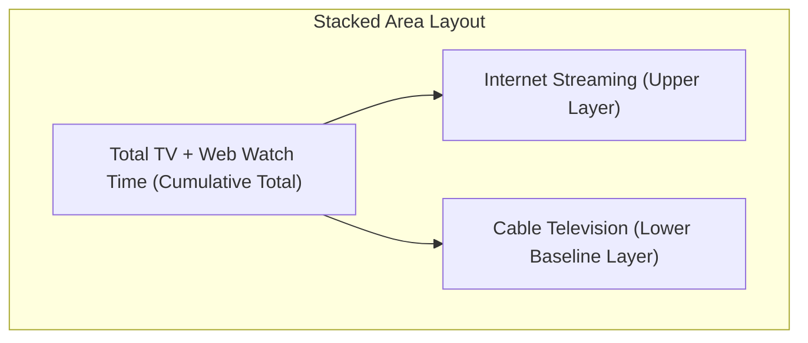
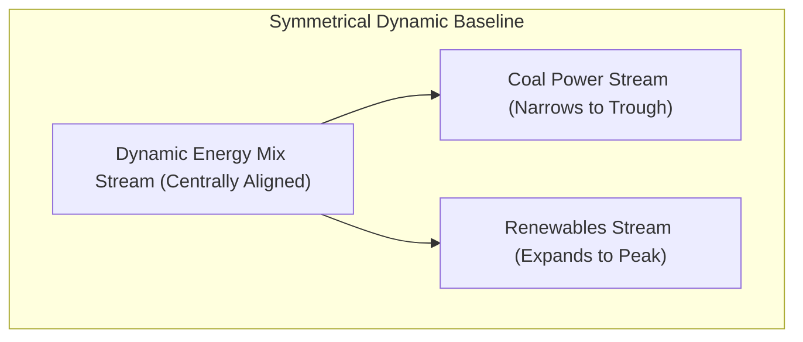
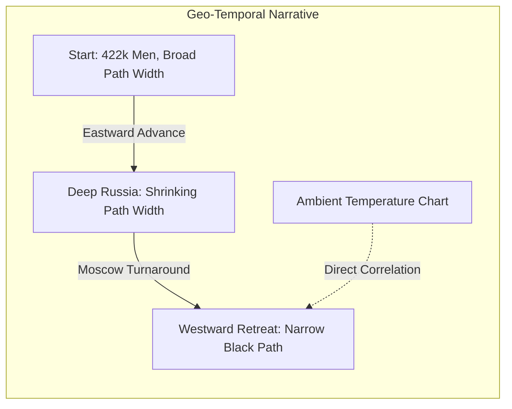

# Domain V: Showing Changes Over Time

Temporal visualizations track trends, rates of growth, and structural shifts across continuous timelines. They help analysts identify seasonal patterns, evaluate business performance, and map complex historic journeys.

### Stacked Area Chart

A stacked area chart is a continuous temporal chart where multiple shaded category areas are stacked sequentially on top of each other along a fixed horizontal timeline baseline (typically the x-axis). Standard line charts can show individual trends but fail to highlight how the cumulative total is constructed over time. A stacked area chart tracks both the total sum and the changing composition of individual sub-categories simultaneously, utilizing the Gestalt principle of continuity to show smooth transitions. A research group tracking average daily media usage over a 20-year timeline can plot this on a stacked area chart to clearly reveal how declining cable television viewership was gradually replaced by surging internet streaming, while other media forms like radio and newspaper remained relatively flat.

Stacked area charts display both overall cumulative growth and the shifting composition of categories over time. Smooth continuous visual pathways make overall trends easy for the human eye to follow, and the format excels at highlighting major substitutions such as one technology replacing another. However, it is difficult to read exact values of nested middle and upper layers because their baselines are uneven and shift over time. Erratic fluctuations in the bottom layer distort the shapes of all layers stacked above it. Common mistakes include stacking too many categories (more than five or six), which turns upper layers into thin unreadable strips, and changing the stacking order of categories across different periods, which breaks visual continuity and confuses viewers. Best practices include placing the most stable or largest category at the bottom of the stack to establish a solid baseline, and using interactive tooltips so users can hover over any point to see exact category values. Python developers can use `matplotlib.pyplot.stackplot` or create stacked configurations in Seaborn, while Tableau users can use the Area mark type and place their category variable on the Color shelf.

### Streamgraph (Steam Chart)

A streamgraph is a variation of the stacked area chart that is displaced around a central, non-flat horizontal axis, resulting in a fluid organic shape resembling a river or stream. The thickness of each category's stream represents its value at that point in time. Traditional stacked area charts anchored to a flat baseline look rigid and limit their ability to show shifting trends across many categories. By using a symmetrical central baseline, streamgraphs focus viewer attention on expanding and shrinking streams, highlighting peaks (high intensity) and troughs (low intensity) across long timelines. Visualizing the historical energy mix of Great Britain over a century shows a thick stream of coal in the early 20th century that gradually narrows into a thin trough, while oil, gas, nuclear, and eventually renewable energy streams expand to take its place.

Streamgraphs create highly engaging organic visuals that capture viewer attention. They easily handle high-cardinality datasets where some categories drop to zero or enter the mix late, and the symmetrical layout makes it easy to spot massive peaks and sudden contractions in the data. However, the shifting baseline makes it almost impossible for viewers to calculate exact numeric values or compute precise sums along the y-axis. The format is also prone to visual clutter if the dataset contains too many tiny highly volatile categories. Common mistakes include adding y-axis gridlines or numeric labels (which do not apply to a shifting baseline and confuse viewers) and using high-contrast jarring color palettes that break the fluid stream metaphor. Best practices include using streamgraphs primarily to show high-level trends rather than precise numbers, applying smooth sequential color palettes like cool blues and greys to represent fluid flow, and limiting the visual to eight to ten major categories to prevent clutter. D3.js developers can use the `d3.stack().offset(d3.stackOffsetWiggle)` layout algorithm to compute symmetrical coordinates.

### Temporal Flow Map (Minard Map)

A temporal flow map is a highly specialized spatial-temporal map that overlays variables such as volume, temperature, and direction onto geographic paths to show how a variable changes over both space and time. Standard spatial charts only show static locations, and standard temporal charts only show times. A temporal flow map links them together, showing the movement, losses, and environmental exposures of an entity along a geographic journey. Charles Minard's map of Napoleon's 1812 Russian Campaign exemplifies this: the width of the path represents the size of the army, starting as a broad band at the Polish-Russian border and shrinking to a thin line as they advance on Moscow. The black return path is linked to a temperature chart below, showing how the freezing Russian winter directly decimated the retreating troops.

Temporal flow maps combine multiple data dimensions (geography, time, volume, and temperature) into a single cohesive visual story. They are highly effective for displaying historic retrospectives, migration patterns, and supply-chain journeys, providing immediate context by showing direct cause-and-effect relationships between environmental factors and volume losses. However, they are extremely difficult and time-consuming to design and build, requiring highly specific datasets with accurate geographic coordinates, timestamps, and localized metrics. Common mistakes include trying to plot too many secondary variables on the map (which clutters the primary path) and failing to scale path widths accurately (which misrepresents volume changes). Best practices include keeping the main flow line highly prominent and easy to follow, and placing secondary data like temperature charts directly below the map aligned with the geographic timeline to show clear correlations. Implementation typically requires custom GIS software (QGIS or ArcGIS) or specialized coordinate-plotting in D3.js or HTML5 Canvas engines.

**Key takeaways for temporal dynamics:** Stacked area charts display both cumulative growth and shifting categories over time using a fixed baseline. Streamgraphs use a symmetrical central baseline to display organic flowing trends across many categories, focusing on relative peaks and troughs. Temporal flow maps combine geography, time, and changing volumes into a single cohesive story, highlighting how external factors impact a journey.
