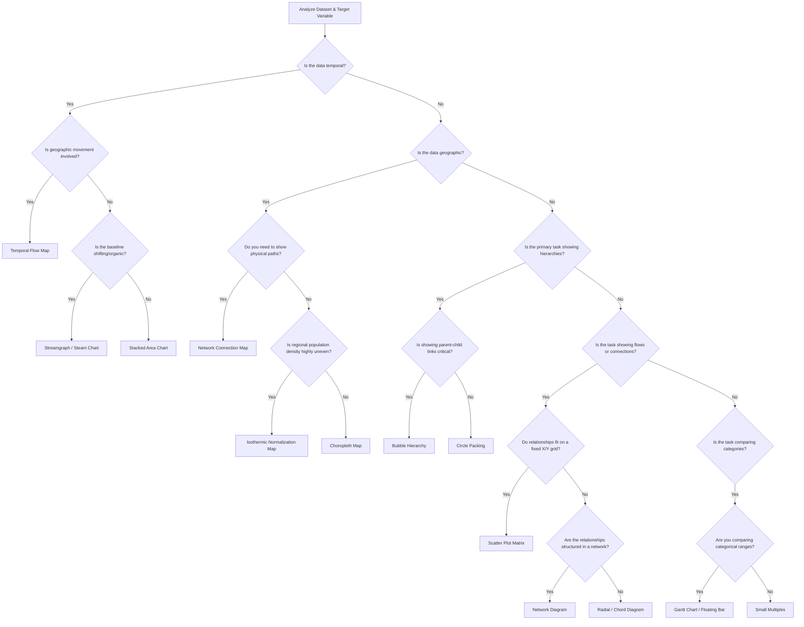

# Enterprise Data Visualization Taxonomy: A Technical Reference Manual

A robust taxonomy organizes data visualization methods by their primary communication purpose, helping engineers and architects select the most effective layout for a given dataset. Choosing the wrong visual can obscure vital insights and lead to incorrect operational decisions. This comprehensive reference manual details the visual paradigms, data architectures, mathematical foundations, and technical trade-offs for five critical communication tasks: comparing categories (Gantt charts, Sankey diagrams, small multiples), assessing hierarchies and part-to-whole relationships (circle packing diagrams, bubble hierarchies), mapping geospatial data (choropleth maps, isothermic maps, network connection maps), plotting connections and relationships (scatter plot matrices, radial/chord diagrams, network diagrams), and showing changes over time (stacked area charts, streamgraphs, temporal flow maps).

Modern enterprise data visualization relies on matching data structures with visual encodings that support specific analytical tasks. The tree diagram below maps out this taxonomy:

```mermaid
graph TD
    Taxonomy[Data Visualization Taxonomy] --> CompCat[Comparing Categories]
    Taxonomy --> Hierarchy[Assessing Hierarchies & Part-to-Whole]
    Taxonomy --> Geospatial[Mapping Geospatial Data]
    Taxonomy --> Connections[Plotting Connections & Relationships]
    Taxonomy --> Temporal[Showing Changes Over Time]

    CompCat --> Gantt[Gantt Chart / Floating Bar]
    CompCat --> Sankey[Sankey Diagram]
    CompCat --> SM[Small Multiples]

    Hierarchy --> CP[Circle Packing Diagram]
    Hierarchy --> BH[Bubble Hierarchy]

    Geospatial --> Choro[Choropleth Map]
    Geospatial --> Isoth[Isothermic Normalization Map]
    Geospatial --> NetConn[Network Connection Map]

    Connections --> SPM[Scatter Plot Matrix & Heatmaps]
    Connections --> Chord[Radial / Chord Diagram]
    Connections --> NetDiag[Network Diagram]

    Temporal --> StackArea[Stacked Area Chart]
    Temporal --> Stream[Streamgraph / Steam Chart]
    Temporal --> TempFlow[Temporal Flow Map]
```

Selecting the correct layout depends on your data structure, dimensionality, and primary analytical goals. The decision tree below guides this selection process:

Each visualization method carries distinct input data requirements, analytical purposes, encoding strategies, and space-efficiency characteristics. Gantt charts accept categorical data with two continuous range points to show spans and overlaps across categories using floating horizontal bars, offering high space efficiency. Sankey diagrams process directed graphs with categorical stages and link weights to display flow volumes and combinations across stages via flow bands where width matches volume, providing moderate space efficiency. Small multiples handle high-dimensional tables with multiple category groupings, allowing users to scan across synchronized multi-panel chart grids to spot trends and anomalies with high space efficiency. Circle packing diagrams and bubble hierarchies both process hierarchical tree data, but the former uses concentric nested circles scaled by area to show part-to-whole relationships within nested categories (moderate space efficiency), while the latter uses linked circles scaled by area and color-coded to show organization reporting lines and relative weights (low space efficiency). Geospatial methods vary significantly: choropleth maps shade geographic regions by quantitative scalars, isothermic maps adjust for population density via area distortion or normalization, and network connection maps draw vector lines between latitude/longitude coordinate nodes. Scatter plot matrices display multi-variable continuous data in high-space-efficiency grids of scatter plots, radial chord diagrams handle N×N adjacency matrices with curved circular bands (moderate efficiency), and network diagrams process unstructured graphs of nodes and edges to analyze complex systems with low space efficiency. Temporal methods include stacked area charts (high efficiency, fixed baseline), streamgraphs (moderate efficiency, shifting central baseline), and temporal flow maps (low efficiency, spatio-temporal path overlays).

## [Domain I: Comparing Categories](./Domain%20I%20-%20Comparing%20Categories.md)

## [Domain II: Assessing Hierarchies and Part-to-Whole Relationships](./Domain%20II%20-%20Assessing%20Hierarchies%20and%20Part-to-Whole%20Relationships.md)
