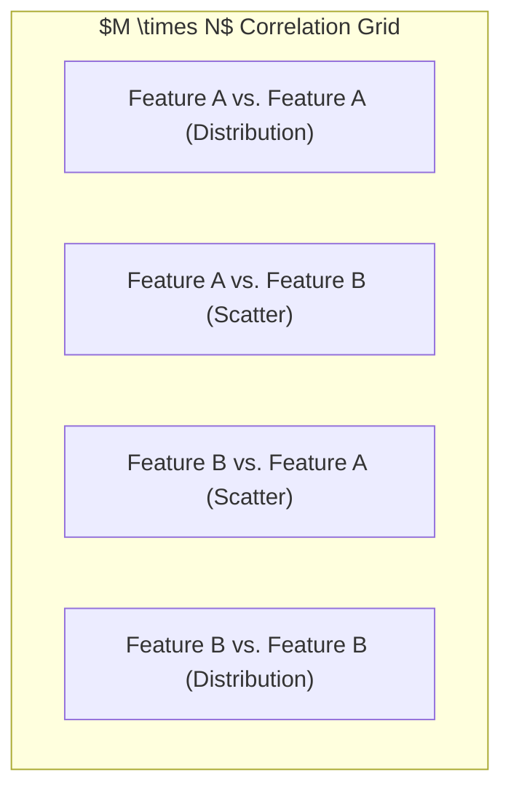
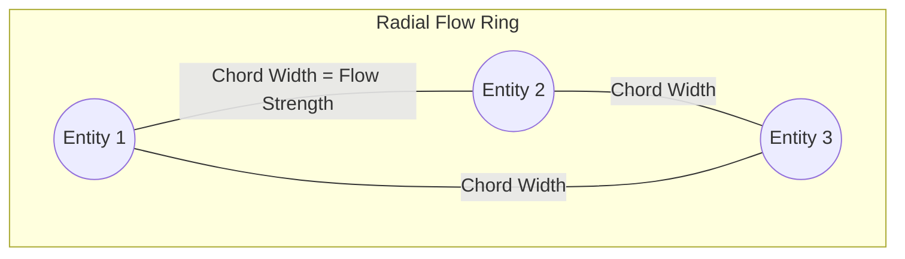
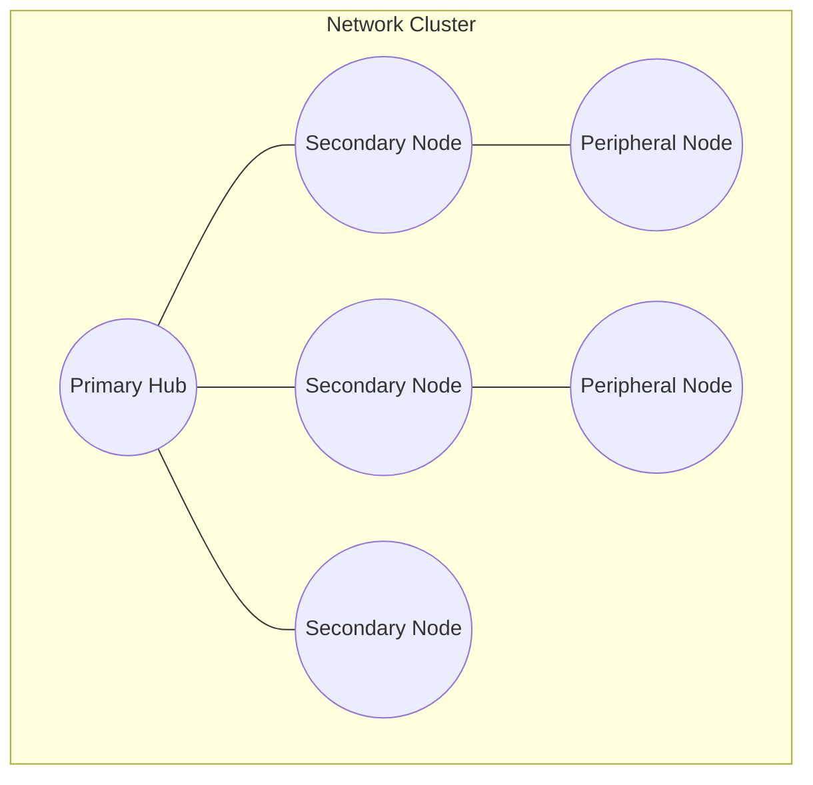

# 5. Domain IV: Plotting Connections & Relationships (Relational Structures)

Relational visualizations map correlations and connections between variables, helping engineers and analysts identify patterns and model complex systems [1, 2].

### A. Scatter Plot Matrix (Pair Plot) & Correlation Heatmaps

#### Technical Breakdown
* **Definition:** A grid of pairwise scatter plots showing the correlation between every combination of continuous variables in a dataset [1]. This is often paired with a correlation heatmap that uses color to show the strength of these relationships [1].
* **Why It Matters:** When exploring a new dataset, the relationships between variables are often completely unknown [1]. A scatter plot matrix allows analysts to scan all pairwise interactions at once, quickly identifying linear, non-linear, and clustered patterns [1].
* **Real-World Use Case:** *Industrial Quality Control.* A manufacturing plant tracks parameters like furnace temperature, cooling speed, pressure, and tensile strength [1]. Running a scatter plot matrix across these variables instantly highlights the optimal combinations for maximum product strength [1].
* **Advantages:**
  * Displays all pairwise interactions across multiple variables in a single view [1].
  * Helps analysts spot correlations, clusters, and outliers early in the modeling process [1].
  * Displays single-variable density distributions alongside pairwise correlations [1].
* **Limitations:**
  * Highly resource-intensive to calculate as the number of variables grows ($O(M^2)$ complexity) [1].
  * Becomes cluttered and difficult to read if the dataset contains more than 8–10 variables [1].
* **Common Mistakes:**
  * Trying to plot high-cardinality categorical variables, which litters the grid with unreadable scatter points.
  * Failing to normalize the scales of different variables, making it difficult to compare correlations.
* **Best Practices:**
  * Color-code the scatter points using a target category (such as pass/fail status) to add a layer of context.
  * Display the Pearson or Spearman correlation coefficient directly inside each grid cell to make the strength of relationships clear.
* **Practical Implementation Notes:**
  * **Python:** Use `sns.pairplot(df, hue="class")` in Seaborn or `px.scatter_matrix(df)` in Plotly Express [1].

### B. Radial / Chord Diagram

#### Technical Breakdown
* **Definition:** A radial diagram where variables are arranged in a circle, and curved bands (chords) are drawn inside the circle to represent the relationships or flows between them [1, 2].
* **Why It Matters:** Standard scatter grids restrict relationships to fixed $X$ and $Y$ axes [1, 2]. A radial diagram removes this limitation, allowing viewers to see how any category connects to any other category without being restricted to a flat grid [1, 2].
* **Real-World Use Case:** *Global Capital and Trade Flows.* A financial dashboard tracks how capital moves between several distinct asset classes [2]. By arranging currencies in a circle, the curved chords show both the origin and destination of major capital flows, highlighting central currency nodes [2].
* **Advantages:**
  * Removes axis limitations, allowing viewers to see multiple relationships simultaneously [1, 2].
  * Displays bidirectional flows between multiple categories clearly [2].
  * Creates an engaging, memorable visual that highlights key hubs [2].
* **Limitations:**
  * Visually complex, requiring more time and mental effort for the viewer to interpret [2].
  * Plotting too many chords can turn the center of the circle into an unreadable block of color.
* **Best Practices:**
  * Add interactive hover states that highlight a single category and its connected chords while fading out the rest of the diagram.
  * Sort categories along the circle chronologically or by size to keep the layout organized.
* **Practical Implementation Notes:**
  * Use D3's `d3.chord()` engine to calculate chord angles and ribbons, or use the `chorddiag` package in R.

### C. Force-Directed Network Diagram

#### Technical Breakdown
* **Definition:** A node-link visualization that uses physical force simulations (such as gravity and repulsion) to position nodes (points) and links (lines) based on their relationship strengths [2].
* **Why It Matters:** Many datasets represent complex systems rather than simple hierarchies [2]. Network diagrams display these systems by representing entities as nodes and relationships as links, helping analysts map peer groups and social networks [2].
* **Real-World Use Case:** *Corporate Communications Analysis.* A company maps internal communications by representing employees as nodes and emails as links [2]. Sizing nodes by their connection volume highlights key communicators (colored in red) and peripheral employees, showing the informal structure of the organization [2].
* **Advantages:**
  * Groups related nodes naturally using dynamic force simulations [2].
  * Highlights key hubs, influencers, and isolated clusters [2].
  * Easily scales to represent complex, unstructured networks [2].
* **Limitations:**
  * Large networks can turn into an unreadable "hairball" without careful filtering.
  * Highly resource-intensive to calculate, which can cause performance lag in the browser.
* **Common Mistakes:**
  * Failing to configure collision forces, causing nodes to overlap and block labels.
  * Showing completely disconnected nodes in the middle of the canvas instead of placing them along the periphery.
* **Best Practices:**
  * Use network algorithms (like Louvain community detection) to color-code related node clusters [2].
  * Splay nodes out using charge forces to keep labels visible and readable.
* **Practical Implementation Notes:**
  * Use the `d3-force` engine in JavaScript or the NetworkX library in Python to calculate node coordinates.

### Section Summary & Key Takeaways
* **Scatter Plot Matrices** help analysts explore unknown datasets by displaying pairwise correlations across all continuous variables [1].
* **Radial Diagrams** arrange categories in a circle to show multi-stage, bidirectional relationships without axis limitations [1, 2].
* **Network Diagrams** display complex, unstructured systems using force simulations to highlight key hubs and communication patterns [2].
