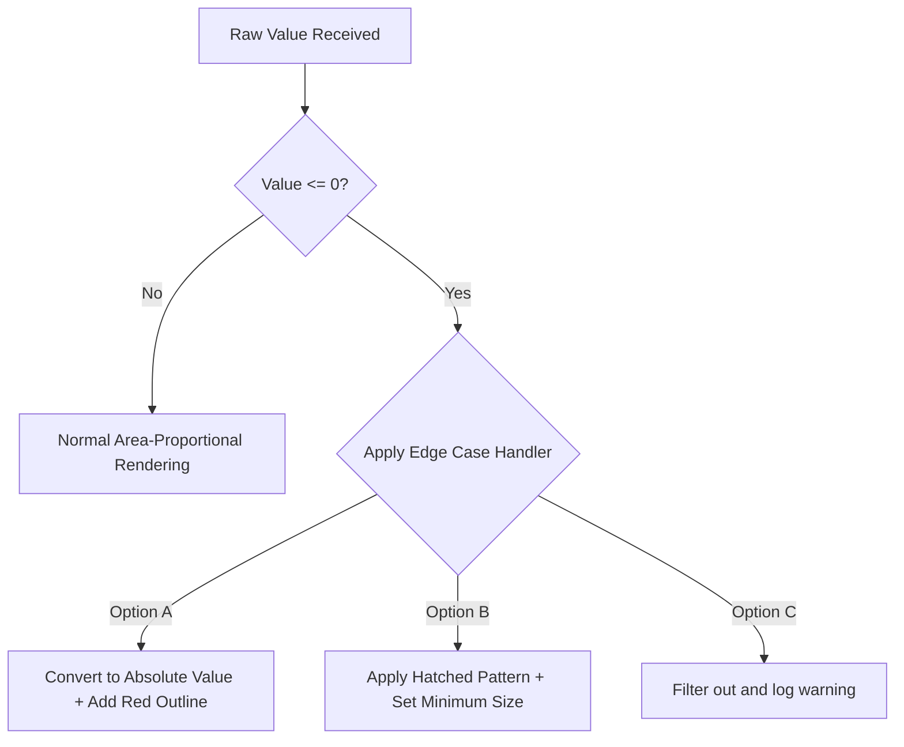

# Export simplified map to file (significantly smaller file size)

gdf.to_file("us_counties_optimized.geojson", driver="GeoJSON")
```

### C. Layout Stability in Force-Directed Node Trees

#### Issue: Endless Jitter and Jiggling Nodes
Interactive network diagrams can sometimes bounce or wobble endlessly on the screen without settling, which distracts users and drains battery life.

#### Mitigations:
* Set a **cooling parameter threshold** to stop calculating node positions once their movement falls below a specific limit.
* Adjust the gravity and collision parameters to prevent nodes from bouncing back and forth indefinitely.

```javascript
// D3.js Force Simulation Stability Configuration
const simulation = d3.forceSimulation(nodes)
    .force("charge", d3.forceManyBody().strength(-50))
    .force("center", d3.forceCenter(width / 2, height / 2))
    .force("collision", d3.forceCollide().radius(d => d.radius + 2))
    .velocityDecay(0.4) // Increases friction to settle nodes faster
    .alphaMin(0.005);   // Stops calculation frames when movement becomes negligible
```

### D. Zero or Negative Values in Part-to-Whole Diagrams

#### Issue: Negative Areas Break Scaling Mathematics
Since you cannot render a circle with a negative area, negative balances or net losses will break circle packing and bubble hierarchy layout engines.



#### Mitigations:
* **Use Absolute Values with Visual Alerts:** Convert negative numbers to positive values to calculate their size, but add a distinct color (like bright red) or a hatched pattern to flag them as negative balances.
* **Apply Hatched Visual Textures:** Use specific textures to represent divisions with zero budget, keeping them visible on the chart without skewing the scaling math.
