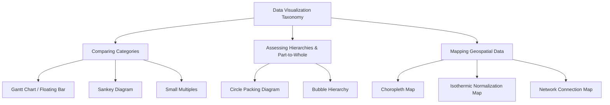
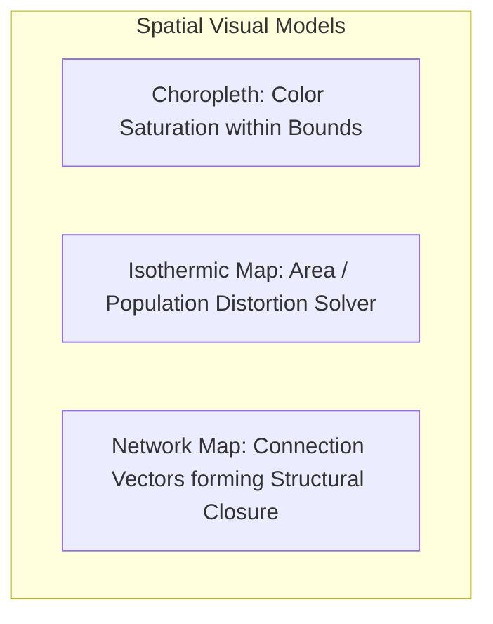
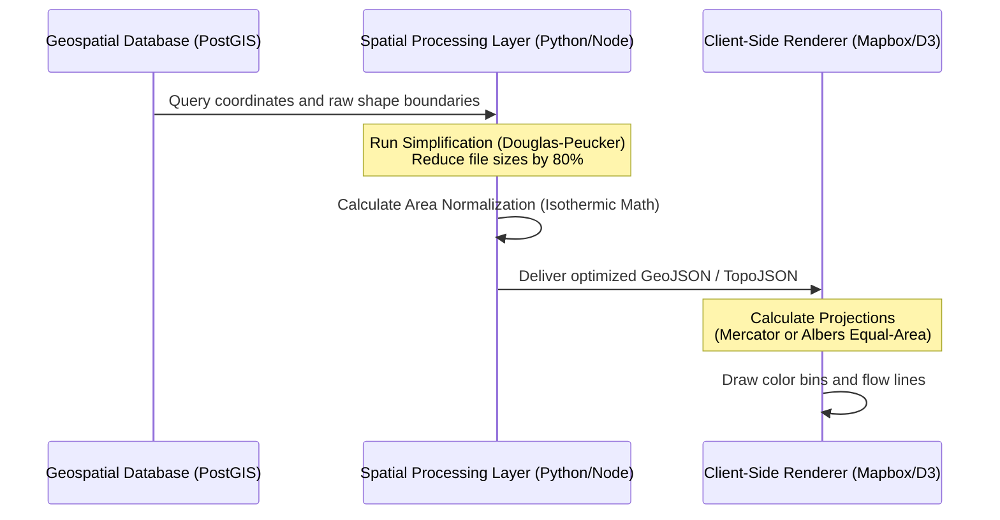
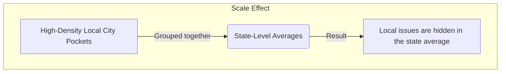

## Enterprise Data Visualization Taxonomy: Categorical Comparison, Flow Mapping, Hierarchical Systems, and Geospatial Architectures

A robust taxonomy organizes data visualization methods by their primary communication purpose, helping engineers and architects select the most effective layout for a given dataset [1]. Choosing the wrong visual can obscure vital insights and lead to incorrect operational decisions [1].

This document details the visual paradigms, technical architectures, and practical trade-offs for three critical communication tasks:
1. **Comparing Categories** (Gantt Charts, Sankey Diagrams, Small Multiples) [1, 2, 3]
2. **Assessing Hierarchies & Part-to-Whole Relationships** (Circle Packing Diagrams, Bubble Hierarchies) [1]
3. **Mapping Geospatial Data** (Choropleth Maps, Isothermic Maps, Network Connection Maps) [1, 2]

## 1. Taxonomic Framework of Data Visualization Methods

Data visualization taxonomy maps specific mathematical and logical datasets to clear visual representations [1]. The tree diagram below outlines this structural mapping:



### Comprehensive Method Evaluation Matrix

| Visualization Method | Input Data Type | Core Analytical Purpose | Primary Encodings | Structural Paradigm |
| :--- | :--- | :--- | :--- | :--- |
| **Gantt Chart (Floating Bar)** [1, 2] | Categorical + Two continuous range points (Start/End) | Show range spans and overlaps across categories [2] | Floating horizontal bars on a shared axis [2] | Interval-based linear comparison |
| **Sankey Diagram** [2] | Directed graph with categorical stages and link weights | Show flow volumes, divisions, and combinations across stages [1] | Flow bands where width matches volume [1] | Node-link flow network |
| **Small Multiples** [3] | High-dimensional tables with multiple category groupings | Scan across multiple grids to spot trends and anomalies [1, 3] | Synchronized multi-panel chart layout [1] | Grid-based dimensional slicing |
| **Circle Packing Diagram** [1] | Hierarchical tree with categorical groupings and leaf sizes | Show part-to-whole relationships within nested categories [1] | Concentric nested circles scaled by area [1] | Containment-based boundary nesting |
| **Bubble Hierarchy** [1] | Hierarchical tree with parental connections and node weights | Show organization, reporting lines, and relative weights [1, 2] | Linked circles scaled by area and color-coded [1, 2] | Connection-based node-link layout |
| **Choropleth Map** [1] | Geographic shape coordinates + Region-linked quantitative scalars [1] | Display geographic distribution of a metric across boundaries [1, 2] | Regional color shading/saturation levels [1, 2] | Regionally bounded thematic map |
| **Isothermic Normalization Map** [2] | Geographic shape coordinates + Population weight + Metric value [2] | Correct geographic area bias to show true population density [2] | Area-distorted shape polygons or normalization-adjusted color saturation [2] | Algorithmic demographic map |
| **Network Connection Map** [2] | Latitude/Longitude coordinate nodes + Origin-Destination Link pairs [2] | Display flows and physical pathways across regions [2] | Vector lines, curves (Great-Circle arcs), and node markers [2] | Spatial node-link overlay |

## 2. Comparing Categories: Relative and Absolute Value Comparisons

Categorical comparison visualizations show how relative and absolute variables change across different categories [1]. They help viewers compare the span, flow, or regional distribution of discrete items on a shared scale [1, 2].

### A. Gantt Chart (Floating Bar)

#### Technical Breakdown
* **Definition:** A horizontal bar chart where each bar floats freely between minimum and maximum quantitative values, rather than anchoring to a fixed zero baseline [2].
* **Why It Matters:** Traditional bar charts can only show a single value starting from zero. Floating bars show both the **relative span** (the size of the bar) and the **absolute position** (where the bar sits on the axis) at the same time [2].
* **Real-World Use Case:** *Commodity Price Volatility.* A global supply-chain dashboard tracks natural gas import prices across regional hubs [2]. Rather than plotting average prices, it uses floating bars to show daily minimum and maximum spreads, revealing both price ranges and absolute market differences [2].
* **Advantages:**
  * Displays two continuous data points (minimum and maximum limits) on a single horizontal line [2].
  * Makes it easy to compare overlapping values and ranges across categories [2].
  * Removes the zero-baseline constraint, preventing visual distortion when values sit far from zero.
* **Limitations:**
  * Cannot show cumulative totals across categories.
  * Becomes cluttered and hard to read if too many overlapping ranges are plotted on the same row.
* **Common Mistakes:**
  * Forcing the chart's axis to start at zero when all data points sit within a narrow, high-value range, which squishes the bars.
  * Arranging categories randomly instead of sorting them by minimum value, maximum value, or span width.
* **Best Practices:**
  * Sort categories by a meaningful metric (such as range width or absolute maximum) to make trends easy to spot.
  * Add vertical reference lines across the grid to help viewers compare absolute values.
* **Practical Implementation Notes:**
  * **Tableau:** Use the `Gantt Bar` mark type, mapping the minimum value to the Columns shelf and the range span (max minus min) to the Size shelf.
  * **Python:** Use `matplotlib.pyplot.barh` and pass the minimum values to the `left` parameter.

### B. Sankey Diagram

#### Technical Breakdown
* **Definition:** A flow-based diagram where categories (nodes) are connected by bands (links) whose width is directly proportional to the flow volume passing between them [1, 2].
* **Why It Matters:** Standard charts struggle to show resource changes across multiple stages [2]. Sankey diagrams solve this by visualizing resource paths, showing both source allocations and final destinations in a single view [1, 2].
* **Real-World Use Case:** *Enterprise Carbon Emissions Tracking.* A manufacturing company maps carbon emissions from its raw material facilities, through production plants, and out to final product lines, highlighting high-emission pathways across the supply chain.
* **Advantages:**
  * Visualizes complex, multi-stage relationships without losing track of total quantities [2].
  * Preserves balance across the system (the total width entering a stage matches the total width exiting it).
  * Helps viewers spot major pathways and system dependencies at a glance [2].
* **Limitations:**
  * Crossing flow lines in dense networks can create a tangled, hard-to-read layout.
  * Minor but critical flows can shrink to thin, unreadable lines if the scale is dominated by massive outliers.
  * Standard layout engines can break down if the data contains circular loops.
* **Common Mistakes:**
  * Leaving hundreds of tiny, insignificant transactions in the dataset, which litters the canvas with thin, distracting lines.
  * Failing to use clear directional cues, leaving users confused about which way the data is moving.
* **Best Practices:**
  * Group minor transactions into an "Other" category to keep the visual clean.
  * Use a dynamic layout solver (such as D3's iterative relaxation algorithm) to position nodes in a way that minimizes crossing paths.
* **Practical Implementation Notes:**
  * **JavaScript:** Use the `d3-sankey` library to calculate node and link coordinates.
  * **Python:** Use `plotly.graph_objects.Sankey` to generate interactive, draggable flow networks.

### C. Small Multiples

#### Technical Breakdown
* **Definition:** A grid-based layout where the same basic chart type is repeated across a categorical variable, with every panel sharing identical axes and scales [1, 3].
* **Why It Matters:** When plotting multiple categories with several series on a single chart, the visual can quickly become cluttered. Small multiples solve this by separating the data into a clean, organized grid of individual charts, making it easy to spot trends and compare patterns across different groups [1, 3].
* **Real-World Use Case:** *Product Performance Across Global Regions.* A retail company analyzes quarterly product line sales (6 categories) across 8 global regions [3]. Instead of cramming all this data into one giant, hard-to-read grouped bar chart, they create an $8 \times 1$ grid of small bar charts, allowing regional managers to easily spot local sales trends [3].
* **Advantages:**
  * Spreads data out into a clean grid, making complex datasets easy to read without overlapping elements [1, 3].
  * Shared axes and scales allow viewers to quickly compare values across charts [3].
  * Simplifies multivariable analysis by separating complex categories into clean slices [1, 3].
* **Limitations:**
  * Needs a larger layout canvas to display the grid of charts clearly.
  * Comparing the exact values of elements in separate grid cells is slightly more difficult than comparing them side-by-side on a single chart.
* **Common Mistakes:**
  * Allowing each chart in the grid to calculate its own y-axis limits, which makes visual comparisons highly misleading.
  * Creating a grid with too many cells, which shrinks the individual charts and makes them unreadable.
* **Best Practices:**
  * Always lock the x- and y-axes to the same scales across all charts in the grid.
  * Sort the individual grid cells by a meaningful metric (such as total sales or growth rate) so that key insights bubble up to the top-left of the grid.
* **Practical Implementation Notes:**
  * **R/ggplot2:** Use `facet_wrap(~ region, ncol = 3)`.
  * **Seaborn:** Use `sns.FacetGrid(data, col="region")`.

## 3. Assessing Hierarchies: Part-to-Whole and Structural Visualizations

Hierarchical visualizations display the relationships between nested categories, showing how individual parts combine to form a larger system [1].

### A. Circle Packing Diagram

#### Technical Breakdown
* **Definition:** A containment-based visualization where hierarchical nodes are represented as circles, and nested child categories are packed tightly inside their parent circles [1].
* **Why It Matters:** Shows nested groupings and proportional sizes at the same time, using natural physical enclosure to define category boundaries [1].
* **Real-World Use Case:** *Technology Sourcing Costs.* An IT department maps hardware and software spending. The outer circle represents total IT spend, containing nested circles for departments (R&D, Sales), which in turn contain smaller circles for individual software licenses [1].
* **Advantages:**
  * Grouping via enclosure is highly intuitive and easy for viewers to understand [1].
  * Helps viewers quickly spot massive, high-cost nodes nested deep within the system [1].
  * Creates an engaging, organic visual layout that stands out on executive dashboards [1].
* **Limitations:**
  * Space is lost between the curved boundaries of packed circles, making it less space-efficient than a Treemap [1].
  * Comparing the exact sizes of circles is difficult for the human eye.
  * Deeply nested hierarchies become unreadable without interactive zoom controls.
* **Common Mistakes:**
  * Scaling circle sizes by radius rather than area, which quadratically distorts the perceived differences between values.
  * Trying to show deep hierarchies statically, turning small child nodes into unreadable pixel dust.
* **Best Practices:**
  * Always scale circles using their area: $r = \sqrt{\text{Value} / \pi}$.
  * Implement interactive "zoom-on-click" features to let users drill down into nested levels.
  * Use high-contrast color strokes to clearly separate parent and child boundaries.
* **Practical Implementation Notes:**
  * **D3.js:** Use the `d3.pack()` layout engine to compute circle coordinates.
  * **Python:** Use the `circlify` library to calculate nested coordinates, then render them using `matplotlib`.

### B. Bubble Hierarchy

#### Technical Breakdown
* **Definition:** A connection-based tree diagram where individual categories are represented as bubbles connected by branch lines, with each bubble sized by its quantitative value [1].
* **Why It Matters:** Unlike circle packing, bubble hierarchies draw explicit lines between parents and children [1, 2]. This makes it easier to track relationship paths across deep or uneven organizational structures [1, 2].
* **Real-World Use Case:** *Corporate Budget Allocation.* A company maps divisional budgets across reporting lines [1, 2]. The central bubble represents total corporate budget, branching out to division nodes (sized by spend), which connect to departmental subdivisions [1, 2]. This layout shows both reporting structures and financial weights in a single view [1, 2].
* **Advantages:**
  * Clearly shows parent-child relationships using explicit connecting lines [1, 2].
  * Easily handles unbalanced hierarchies where some branches are much deeper than others.
  * Allows viewers to compare the sizes of bubbles in different branches of the tree [2].
* **Limitations:**
  * Force-directed physics engines can cause nodes to wobble, overlap, or drift off the screen.
  * Needs significant canvas space to prevent connecting lines and bubbles from overlapping.
  * Recalculating physics simulations for more than 500 interactive nodes can cause performance lag.
* **Common Mistakes:**
  * Allowing bubbles to overlap due to weak collision detection in the layout engine.
  * Disconnecting parent and child nodes by using low-contrast connecting lines.
* **Best Practices:**
  * Use a layout engine with active collision detection to prevent bubble overlap.
  * Allow users to collapse and expand branches to keep the visual clean.
  * Keep bubble sizes proportional across the entire diagram to ensure accurate comparisons [2].
* **Practical Implementation Notes:**
  * Use D3's `d3-force` engine with `forceCollide` to keep bubbles separated.
  * Use NetworkX in Python to calculate tree structures, and Plotly to render the interactive layout.

## 4. Mapping Geospatial Data: Spatial Representations and Coordinate Systems

Geospatial mapping overlays quantitative or qualitative datasets onto geographic reference layers [1]. It helps viewers identify spatial clusters, physical routes, and regional patterns directly linked to real-world geography [1, 2].



### A. Choropleth Map

#### Technical Breakdown
* **Definition:** A thematic map where defined geographic boundaries (such as states or counties) are shaded in proportion to a specific quantitative or qualitative metric [1, 2].
* **Why It Matters:** Maps allow viewers to connect abstract data to real-world spaces [1]. Overlaying metrics onto a familiar geographic map makes it easy to identify spatial patterns and regional trends at a glance [1].
* **Real-World Use Case:** *Tracking Regional Economic Shifts.* Visualizing changes in the annual United States unemployment rate [1]. Comparing a 2004 baseline map (5.5% national average) with a September 2009 map (9.8% during the Global Financial Crisis) highlights exactly which industrial regions and states suffered the most job losses [1, 2].
* **Advantages:**
  * Leverages familiar geographic boundaries, making the map easy for general audiences to interpret [1].
  * Effectively highlights clear spatial clusters, such as contiguous states experiencing similar economic challenges [1].
  * Displays complex geographic variations without cluttering the screen [1].
* **Limitations:**
  * **Area Bias:** Large, sparsely populated regions (like Montana or Alaska) dominate the map visually, while small, densely populated areas (like Rhode Island or Washington D.C.) can be hard to see.
  * **Abrupt Transitions:** Color changes occur sharply at state borders, which does not represent how variables actually flow across real-world geography.
* **Common Mistakes:**
  * **Using Raw Counts Instead of Ratios:** Shading a map by total case numbers instead of rates (such as cases per capita), which simply highlights where the most people live.
  * **Poor Color Palette Selection:** Using non-sequential or low-contrast color palettes, making it difficult to distinguish between different values.
* **Best Practices:**
  * Always normalize your data (such as using percentages or per-capita rates) to ensure fair comparisons across regions of different sizes [2].
  * Use perceptually uniform, sequential color palettes (such as Viridis or Single-Hue Blues) to represent quantitative ranges clearly.
* **Practical Implementation Notes:**
  * Bind spatial coordinate boundaries (GeoJSON or TopoJSON) to your dataset using web tools like Leaflet, Mapbox, or Python's `folium` library.

### B. Isothermic Normalization Map (Demographic Area Correction)

#### Technical Breakdown
* **Definition:** An algorithmic cartographic layout that adjusts either the physical area of geographic regions or their color saturation to correct for underlying population density imbalances [2].
* **Why It Matters:** Standard choropleth maps can be misleading because a large, sparsely populated state looks more prominent than a small, densely populated state [1, 2]. Isothermic normalization algorithms adjust the map's visual weight so that colors and areas reflect the actual population density of the metric being measured [2].
* **Real-World Use Case:** *National Public Health Mapping.* When mapping disease outbreaks across a country, an isothermic normalization map adjusts the visual weight of each state based on its population [2]. This ensures that high case rates in small, dense cities are not visually overshadowed by low case rates in large, empty rural regions [2].
* **Advantages:**
  * Corrects the geographic area bias of standard choropleth maps [2].
  * Ensures color saturation accurately represents the metric's true density and impact [2].
  * Provides a more balanced, honest view of demographics and public health trends [2].
* **Limitations:**
  * Distorting geographic shapes can make familiar regions look unrecognizable to some viewers.
  * Calculating these normalized adjustments requires specialized spatial software and complex datasets [2].
* **Common Mistakes:**
  * Distorting shapes so severely that the map loses all geographic context.
  * Failing to explain the normalization algorithm to viewers, leaving them confused by the altered shapes.
* **Best Practices:**
  * Keep distortion levels moderate so that the map's shapes remain recognizable.
  * Provide a clear legend and caption explaining how the areas or colors have been normalized.
* **Practical Implementation Notes:**
  * Use cartogram plugins in QGIS, or the `cartogram` library in R, to calculate distorted boundary coordinates before rendering.

### C. Network Connection Map

#### Technical Breakdown
* **Definition:** A geographic map overlay that draws vector lines (often curved Great-Circle arcs) to represent connections, flows, or relationships between different geographic points [2].
* **Why It Matters:** Visualizing regional relationships requires showing how points connect across space [2]. Drawing these connection lines reveals active routes and logistics pathways [2].
* **Real-World Use Case:** *Global Trade Networks.* A shipping company maps imports and exports between international hubs [2, 3]. By drawing curved connection lines between ports, the density of the routes naturally outlines the continents—a design concept known as **structural closure** [2].
* **Advantages:**
  * Displays origin-destination paths, structural dependencies, and route densities clearly [2].
  * **Structural Closure:** The density of the connection lines can outline the shape of the world map even if the background map layer is completely hidden [2].
  * Helps logistics managers quickly identify key regional hubs and potential bottlenecks [2].
* **Limitations:**
  * Plotting too many intersecting lines can create a cluttered "spaghetti" effect on the map.
  * Flat, straight lines on a 2D projection can distort the actual flight or shipping paths over the Earth's curved surface.
* **Common Mistakes:**
  * Drawing straight 2D lines instead of curved Great-Circle arcs, which distorts the true paths of long-distance routes.
  * Cluttering the map by showing minor routes with the same line thickness as major pathways.
* **Best Practices:**
  * Use curved Great-Circle arcs to represent long-distance paths accurately.
  * Use line thickness and transparency to represent route volume, keeping major paths prominent while keeping minor routes subtle.
* **Practical Implementation Notes:**
  * **Python:** Use `cartopy` or `geopandas` to calculate curved Great-Circle arcs between coordinate points.
  * **JavaScript:** Use WebGL engines like `deck.gl` to render high-performance, interactive connection lines in the browser.

## 5. Technical Geospatial Pipeline & Processing

Mapping spatial data requires a structured pipeline to transform geographic coordinates and shapefiles into performant, interactive web layers.



### TopoJSON Structure for Spatial Rendering
To keep map files small and fast, use the **TopoJSON** format instead of GeoJSON. TopoJSON reduces file sizes by sharing boundary lines (arcs) between adjacent regions, preventing duplicate coordinates:

```json
{
  "type": "Topology",
  "objects": {
    "counties": {
      "type": "GeometryCollection",
      "geometries": [
        {
          "type": "Polygon",
          "arcs": [[0, 1, 2]],
          "properties": {
            "FIPS": "36061",
            "name": "New York County",
            "unemployment_2009": 8.9
          }
        }
      ]
    }
  },
  "arcs": [
    [[1000, 2000], [1010, 2050]],
    [[1010, 2050], [990, 2100]],
    [[990, 2100], [1000, 2000]]
  ]
}
```

## 6. Advanced Performance, Edge Cases, and Debugging

### A. Modifiable Areal Unit Problem (MAUP)

#### Issue: Changing Boundaries Alter Data Trends
The Modifiable Areal Unit Problem (MAUP) is a spatial phenomenon where changing the boundaries of a region can completely alter the apparent data trend. For example, grouping city-level data into broad state averages can hide severe local economic issues, while gerrymandered voting districts can warp election trends.



#### Mitigations:
* **Display Data at Multiple Scales:** Provide toggles that let users switch between county-level, state-level, and census-tract views to see the data clearly at different granularities.
* **Add Spatial Density Overlays:** Use a secondary layer, such as dot-density plots, over the choropleth map to show exactly where the population is concentrated within each boundary.

### B. High-Density Vector Mapping Performance

#### Issue: Heavy Boundary Files Slow Down Web Rendering
Trying to render highly detailed boundaries (like high-resolution national shapefiles) on an interactive map can overwhelm the browser, causing slow zoom and pan animations.

#### Mitigations:
* **Use the Douglas-Peucker Simplification Algorithm:** Use this algorithm to simplify complex boundary shapes by removing redundant vertices while preserving the overall geographic shape.
* **Implement Vector Tiles:** Split large map files into small vector tiles that are loaded dynamically as the user pans and zooms, keeping the map fast and responsive.

```python
import geopandas as gpd

## Load high-resolution county boundaries
gdf = gpd.read_file("us_counties_high_res.shp")

## Simplify shapes using the Douglas-Peucker algorithm (tolerance in degrees/meters)
gdf["geometry"] = gdf["geometry"].simplify(tolerance=0.001, preserve_topology=True)

## Export simplified map to file (significantly smaller file size)
gdf.to_file("us_counties_optimized.geojson", driver="GeoJSON")
```

### C. Colorblind-Friendly Map Styling

#### Issue: Standard Green-to-Red Palettes Are Misleading
Using a standard green-to-red color palette (such as green for low unemployment, red for high unemployment) makes maps unreadable for red-green colorblind viewers, rendering critical economic or health maps useless.

#### Mitigations:
* **Use Colorblind-Friendly Palettes:** Use perceptually uniform palettes like **Viridis** (blue-to-yellow) or **Cividis** that remain clear and distinguishable for all colorblind viewers.
* **Test Your Map's Contrast:** Convert your map to grayscale to ensure there is enough contrast and brightness variation for readers to tell the regions apart without relying on color alone.

## References
[1] Comparing Categories of Plots Transcript, Page 1.
[2] Mapping Geo-Spatial Data Transcript, Page 1.
[3] Comparing Categories of Plots Transcript, Page 3.

Tags: #statistics #machine-learning #data-science #statistical-modelling
