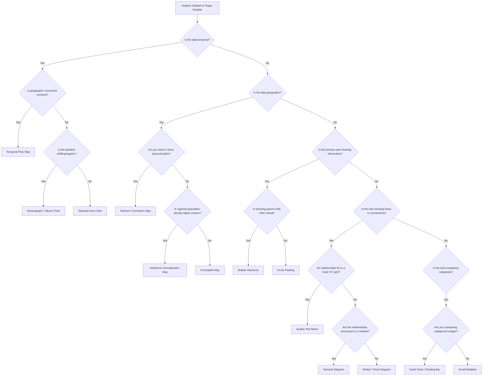
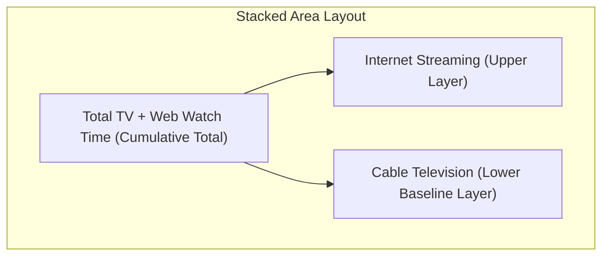
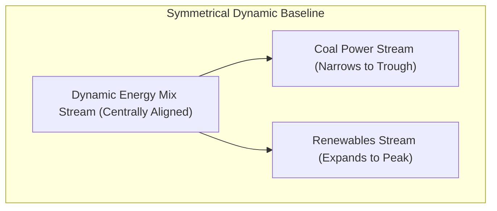
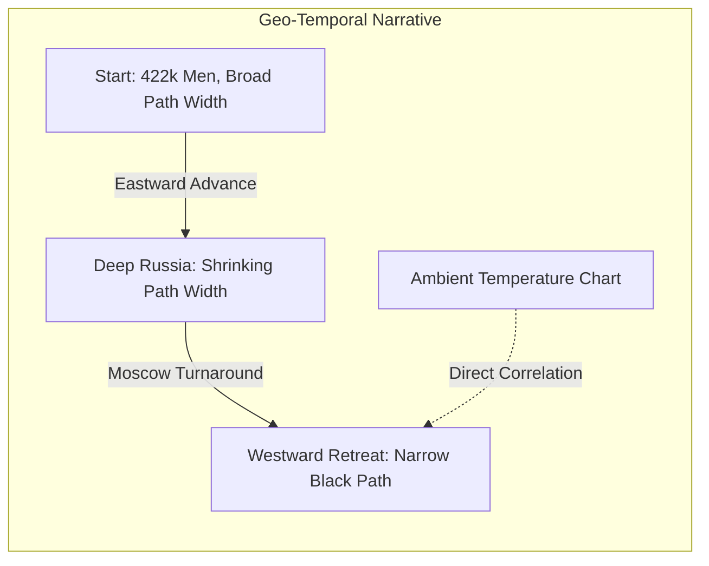
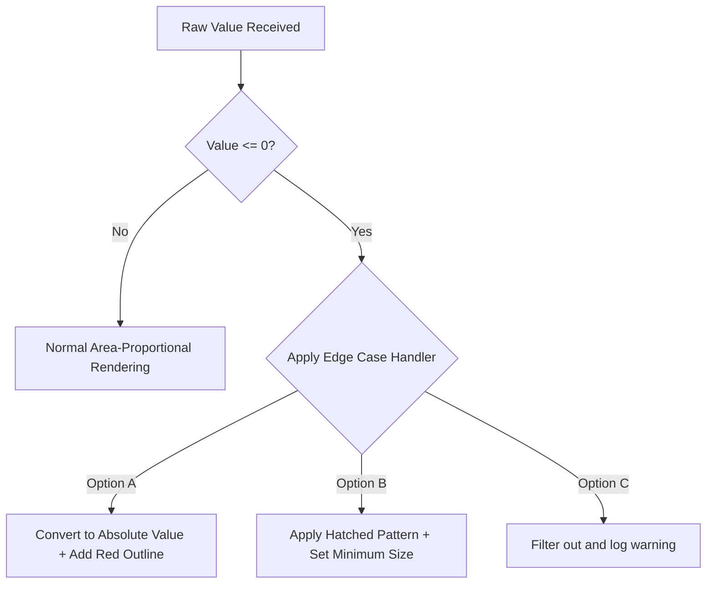
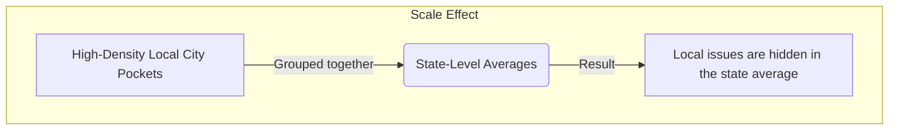

# Enterprise Data Visualization Taxonomy: Categorical Comparison, Flow Mapping, Hierarchical Systems, Geospatial Architectures, and Relational/Temporal Networks

A robust taxonomy organizes data visualization methods by their primary communication purpose, helping engineers and architects select the most effective layout for a given dataset [1]. Choosing the wrong visual can obscure vital insights and lead to incorrect operational decisions [1].

This comprehensive reference manual details the visual paradigms, data architectures, mathematical foundations, and technical trade-offs for five critical communication tasks:
1. **Comparing Categories** (Gantt Charts, Sankey Diagrams, Small Multiples) [1, 2, 3]
2. **Assessing Hierarchies & Part-to-Whole Relationships** (Circle Packing Diagrams, Bubble Hierarchies) [1]
3. **Mapping Geospatial Data** (Choropleth Maps, Isothermic Maps, Network Connection Maps) [1, 2]
4. **Plotting Connections & Relationships** (Scatter Plot Matrices, Radial/Chord Diagrams, Network Diagrams) [1, 2]
5. **Showing Changes Over Time** (Stacked Area Charts, Streamgraphs, Temporal Flow Maps) [1, 2]

---

## 1. Unified Taxonomic Framework of Data Visualization Methods

Modern enterprise data visualization relies on matching data structures with visual encodings that support specific analytical tasks [1]. The tree diagram below maps out this taxonomy:

```mermaid
graph TD
    Taxonomy[Data Visualization Taxonomy] --> CompCat[Comparing Categories]
    Taxonomy --> Hierarchy[Assessing Hierarchies & Part-to-Whole]
    Taxonomy --> Geospatial[Mapping Geospatial Data]
    Taxonomy --> Connections[Plotting Connections & Relationships]
    Taxonomy --> Temporal[Showing Changes Over Time]

    CompCat --> Gantt[Gantt Chart / Floating Bar]
    CompCat --> Sankey[Sankey Diagram]
    CompCat --> SM[Small Multiples]

    Hierarchy --> CP[Circle Packing Diagram]
    Hierarchy --> BH[Bubble Hierarchy]

    Geospatial --> Choro[Choropleth Map]
    Geospatial --> Isoth[Isothermic Normalization Map]
    Geospatial --> NetConn[Network Connection Map]

    Connections --> SPM[Scatter Plot Matrix & Heatmaps]
    Connections --> Chord[Radial / Chord Diagram]
    Connections --> NetDiag[Network Diagram]

    Temporal --> StackArea[Stacked Area Chart]
    Temporal --> Stream[Streamgraph / Steam Chart]
    Temporal --> TempFlow[Temporal Flow Map]
```



### Global Selection & Decision Framework

Selecting the correct layout depends on your data structure, dimensionality, and primary analytical goals [1]. Use the decision tree below to choose the right visualization:



### Comprehensive Method Evaluation Matrix

| Visualization Method | Input Data Type | Core Analytical Purpose | Primary Encodings | Space Efficiency |
| :--- | :--- | :--- | :--- | :--- |
| **Gantt Chart (Floating Bar)** [1, 2] | Categorical + Two continuous range points (Start/End) | Show range spans and overlaps across categories [2] | Floating horizontal bars on a shared axis [2] | High |
| **Sankey Diagram** [2] | Directed graph with categorical stages and link weights | Show flow volumes, divisions, and combinations across stages [1] | Flow bands where width matches volume [1] | Moderate |
| **Small Multiples** [3] | High-dimensional tables with multiple category groupings | Scan across multiple grids to spot trends and anomalies [1, 3] | Synchronized multi-panel chart layout [1] | High |
| **Circle Packing Diagram** [1] | Hierarchical tree with categorical groupings and leaf sizes | Show part-to-whole relationships within nested categories [1] | Concentric nested circles scaled by area [1] | Moderate |
| **Bubble Hierarchy** [1] | Hierarchical tree with parental connections and node weights | Show organization, reporting lines, and relative weights [1, 2] | Linked circles scaled by area and color-coded [1, 2] | Low |
| **Choropleth Map** [1] | Geographic shape coordinates + Region-linked quantitative scalars [1] | Display geographic distribution of a metric across boundaries [1, 2] | Regional color shading/saturation levels [1, 2] | Regionally bounded thematic map |
| **Isothermic Map** [2] | Geographic shape coordinates + Population weight + Metric value [2] | Correct geographic area bias to show true population density [2] | Area-distorted shape polygons or normalization-adjusted color saturation [2] | Algorithmic demographic map |
| **Network Connection Map** [2] | Latitude/Longitude coordinate nodes + Origin-Destination Link pairs [2] | Display flows and physical pathways across regions [2] | Vector lines, curves (Great-Circle arcs), and node markers [2] | Spatial node-link overlay |
| **Scatter Plot Matrix** [1] | Multi-variable continuous dataframe ($M \times N$ matrix) [1] | Explore unknown relationships and pairwise correlations in a dataset [1] | Grid of scatter plots with localized linear/non-linear curves [1] | High |
| **Radial / Chord Diagram** [1, 2] | $N \times N$ adjacency matrix or directed link weights [1] | Study simultaneous multi-variate interactions without X/Y grid limits [1, 2] | Curved circular bands (chords) scaled by connection weight [2] | Moderate |
| **Network Diagram** [2] | Unstructured graph of Nodes (vertices) and Connections (edges) [2] | Analyze complex systems, peer groups, and node centrality [2] | Node size (degree centrality), line weight, and color [2] | Low |
| **Stacked Area Chart** [1] | Continuous temporal series ($T$) + Nested category weights | Track shifts in composition and cumulative totals over time [1] | Stacked continuous area polygons on a fixed baseline [1] | High |
| **Streamgraph (Steam Chart)** [2] | Continuous temporal series ($T$) + High-cardinality category weights | Show flowing trends and organic changes across many categories [2] | Symmetrical flowing streams around a shifting central baseline [2] | Moderate |
| **Temporal Flow Map** [2, 3] | Spatio-temporal path nodes + Node-link attributes (Volume, Temp) | Show spatial movement, volume changes, and environmental factors over time [2] | Map-overlaid paths where line thickness matches volume [2] | Low |

---

## 2. Domain I: Comparing Categories (Relative and Absolute Comparisons)

Categorical comparison visualizations show how relative and absolute variables change across different categories [1]. They help viewers compare the span, flow, or regional distribution of discrete items on a shared scale [1, 2].

### A. Gantt Chart (Floating Bar)

#### Technical Breakdown
* **Definition:** A horizontal bar chart where each bar floats freely between minimum and maximum quantitative values, rather than anchoring to a fixed zero baseline [2].
* **Why It Matters:** Traditional bar charts can only show a single value starting from zero. Floating bars show both the **relative span** (the size of the bar) and the **absolute position** (where the bar sits on the axis) at the same time [2].
* **Real-World Use Case:** *Commodity Price Volatility.* A global supply-chain dashboard tracks natural gas import prices across regional hubs [2]. Rather than plotting average prices, it uses floating bars to show daily minimum and maximum spreads, revealing both price ranges and absolute market differences [2].
* **Advantages:**
  * Displays two continuous data points (minimum and maximum limits) on a single horizontal line [2].
  * Makes it easy to compare overlapping values and ranges across categories [2].
  * Removes the zero-baseline constraint, preventing visual distortion when values sit far from zero.
* **Limitations:**
  * Cannot show cumulative totals across categories.
  * Becomes cluttered and hard to read if too many overlapping ranges are plotted on the same row.
* **Common Mistakes:**
  * Forcing the chart's axis to start at zero when all data points sit within a narrow, high-value range, which squishes the bars.
  * Arranging categories randomly instead of sorting them by minimum value, maximum value, or span width.
* **Best Practices:**
  * Sort categories by a meaningful metric (such as range width or absolute maximum) to make trends easy to spot.
  * Add vertical reference lines across the grid to help viewers compare absolute values.
* **Practical Implementation Notes:**
  * **Tableau:** Use the `Gantt Bar` mark type, mapping the minimum value to the Columns shelf and the range span (max minus min) to the Size shelf.
  * **Python:** Use `matplotlib.pyplot.barh` and pass the minimum values to the `left` parameter.

---

### B. Sankey Diagram

#### Technical Breakdown
* **Definition:** A flow-based diagram where categories (nodes) are connected by bands (links) whose width is directly proportional to the flow volume passing between them [1, 2].
* **Why It Matters:** Standard charts struggle to show resource changes across multiple stages [2]. Sankey diagrams solve this by visualizing resource paths, showing both source allocations and final destinations in a single view [1, 2].
* **Real-World Use Case:** *Enterprise Carbon Emissions Tracking.* A manufacturing company maps carbon emissions from its raw material facilities, through production plants, and out to final product lines, highlighting high-emission pathways across the supply chain.
* **Advantages:**
  * Visualizes complex, multi-stage relationships without losing track of total quantities [2].
  * Preserves balance across the system (the total width entering a stage matches the total width exiting it).
  * Helps viewers spot major pathways and system dependencies at a glance [2].
* **Limitations:**
  * Crossing flow lines in dense networks can create a tangled, hard-to-read layout.
  * Minor but critical flows can shrink to thin, unreadable lines if the scale is dominated by massive outliers.
  * Standard layout engines can break down if the data contains circular loops.
* **Common Mistakes:**
  * Leaving hundreds of tiny, insignificant transactions in the dataset, which litters the canvas with thin, distracting lines.
  * Failing to use clear directional cues, leaving users confused about which way the data is moving.
* **Best Practices:**
  * Group minor transactions into an "Other" category to keep the visual clean.
  * Use a dynamic layout solver (such as D3's iterative relaxation algorithm) to position nodes in a way that minimizes crossing paths.
* **Practical Implementation Notes:**
  * **JavaScript:** Use the `d3-sankey` library to calculate node and link coordinates.
  * **Python:** Use `plotly.graph_objects.Sankey` to generate interactive, draggable flow networks.

---

### C. Small Multiples

#### Technical Breakdown
* **Definition:** A grid-based layout where the same basic chart type is repeated across a categorical variable, with every panel sharing identical axes and scales [1, 3].
* **Why It Matters:** When plotting multiple categories with several series on a single chart, the visual can quickly become cluttered. Small multiples solve this by separating the data into a clean, organized grid of individual charts, making it easy to spot trends and compare patterns across different groups [1, 3].
* **Real-World Use Case:** *Product Performance Across Global Regions.* A retail company analyzes quarterly product line sales (6 categories) across 8 global regions [3]. Instead of cramming all this data into one giant, hard-to-read grouped bar chart, they create an $8 \times 1$ grid of small bar charts, allowing regional managers to easily spot local sales trends [3].
* **Advantages:**
  * Spreads data out into a clean grid, making complex datasets easy to read without overlapping elements [1, 3].
  * Shared axes and scales allow viewers to quickly compare values across charts [3].
  * Simplifies multivariable analysis by separating complex categories into clean slices [1, 3].
* **Limitations:**
  * Needs a larger layout canvas to display the grid of charts clearly.
  * Comparing the exact values of elements in separate grid cells is slightly more difficult than comparing them side-by-side on a single chart.
* **Common Mistakes:**
  * Allowing each chart in the grid to calculate its own y-axis limits, which makes visual comparisons highly misleading.
  * Creating a grid with too many cells, which shrinks the individual charts and makes them unreadable.
* **Best Practices:**
  * Always lock the x- and y-axes to the same scales across all charts in the grid.
  * Sort the individual grid cells by a meaningful metric (such as total sales or growth rate) so that key insights bubble up to the top-left of the grid.
* **Practical Implementation Notes:**
  * **R/ggplot2:** Use `facet_wrap(~ region, ncol = 3)`.
  * **Seaborn:** Use `sns.FacetGrid(data, col="region")`.

---

### Section Summary & Key Takeaways
* **Gantt Charts** compare absolute and relative ranges, removing the zero-baseline constraint [2].
* **Sankey Diagrams** map continuous, multi-stage resource flows, preserving volume balances across the system [2].
* **Small Multiples** use a synchronized grid of simple charts to display high-dimensional data clearly, avoiding visual clutter [3].

---

## 3. Domain II: Assessing Hierarchies (Part-to-Whole and Structural Visualizations)

Hierarchical visualizations display the relationships between nested categories, showing how individual parts combine to form a larger system [1].

### A. Circle Packing Diagram

#### Technical Breakdown
* **Definition:** A containment-based visualization where hierarchical nodes are represented as circles, and nested child categories are packed tightly inside their parent circles [1].
* **Why It Matters:** Shows nested groupings and proportional sizes at the same time, using natural physical enclosure to define category boundaries [1].
* **Real-World Use Case:** *Technology Sourcing Costs.* An IT department maps hardware and software spending. The outer circle represents total IT spend, containing nested circles for departments (R&D, Sales), which in turn contain smaller circles for individual software licenses [1].
* **Advantages:**
  * Grouping via enclosure is highly intuitive and easy for viewers to understand [1].
  * Helps viewers quickly spot massive, high-cost nodes nested deep within the system [1].
  * Creates an engaging, organic visual layout that stands out on executive dashboards [1].
* **Limitations:**
  * Space is lost between the curved boundaries of packed circles, making it less space-efficient than a Treemap [1].
  * Comparing the exact sizes of circles is difficult for the human eye.
  * Deeply nested hierarchies become unreadable without interactive zoom controls.
* **Common Mistakes:**
  * Scaling circle sizes by radius rather than area, which quadratically distorts the perceived differences between values.
  * Trying to show deep hierarchies statically, turning small child nodes into unreadable pixel dust.
* **Best Practices:**
  * Always scale circles using their area: $r = \sqrt{\text{Value} / \pi}$.
  * Implement interactive "zoom-on-click" features to let users drill down into nested levels.
  * Use high-contrast color strokes to clearly separate parent and child boundaries.
* **Practical Implementation Notes:**
  * **D3.js:** Use the `d3.pack()` layout engine to compute circle coordinates.
  * **Python:** Use the `circlify` library to calculate nested coordinates, then render them using `matplotlib`.

---

### B. Bubble Hierarchy

#### Technical Breakdown
* **Definition:** A connection-based tree diagram where individual categories are represented as bubbles connected by branch lines, with each bubble sized by its quantitative value [1].
* **Why It Matters:** Unlike circle packing, bubble hierarchies draw explicit lines between parents and children [1, 2]. This makes it easier to track relationship paths across deep or uneven organizational structures [1, 2].
* **Real-World Use Case:** *Corporate Budget Allocation.* A company maps divisional budgets across reporting lines [1, 2]. The central bubble represents total corporate budget, branching out to division nodes (sized by spend), which connect to departmental subdivisions [1, 2]. This layout shows both reporting structures and financial weights in a single view [1, 2].
* **Advantages:**
  * Clearly shows parent-child relationships using explicit connecting lines [1, 2].
  * Easily handles unbalanced hierarchies where some branches are much deeper than others.
  * Allows viewers to compare the sizes of bubbles in different branches of the tree [2].
* **Limitations:**
  * Force-directed physics engines can cause nodes to wobble, overlap, or drift off the screen.
  * Needs significant canvas space to prevent connecting lines and bubbles from overlapping.
  * Recalculating physics simulations for more than 500 interactive nodes can cause performance lag.
* **Common Mistakes:**
  * Allowing bubbles to overlap due to weak collision detection in the layout engine.
  * Disconnecting parent and child nodes by using low-contrast connecting lines.
* **Best Practices:**
  * Use a layout engine with active collision detection to prevent bubble overlap.
  * Allow users to collapse and expand branches to keep the visual clean.
  * Keep bubble sizes proportional across the entire diagram to ensure accurate comparisons [2].
* **Practical Implementation Notes:**
  * Use D3's `d3-force` engine with `forceCollide` to keep bubbles separated.
  * Use NetworkX in Python to calculate tree structures, and Plotly to render the interactive layout.

---

### Section Summary & Key Takeaways
* **Circle Packing** uses nested containment to show group boundaries, making it highly aesthetic but less space-efficient [1].
* **Bubble Hierarchies** use explicit connecting lines to map complex, uneven organizational structures, though they require more screen space to prevent clutter [1, 2].

---

## 4. Domain III: Mapping Geospatial Data (Spatial Representations and Coordinate Systems)

Geospatial mapping overlays quantitative or qualitative datasets onto geographic reference layers [1]. It helps viewers identify spatial clusters, physical routes, and regional patterns directly linked to real-world geography [1, 2].

### A. Choropleth Map

#### Technical Breakdown
* **Definition:** A thematic map where defined geographic boundaries (such as states or counties) are shaded in proportion to a specific quantitative or qualitative metric [1, 2].
* **Why It Matters:** Maps allow viewers to connect abstract data to real-world spaces [1]. Overlaying metrics onto a familiar geographic map makes it easy to identify spatial patterns and regional trends at a glance [1].
* **Real-World Use Case:** *Tracking Regional Economic Shifts.* Visualizing changes in the annual United States unemployment rate [1]. Comparing a 2004 baseline map (5.5% national average) with a September 2009 map (9.8% during the Global Financial Crisis) highlights exactly which industrial regions and states suffered the most job losses [1, 2].
* **Advantages:**
  * Leverages familiar geographic boundaries, making the map easy for general audiences to interpret [1].
  * Effectively highlights clear spatial clusters, such as contiguous states experiencing similar economic challenges [1].
  * Displays complex geographic variations without cluttering the screen [1].
* **Limitations:**
  * **Area Bias:** Large, sparsely populated regions (like Montana or Alaska) dominate the map visually, while small, densely populated areas (like Rhode Island or Washington D.C.) can be hard to see [1, 2].
  * **Abrupt Transitions:** Color changes occur sharply at state borders, which does not represent how variables actually flow across real-world geography.
* **Common Mistakes:**
  * **Using Raw Counts Instead of Ratios:** Shading a map by total case numbers instead of rates (such as cases per capita), which simply highlights where the most people live [2].
  * **Poor Color Palette Selection:** Using non-sequential or low-contrast color palettes, making it difficult to distinguish between different values.
* **Best Practices:**
  * Always normalize your data (such as using percentages or per-capita rates) to ensure fair comparisons across regions of different sizes [2].
  * Use perceptually uniform, sequential color palettes (such as Viridis or Single-Hue Blues) to represent quantitative ranges clearly.
* **Practical Implementation Notes:**
  * Bind spatial coordinate boundaries (GeoJSON or TopoJSON) to your dataset using web tools like Leaflet, Mapbox, or Python's `folium` library.

---

### B. Isothermic Map (Demographic Area Correction)

#### Technical Breakdown
* **Definition:** An algorithmic cartographic layout that adjusts either the physical area of geographic regions or their color saturation to correct for underlying population density imbalances [2].
* **Why It Matters:** Standard choropleth maps can be misleading because a large, sparsely populated state looks more prominent than a small, densely populated state [1, 2]. Isothermic normalization algorithms adjust the map's visual weight so that colors and areas reflect the actual population density of the metric being measured [2].
* **Real-World Use Case:** *National Public Health Mapping.* When mapping disease outbreaks across a country, an isothermic map adjusts the visual weight of each state based on its population [2]. This ensures that high case rates in small, dense cities are not visually overshadowed by low case rates in large, empty rural regions [2].
* **Advantages:**
  * Corrects the geographic area bias of standard choropleth maps [2].
  * Ensures color saturation accurately represents the metric's true density and impact [2].
  * Provides a more balanced, honest view of demographics and public health trends [2].
* **Limitations:**
  * Distorting geographic shapes can make familiar regions look unrecognizable to some viewers.
  * Calculating these normalized adjustments requires specialized spatial software and complex datasets [2].
* **Common Mistakes:**
  * Distorting shapes so severely that the map loses all geographic context.
  * Failing to explain the normalization algorithm to viewers, leaving them confused by the altered shapes.
* **Best Practices:**
  * Keep distortion levels moderate so that the map's shapes remain recognizable.
  * Provide a clear legend and caption explaining how the areas or colors have been normalized [2].
* **Practical Implementation Notes:**
  * Use cartogram plugins in QGIS, or the `cartogram` library in R, to calculate distorted boundary coordinates before rendering.

---

### C. Network Connection Map

#### Technical Breakdown
* **Definition:** A geographic map overlay that draws vector lines (often curved Great-Circle arcs) to represent connections, flows, or relationships between different geographic points [2].
* **Why It Matters:** Visualizing regional relationships requires showing how points connect across space [2]. Drawing these connection lines reveals active routes and logistics pathways [2].
* **Real-World Use Case:** *Global Trade Networks.* A shipping company maps imports and exports between international hubs [2]. By drawing curved connection lines between ports, the density of the routes naturally outlines the continents—a design concept known as **structural closure** [2].
* **Advantages:**
  * Displays origin-destination paths, structural dependencies, and route densities clearly [2].
  * **Structural Closure:** The density of the connection lines can outline the shape of the world map even if the background map layer is completely hidden [2].
  * Helps logistics managers quickly identify key regional hubs and potential bottlenecks [2].
* **Limitations:**
  * Plotting too many intersecting lines can create a cluttered "spaghetti" effect on the map.
  * Flat, straight lines on a 2D projection can distort the actual flight or shipping paths over the Earth's curved surface.
* **Common Mistakes:**
  * Drawing straight 2D lines instead of curved Great-Circle arcs, which distorts the true paths of long-distance routes.
  * Cluttering the map by showing minor routes with the same line thickness as major pathways.
* **Best Practices:**
  * Use curved Great-Circle arcs to represent long-distance paths accurately.
  * Use line thickness and transparency to represent route volume, keeping major paths prominent while keeping minor routes subtle.
* **Practical Implementation Notes:**
  * **Python:** Use `cartopy` or `geopandas` to calculate curved Great-Circle arcs between coordinate points.
  * **JavaScript:** Use WebGL engines like `deck.gl` to render high-performance, interactive connection lines in the browser.

---

### Section Summary & Key Takeaways
* **Choropleth Maps** shade geographic areas to represent regional metrics, but they suffer from area bias where large, empty regions dominate the view [1, 2].
* **Isothermic Maps** solve this bias by adjusting colors and areas based on population density, offering a more representative view of the data [2].
* **Network Connection Maps** draw lines to show routes between locations, often revealing the shapes of landmasses through route density alone [2].

---

## 5. Domain IV: Plotting Connections & Relationships (Relational Structures)

Relational visualizations map correlations and connections between variables, helping engineers and analysts identify patterns and model complex systems [1, 2].

### A. Scatter Plot Matrix (Pair Plot) & Correlation Heatmaps

#### Technical Breakdown
* **Definition:** A grid of pairwise scatter plots showing the correlation between every combination of continuous variables in a dataset [1]. This is often paired with a correlation heatmap that uses color to show the strength of these relationships [1].
* **Why It Matters:** When exploring a new dataset, the relationships between variables are often completely unknown [1]. A scatter plot matrix allows analysts to scan all pairwise interactions at once, quickly identifying linear, non-linear, and clustered patterns [1].
* **Real-World Use Case:** *Industrial Quality Control.* A manufacturing plant tracks parameters like furnace temperature, cooling speed, pressure, and tensile strength [1]. Running a scatter plot matrix across these variables instantly highlights the optimal combinations for maximum product strength [1].
* **Advantages:**
  * Displays all pairwise interactions across multiple variables in a single view [1].
  * Helps analysts spot correlations, clusters, and outliers early in the modeling process [1].
  * Displays single-variable density distributions alongside pairwise correlations [1].
* **Limitations:**
  * Highly resource-intensive to calculate as the number of variables grows ($O(M^2)$ complexity) [1].
  * Becomes cluttered and difficult to read if the dataset contains more than 8–10 variables [1].
* **Common Mistakes:**
  * Trying to plot high-cardinality categorical variables, which litters the grid with unreadable scatter points.
  * Failing to normalize the scales of different variables, making it difficult to compare correlations.
* **Best Practices:**
  * Color-code the scatter points using a target category (such as pass/fail status) to add a layer of context.
  * Display the Pearson or Spearman correlation coefficient directly inside each grid cell to make the strength of relationships clear.
* **Practical Implementation Notes:**
  * **Python:** Use `sns.pairplot(df, hue="class")` in Seaborn or `px.scatter_matrix(df)` in Plotly Express [1].

---

### B. Radial / Chord Diagram

#### Technical Breakdown
* **Definition:** A radial diagram where variables are arranged in a circle, and curved bands (chords) are drawn inside the circle to represent the relationships or flows between them [1, 2].
* **Why It Matters:** Standard scatter grids restrict relationships to fixed $X$ and $Y$ axes [1, 2]. A radial diagram removes this limitation, allowing viewers to see how any category connects to any other category without being restricted to a flat grid [1, 2].
* **Real-World Use Case:** *Global Capital and Trade Flows.* A financial dashboard tracks how capital moves between several distinct asset classes [2]. By arranging currencies in a circle, the curved chords show both the origin and destination of major capital flows, highlighting central currency nodes [2].
* **Advantages:**
  * Removes axis limitations, allowing viewers to see multiple relationships simultaneously [1, 2].
  * Displays bidirectional flows between multiple categories clearly [2].
  * Creates an engaging, memorable visual that highlights key hubs [2].
* **Limitations:**
  * Visually complex, requiring more time and mental effort for the viewer to interpret [2].
  * Plotting too many chords can turn the center of the circle into an unreadable block of color.
* **Best Practices:**
  * Add interactive hover states that highlight a single category and its connected chords while fading out the rest of the diagram.
  * Sort categories along the circle chronologically or by size to keep the layout organized.
* **Practical Implementation Notes:**
  * Use D3's `d3.chord()` engine to calculate chord angles and ribbons, or use the `chorddiag` package in R.

---

### C. Force-Directed Network Diagram

#### Technical Breakdown
* **Definition:** A node-link visualization that uses physical force simulations (such as gravity and repulsion) to position nodes (points) and links (lines) based on their relationship strengths [2].
* **Why It Matters:** Many datasets represent complex systems rather than simple hierarchies [2]. Network diagrams display these systems by representing entities as nodes and relationships as links, helping analysts map peer groups and social networks [2].
* **Real-World Use Case:** *Corporate Communications Analysis.* A company maps internal communications by representing employees as nodes and emails as links [2]. Sizing nodes by their connection volume highlights key communicators (colored in red) and peripheral employees, showing the informal structure of the organization [2].
* **Advantages:**
  * Groups related nodes naturally using dynamic force simulations [2].
  * Highlights key hubs, influencers, and isolated clusters [2].
  * Easily scales to represent complex, unstructured networks [2].
* **Limitations:**
  * Large networks can turn into an unreadable "hairball" without careful filtering.
  * Highly resource-intensive to calculate, which can cause performance lag in the browser.
* **Common Mistakes:**
  * Failing to configure collision forces, causing nodes to overlap and block labels.
  * Showing completely disconnected nodes in the middle of the canvas instead of placing them along the periphery.
* **Best Practices:**
  * Use network algorithms (like Louvain community detection) to color-code related node clusters [2].
  * Splay nodes out using charge forces to keep labels visible and readable.
* **Practical Implementation Notes:**
  * Use the `d3-force` engine in JavaScript or the NetworkX library in Python to calculate node coordinates.

---

### Section Summary & Key Takeaways
* **Scatter Plot Matrices** help analysts explore unknown datasets by displaying pairwise correlations across all continuous variables [1].
* **Radial Diagrams** arrange categories in a circle to show multi-stage, bidirectional relationships without axis limitations [1, 2].
* **Network Diagrams** display complex, unstructured systems using force simulations to highlight key hubs and communication patterns [2].

---

## 6. Domain V: Showing Changes Over Time (Temporal Dynamics)

Temporal visualizations track trends, rates of growth, and structural shifts across continuous timelines [1]. They help analysts identify seasonal patterns, evaluate business performance, and map complex historic journeys [1, 2].

---

### A. Stacked Area Chart



#### Technical Breakdown
* **Definition:** A continuous temporal chart where multiple shaded category areas are stacked sequentially on top of each other along a fixed horizontal timeline baseline (typically the x-axis) [1].
* **Why It Matters:** Standard line charts can show individual trends but fail to highlight how the cumulative total is constructed over time [1]. A stacked area chart tracks both the total sum and the changing composition of individual sub-categories simultaneously, utilizing the Gestalt principle of continuity to show smooth transitions [1].
* **Real-World Use Case:** *Media Consumption Shifts.* A research group tracks average daily media usage (measured in hours) over a 20-year timeline [1]. Plotting this on a stacked area chart clearly reveals how declining cable television viewership was gradually replaced by surging internet streaming, while other media forms like radio and newspaper remained relatively flat [1].
* **Advantages:**
  * Displays both overall cumulative growth and the shifting composition of categories over time [1].
  * Smooth, continuous visual pathways make overall trends easy for the human eye to follow [1].
  * Excellent for highlighting major substitutions, such as one technology replacing another.
* **Limitations:**
  * It is difficult to read the exact values of nested middle and upper layers because their baselines are uneven and shift over time.
  * Erratic fluctuations in the bottom layer distort the shapes of all the layers stacked above it.
* **Common Mistakes:**
  * Stacking too many categories (more than 5–6), which turns the upper layers into thin, unreadable strips.
  * Changing the stacking order of categories across different periods, which breaks visual continuity and confuses viewers.
* **Best Practices:**
  * Place the most stable or largest category at the bottom of the stack to establish a solid baseline.
  * Use interactive tool-tips so users can hover over any point in the chart to see the exact value of a specific category.
* **Practical Implementation Notes:**
  * **Python:** Use `matplotlib.pyplot.stackplot` or create stacked configurations in Seaborn.
  * **Tableau:** Use the `Area` mark type and place your category variable on the Color shelf.

---

### B. Streamgraph (Steam Chart)



#### Technical Breakdown
* **Definition:** A variation of the stacked area chart that is displaced around a central, non-flat horizontal axis, resulting in a fluid, organic shape resembling a river or stream [2]. The thickness of each category's stream represents its value at that point in time [2].
* **Why It Matters:** Traditional stacked area charts are anchored to a flat baseline, which makes the chart look rigid and limits its ability to show shifting trends across many categories [2]. By using a symmetrical central baseline, streamgraphs focus the viewer's attention on the expanding and shrinking streams, highlighting peaks (high intensity) and troughs (low intensity) across a long timeline [2].
* **Real-World Use Case:** *Evolving National Energy Mix.* Visualizing the historical energy mix of Great Britain over a century [2]. The streamgraph shows a thick stream of coal in the early 20th century that gradually narrows into a thin trough, while oil, gas, nuclear, and eventually renewable energy streams expand to take its place [2].
* **Advantages:**
  * Highly engaging, organic visual that captures the viewer's attention [2].
  * Easily handles high-cardinality datasets where some categories drop to zero or enter the mix late [2].
  * Symmetrical layout makes it easy to spot massive peaks and sudden contractions in the data [2].
* **Limitations:**
  * The shifting baseline makes it almost impossible for viewers to calculate exact numeric values or compute precise sums along the y-axis.
  * Prone to visual clutter if the dataset contains too many tiny, highly volatile categories.
* **Common Mistakes:**
  * Adding a y-axis gridline or numeric labels, which do not apply to a shifting baseline and confuse the viewer.
  * Using high-contrast, jarring color palettes that break the fluid "stream" metaphor.
* **Best Practices:**
  * Use streamgraphs primarily to show high-level trends rather than precise numbers [2].
  * Apply a smooth, sequential color palette (like cool blues and greys) to represent the fluid flow of categories.
  * Limit the visual to showing 8–10 major categories to prevent the streams from becoming too cluttered.
* **Practical Implementation Notes:**
  * **D3.js:** Use the `d3.stack().offset(d3.stackOffsetWiggle)` layout algorithm to compute symmetrical coordinates.

---

### C. Temporal Flow Map (Minard Map)



#### Technical Breakdown
* **Definition:** A highly specialized spatial-temporal map that overlays variables (such as volume, temperature, and direction) onto geographic paths to show how a variable changes over both space and time [2, 3].
* **Why It Matters:** Standard spatial charts only show static locations, and standard temporal charts only show times [2, 3]. A temporal flow map links them together, showing the movement, losses, and environmental exposures of an entity along a geographic journey [2, 3].
* **Real-World Use Case:** *Charles Minard's Map of Napoleon's 1812 Russian Campaign.* This historic visualization maps the disastrous campaign of the French army [2]. The width of the path represents the size of the army, starting as a broad band at the Polish-Russian border and shrinking to a thin line as they advance on Moscow [2]. The black return path is linked to a temperature chart below, showing how the freezing Russian winter directly decimated the retreating troops [2].
* **Advantages:**
  * Combines multiple data dimensions (geography, time, volume, and temperature) into a single, cohesive visual story [2].
  * Highly effective for displaying historic retrospectives, migration patterns, and supply-chain journeys [2, 3].
  * Provides immediate context by showing the direct cause-and-effect relationships between environmental factors and volume losses [2].
* **Limitations:**
  * Extremely difficult and time-consuming to design and build.
  * Requires a highly specific dataset with accurate geographic coordinates, timestamps, and localized metrics.
* **Common Mistakes:**
  * Trying to plot too many secondary variables on the map, which clutters the primary path.
  * Failing to scale path widths accurately, which misrepresents the changes in volume.
* **Best Practices:**
  * Keep the main flow line highly prominent and easy to follow [2].
  * Place secondary data (like temperature charts) directly below the map, aligned with the geographic timeline, to show clear correlations [2].
* **Practical Implementation Notes:**
  * Custom GIS software (QGIS/ArcGIS), or specialized coordinate-plotting in D3.js or HTML5 Canvas engines.

---

### Section Summary & Key Takeaways
* **Stacked Area Charts** display both cumulative growth and shifting categories over time, using a fixed baseline [1].
* **Streamgraphs** use a symmetrical central baseline to display organic, flowing trends across many categories, focusing on relative peaks and troughs [2].
* **Temporal Flow Maps** combine geography, time, and changing volumes into a single cohesive story, highlighting how external factors impact a journey [2, 3].

---

## 7. Production-Grade Systems Architecture & Pipelines

Transforming raw transactional records into advanced interactive visualizations requires a structured data pipeline. The system architecture below outlines this flow:

```mermaid
flowchart LR
    subgraph Data Tier
        DB[(PostgreSQL / Snowflake)] -->|1. Export Flat Transactions| CSV[Flat CSV / JSON Stream]
    end
    
    subgraph Transformation Tier (Python / Node.js API)
        CSV -->|2. Validate Schema| VAL[Schema Validator]
        VAL -->|3. Route Data| ROUTE{Target Paradigm?}
        
        ROUTE -->|Sankey / Network| SANK[Build Nodes & Edges]
        ROUTE -->|Circle Pack| PACK[Build Nested JSON Tree]
        ROUTE -->|Geospatial| GEO[Project Shape Coordinates]
        ROUTE -->|Temporal Stream| STRM[Apply Wiggle Offset Algorithm]
        
        SANK -->|Cycle Check| CYC[Detect & Break Loops]
        PACK -->|Scaling Math| SCALE[Apply Area Scaling: r = sqrt V/pi]
        GEO -->|Simplification| SIMP[Simplify Polygon Coordinates]
        STRM -->|Interpolation| INT[Symmetric Baseline Interpolator]
    end

    subgraph Client-Side Render Tier (Web UI)
        CYC -->|Nodes & Edges List| G_SANKEY[Plotly / D3 Sankey Canvas]
        SCALE -->|Coordinate Tree| G_PACK[D3 Pack / Canvas Engine]
        SIMP -->|Optimized TopoJSON| G_MAP[Leaflet / Mapbox Map]
        INT -->|Interpolated Ribbons| G_STRM[D3 Stream Canvas]
    end
```

### Production Data Schemas

#### A. Relational Network Node-Link Schema
Network and flow engines require separate, validated lists of **nodes** and **links** (source-to-target pairs) [2]:

```json
{
  "$schema": "https://json-schema.org/draft/2020-12/schema",
  "title": "NetworkLinkData",
  "type": "object",
  "properties": {
    "nodes": {
      "type": "array",
      "items": {
        "type": "object",
        "properties": {
          "id": { "type": "string" },
          "label": { "type": "string" },
          "group": { "type": "integer" }
        },
        "required": ["id", "label"]
      }
    },
    "links": {
      "type": "array",
      "items": {
        "type": "object",
        "properties": {
          "source": { "type": "string" },
          "target": { "type": "string" },
          "weight": { "type": "number", "minimum": 0.01 }
        },
        "required": ["source", "target", "weight"]
      }
    }
  },
  "required": ["nodes", "links"]
}
```

#### B. Hierarchical (Circle Packing / Bubble Tree) Nested JSON Schema
Hierarchical engines require a nested tree structure where parent nodes contain child arrays [1]:

```json
{
  "$schema": "https://json-schema.org/draft/2020-12/schema",
  "title": "HierarchicalTreeData",
  "type": "object",
  "properties": {
    "name": { "type": "string" },
    "value": { "type": "number" },
    "children": {
      "type": "array",
      "items": { "$ref": "#" }
    }
  },
  "required": ["name"]
}
```

#### C. Temporal Stream / Stacked Area Data Schema
Temporal engines require sorted arrays of data points representing categories across a continuous timeline [1, 2]:

```json
{
  "$schema": "https://json-schema.org/draft/2020-12/schema",
  "title": "TemporalStreamData",
  "type": "object",
  "properties": {
    "timestamps": {
      "type": "array",
      "items": { "type": "string", "format": "date-time" }
    },
    "series": {
      "type": "array",
      "items": {
        "type": "object",
        "properties": {
          "category": { "type": "string" },
          "values": {
            "type": "array",
            "items": { "type": "number" }
          }
        },
        "required": ["category", "values"]
      }
    }
  },
  "required": ["timestamps", "series"]
}
```

---

## 8. Performance Engineering & Debugging Strategies

### A. Dynamic Cycle Resolution in Flow Pipelines
Standard Sankey layout engines throw stack overflow errors when they encounter circular loops (e.g., Node A flows to Node B, which flows back to Node A). To prevent layout calculation crashes, implement a preprocessing cycle-detector to find and resolve loops before feeding data to your rendering engine:

```python
def detect_and_resolve_sankey_cycles(links_list):
    """
    Scans a list of links (dictionaries with 'source' and 'target')
    to detect and remove circular dependencies, avoiding rendering engine crashes.
    """
    visited = set()
    path = set()
    safe_links = []
    removed_links = []

    # Map out adjacency list
    adj = {}
    for link in links_list:
        adj.setdefault(link['source'], []).append(link)

    def dfs(node):
        if node in path:
            return False  # Cycle detected
        if node in visited:
            return True

        path.add(node)
        for link in adj.get(node, []):
            if not dfs(link['target']):
                removed_links.append(link)
                continue
            safe_links.append(link)
        
        path.remove(node)
        visited.add(node)
        return True

    all_nodes = set(link['source'] for link in links_list).union(
        set(link['target'] for link in links_list)
    )
    
    for node in all_nodes:
        if node not in visited:
            dfs(node)
            
    return safe_links, removed_links
```

---

### B. High-Density Vector Mapping Performance

#### Issue: Heavy Boundary Files Slow Down Web Rendering
Trying to render highly detailed boundaries (like high-resolution national shapefiles) on an interactive map can overwhelm the browser, causing slow zoom and pan animations.

#### Mitigations:
* **Use the Douglas-Peucker Simplification Algorithm:** Use this algorithm to simplify complex boundary shapes by removing redundant vertices while preserving the overall geographic shape.
* **Implement Vector Tiles:** Split large map files into small vector tiles that are loaded dynamically as the user pans and zooms, keeping the map fast and responsive.

```python
import geopandas as gpd

# Load high-resolution county boundaries
gdf = gpd.read_file("us_counties_high_res.shp")

# Simplify shapes using the Douglas-Peucker algorithm (tolerance in degrees/meters)
gdf["geometry"] = gdf["geometry"].simplify(tolerance=0.001, preserve_topology=True)

# Export simplified map to file (significantly smaller file size)
gdf.to_file("us_counties_optimized.geojson", driver="GeoJSON")
```

---

### C. Layout Stability in Force-Directed Node Trees

#### Issue: Endless Jitter and Jiggling Nodes
Interactive network diagrams can sometimes bounce or wobble endlessly on the screen without settling, which distracts users and drains battery life [2].

#### Mitigations:
* Set a **cooling parameter threshold** to stop calculating node positions once their movement falls below a specific limit [2].
* Adjust the gravity and collision parameters to prevent nodes from bouncing back and forth indefinitely [2].

```javascript
// D3.js Force Simulation Stability Configuration
const simulation = d3.forceSimulation(nodes)
    .force("charge", d3.forceManyBody().strength(-50))
    .force("center", d3.forceCenter(width / 2, height / 2))
    .force("collision", d3.forceCollide().radius(d => d.radius + 2))
    .velocityDecay(0.4) // Increases friction to settle nodes faster
    .alphaMin(0.005);   // Stops calculation frames when movement becomes negligible
```

---

### D. Zero or Negative Values in Part-to-Whole Diagrams

#### Issue: Negative Areas Break Scaling Mathematics
Since you cannot render a circle with a negative area, negative balances or net losses will break circle packing and bubble hierarchy layout engines [1].



#### Mitigations:
* **Use Absolute Values with Visual Alerts:** Convert negative numbers to positive values to calculate their size, but add a distinct color (like bright red) or a hatched pattern to flag them as negative balances.
* **Apply Hatched Visual Textures:** Use specific textures to represent divisions with zero budget, keeping them visible on the chart without skewing the scaling math.

---

### E. Modifiable Areal Unit Problem (MAUP)

#### Issue: Changing Boundaries Alter Data Trends
The Modifiable Areal Unit Problem (MAUP) is a spatial phenomenon where changing the boundaries of a region can completely alter the apparent data trend. For example, grouping city-level data into broad state averages can hide severe local economic issues, while gerrymandered voting districts can warp election trends.



#### Mitigations:
* **Display Data at Multiple Scales:** Provide toggles that let users switch between county-level, state-level, and census-tract views to see the data clearly at different granularities.
* **Add Spatial Density Overlays:** Use a secondary layer, such as dot-density plots, over the choropleth map to show exactly where the population is concentrated within each boundary.

---

### F. Colorblind-Friendly Map Styling

#### Issue: Standard Green-to-Red Palettes Are Misleading
Using a standard green-to-red color palette (such as green for low unemployment, red for high unemployment) makes maps unreadable for red-green colorblind viewers, rendering critical economic or health maps useless.

#### Mitigations:
* **Use Colorblind-Friendly Palettes:** Use perceptually uniform palettes like **Viridis** (blue-to-yellow) or **Cividis** that remain clear and distinguishable for all colorblind viewers.
* **Test Your Map's Contrast:** Convert your map to grayscale to ensure there is enough contrast and brightness variation for readers to tell the regions apart without relying on color alone.

---

## 9. Summary of Actionable Operational Checklists

1. **Verify Your Data Engine Capabilities:** Ensure your charting engine supports the dynamic layout calculations required for advanced visualizations [1]. Avoid basic spreadsheets for complex layouts like circle packing and Sankey diagrams [1].
2. **Handle Edge Cases Early:** Sanitize raw transactional data to resolve nested loops, scale outliers, and handle negative values before passing records to client-side renders.
3. **Prioritize Reader Comprehension:** Limit initial rendering depth, lock scales across multi-chart grids, and use hover states to keep dashboards clean, clear, and easy to interpret [3].

---

## References
[1] Comparing Categories of Plots Transcript, Page 1.
[2] Showing Changes Over Time Transcript, Pages 1-3.
[3] Comparing Categories of Plots Transcript, Page 3.z