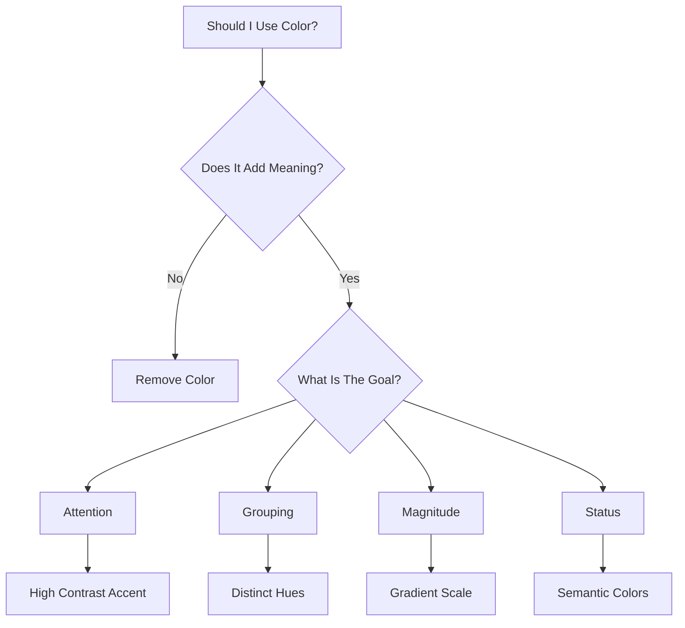

# Ask These Questions Before Using Color

```mermaid
flowchart TD
    A[Should I Use Color?] --> B{Does It Add Meaning?}
    
    B -->|No| C[Remove Color]
    
    B -->|Yes| D{What Is The Goal?}
    
    D --> E[Attention]
    D --> F[Grouping]
    D --> G[Magnitude]
    D --> H[Status]
    
    E --> I[High Contrast Accent]
    F --> J[Distinct Hues]
    G --> K[Gradient Scale]
    H --> L[Semantic Colors]
```
