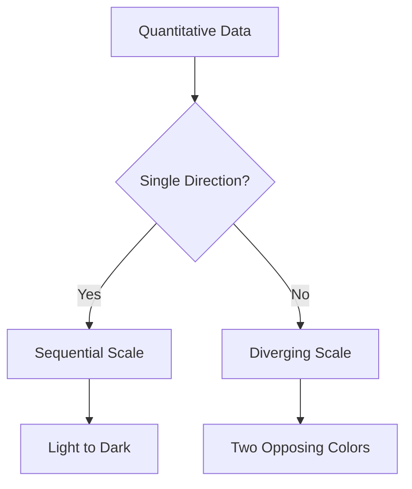

# Decision Rule for Quantitative Data

```mermaid
flowchart TD
    A[Quantitative Data] --> B{Single Direction?}
    
    B -->|Yes| C[Sequential Scale]
    B -->|No| D[Diverging Scale]
    
    C --> E[Light to Dark]
    D --> F[Two Opposing Colors]
```
