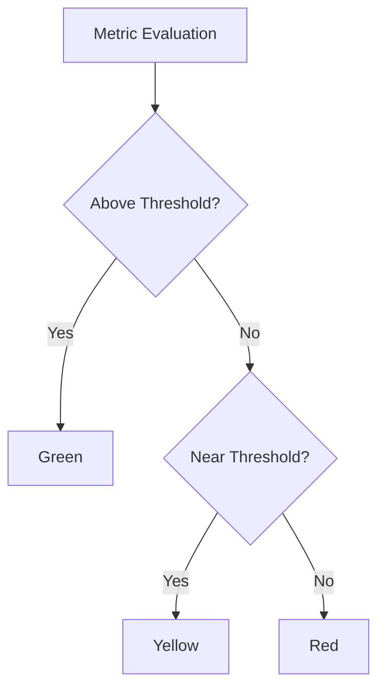

# Status Indicator Decision Tree

```mermaid
flowchart TD
    A[Metric Evaluation] --> B{Above Threshold?}
    
    B -->|Yes| C[Green]
    B -->|No| D{Near Threshold?}
    
    D -->|Yes| E[Yellow]
    D -->|No| F[Red]
```
