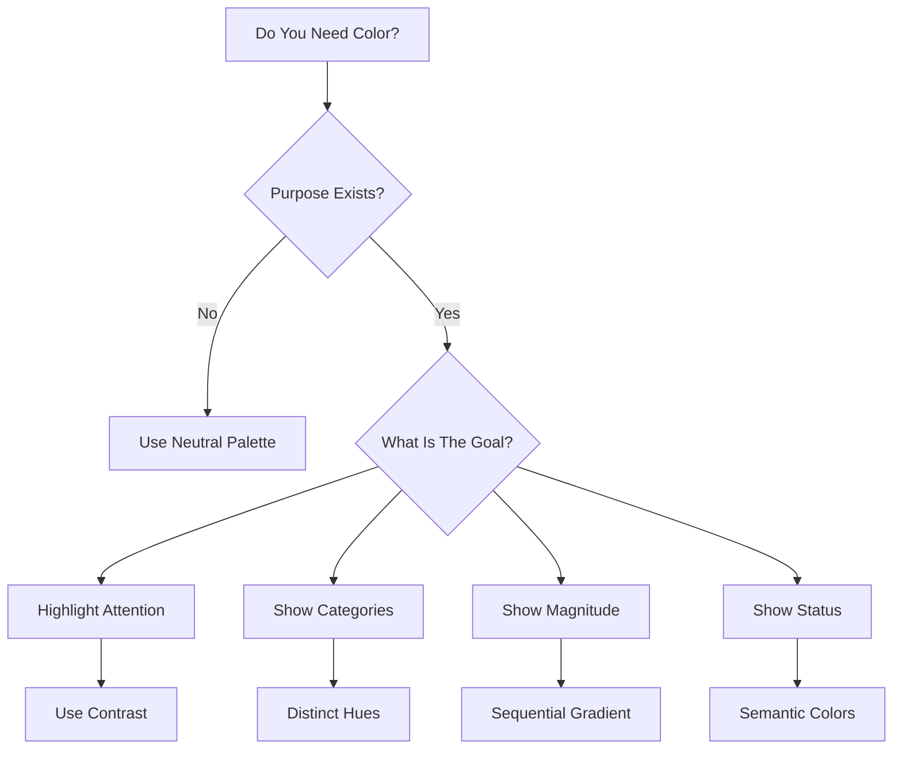

# Strategic Color Usage Framework

A useful mental model:

```mermaid
flowchart TD
    A[Do You Need Color?] --> B{Purpose Exists?}
    
    B -->|No| C[Use Neutral Palette]
    B -->|Yes| D{What Is The Goal?}
    
    D --> E[Highlight Attention]
    D --> F[Show Categories]
    D --> G[Show Magnitude]
    D --> H[Show Status]
    
    E --> I[Use Contrast]
    F --> J[Distinct Hues]
    G --> K[Sequential Gradient]
    H --> L[Semantic Colors]
```
