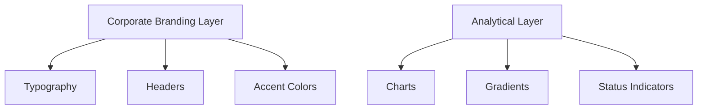

# Balanced Design Pattern

```mermaid
flowchart TD
    A[Corporate Branding Layer]
    
    A --> B[Typography]
    A --> C[Headers]
    A --> D[Accent Colors]
    
    E[Analytical Layer]
    
    E --> F[Charts]
    E --> G[Gradients]
    E --> H[Status Indicators]
```
