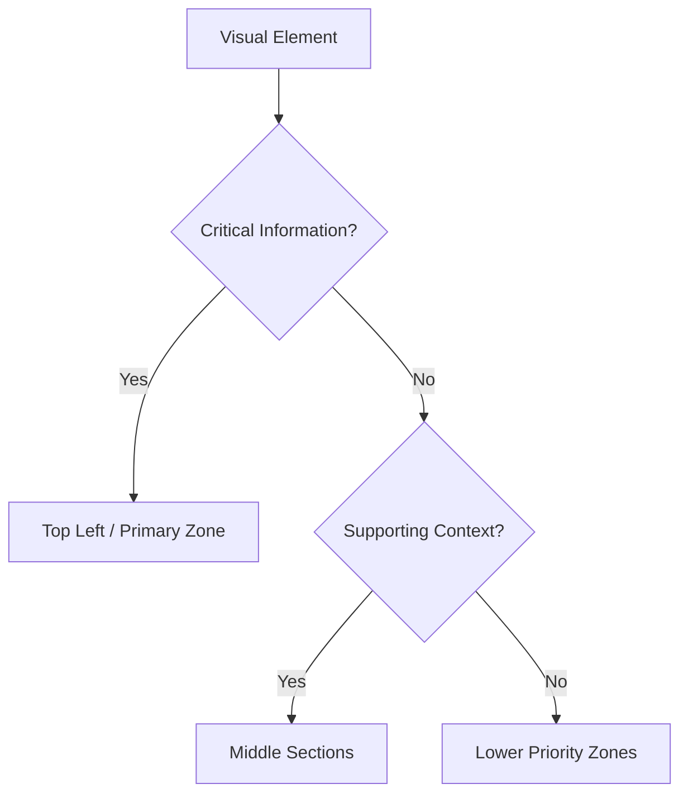

# Dashboard Positioning Decision Tree

```mermaid
flowchart TD
    A[Visual Element] --> B{Critical Information?}
    
    B -->|Yes| C[Top Left / Primary Zone]
    
    B -->|No| D{Supporting Context?}
    
    D -->|Yes| E[Middle Sections]
    
    D -->|No| F[Lower Priority Zones]
```
