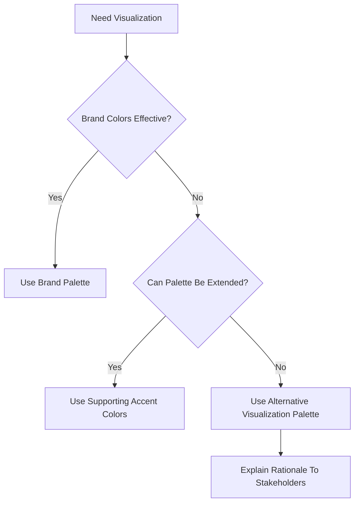

# Real-World Visualization Decision Tree

```mermaid
flowchart TD
    A[Need Visualization] --> B{Brand Colors Effective?}
    
    B -->|Yes| C[Use Brand Palette]
    
    B -->|No| D{Can Palette Be Extended?}
    
    D -->|Yes| E[Use Supporting Accent Colors]
    
    D -->|No| F[Use Alternative Visualization Palette]
    
    F --> G[Explain Rationale To Stakeholders]
```
