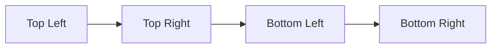

# Z-Pattern Reading Flow

```mermaid
flowchart LR
    A[Top Left] --> B[Top Right]
    B --> C[Bottom Left]
    C --> D[Bottom Right]
```

This is one of the foundational concepts in:

- UX design
    
- dashboard design
    
- web design
    
- slide design
    
- eye-tracking research
