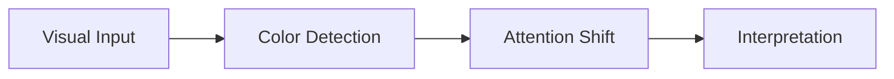
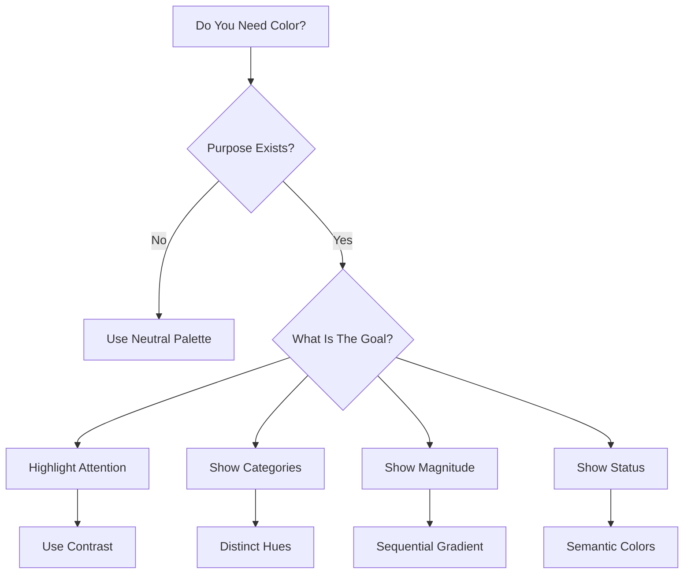
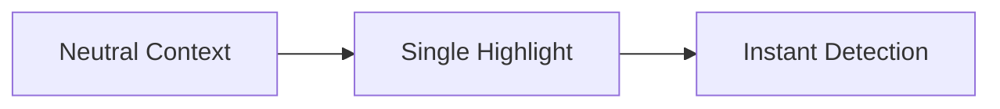
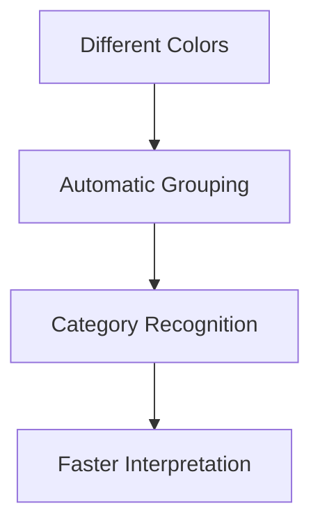
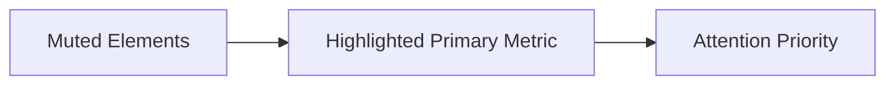
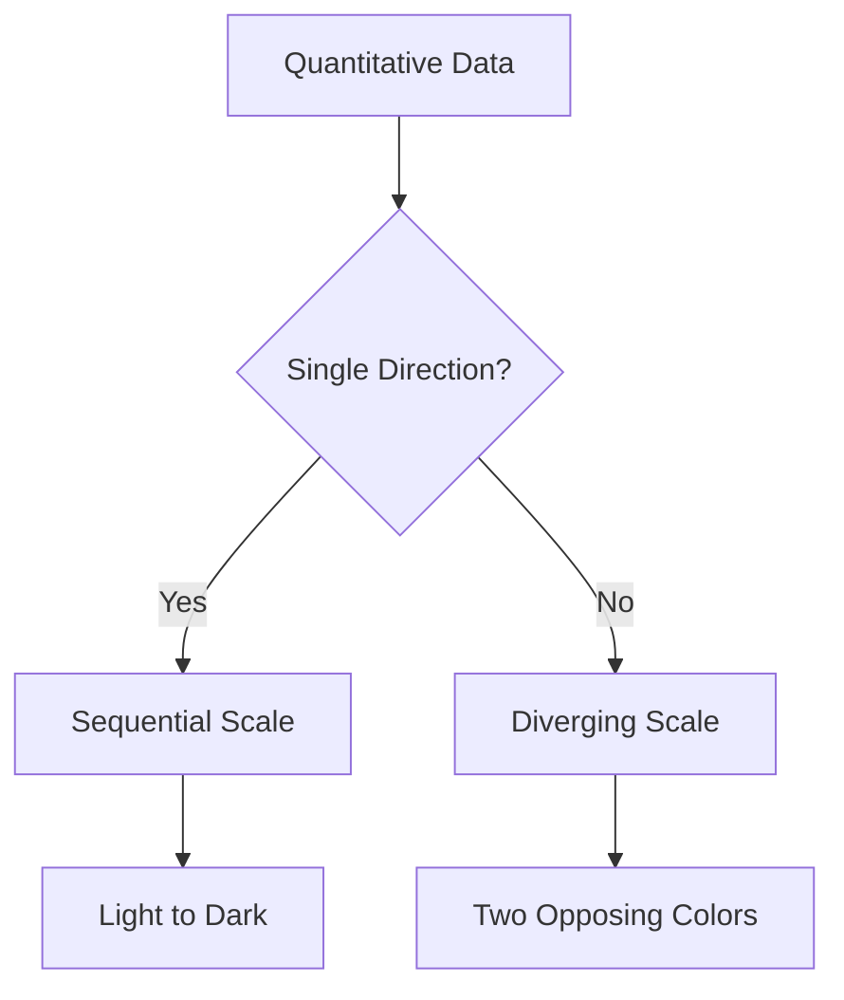
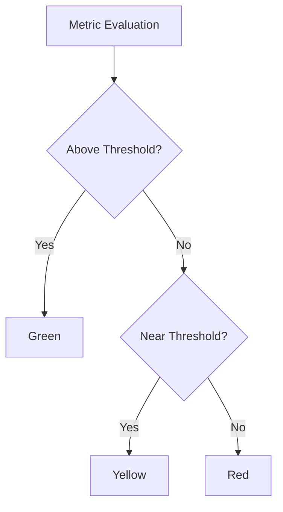
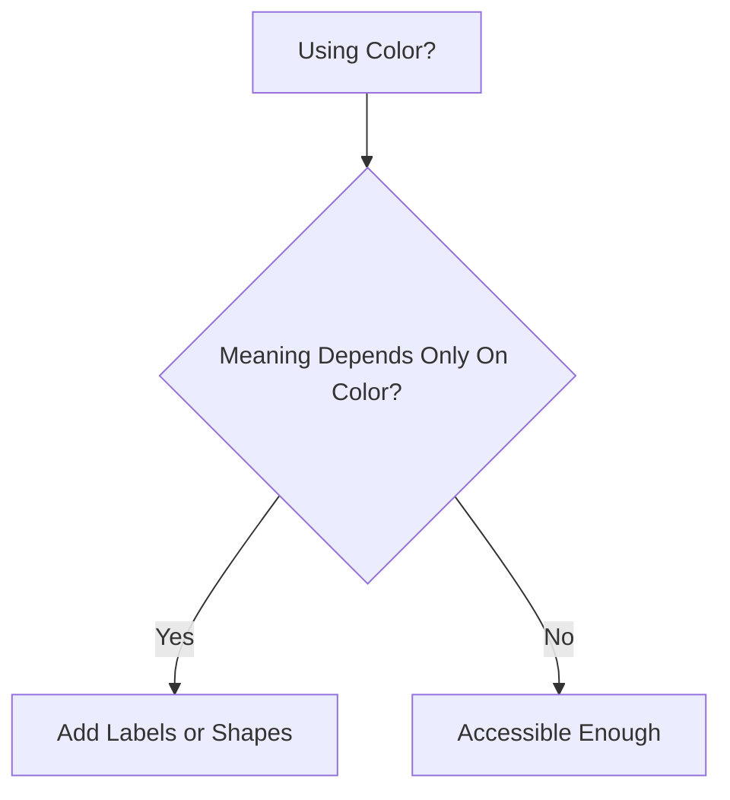
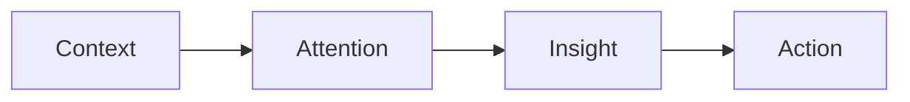
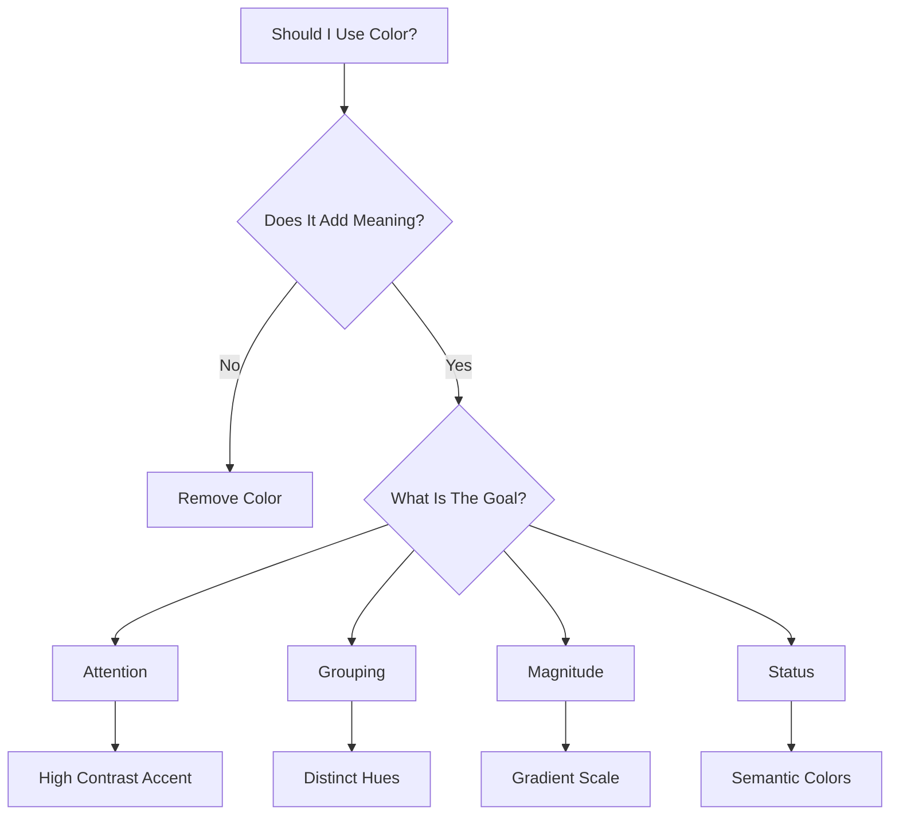

# Strategic Use of Color in Visualizations

Color is one of the most powerful tools in data visualization.

It can:

- direct attention
    
- establish hierarchy
    
- communicate meaning
    
- create emotional response
    
- organize information
    
- reduce cognitive load
    
- improve recall
    

But color is also one of the most misused elements in visualization design.

Most poor dashboards fail because color is treated as decoration instead of communication.

The transcript introduces a very important idea:

> Color must be used strategically, not aesthetically alone.

Good visualizations use color intentionally.

Bad visualizations use color excessively.

# Why Color Matters So Much

Human vision is highly sensitive to color differences.

Color processing happens very early in the perceptual pipeline through:

- iconic memory
    
- pre-attentive processing
    
- automatic visual detection
    

This means color can guide attention almost instantly.



This is why highlighted elements immediately stand out in dashboards.

# Color Is a Pre-Attentive Attribute

Color is processed before conscious thinking.

This means users notice color differences:

- faster than text
    
- faster than labels
    
- faster than numerical comparisons
    

Example:

- one red bar among gray bars
    
- one cyan KPI among white text
    
- one highlighted trend line
    

These are instantly perceived.

# The Core Purpose of Color in Visualization

Color should primarily serve one of these purposes:

|Purpose|Explanation|
|---|---|
|Attention|Highlight important elements|
|Grouping|Categorize related data|
|Hierarchy|Show priority|
|Meaning|Encode information|
|Emotion|Influence perception|
|Status|Indicate conditions|
|Comparison|Differentiate variables|

# Color Is NOT Primarily for Decoration

This is one of the biggest misconceptions.

Bad dashboards often:

- use random gradients
    
- apply excessive neon palettes
    
- color every chart differently
    
- overload saturation
    

Result:

```text
Visual noise
```

instead of clarity.

# Visualization Design Principle

```text
Every color choice should have communicative intent.
```

# The Psychology of Color

Humans associate colors with meanings through:

- culture
    
- experience
    
- long-term memory
    
- environmental conditioning
    

These associations influence interpretation.

# Common Color Associations

|Color|Typical Meaning|
|---|---|
|Red|Danger, loss, warning|
|Green|Growth, success|
|Blue|Trust, stability|
|Yellow|Attention, caution|
|Gray|Neutrality|
|Black|Authority, seriousness|

These are not universal, but they are deeply ingrained in many contexts.

# Why This Matters

If profit is shown in red:

users may subconsciously interpret it negatively.

Even if the data is positive.

# Cognitive Impact of Color

Color affects:

- scanning speed
    
- attention allocation
    
- memory recall
    
- emotional interpretation
    
- perceived importance
    

This means color directly affects decision-making quality.

# Strategic Color Usage Framework

A useful mental model:



# 1. Using Color for Attention

One of the most important uses.

## Goal

Guide the audience toward the most important information.

## Technique

Keep most elements neutral.

Highlight only critical elements.

# Example

## Bad

- every bar different color
    
- every KPI highlighted
    
- every card saturated
    

No visual hierarchy exists.

## Good

- all bars gray
    
- one critical bar cyan
    
- one anomaly highlighted red
    

Immediate focus emerges.

# Attention Design Pattern



# Important Principle

```text
Contrast creates attention.
```

Not brightness alone.

# 2. Using Color for Categorization

Color can separate groups automatically.

This leverages:

- Gestalt similarity principles
    
- pre-attentive grouping
    
- iconic memory
    

# Example

Scatter plot:

- blue dots = Segment A
    
- yellow dots = Segment B
    
- cyan dots = Segment C
    

The brain instantly forms categories.

# Categorization Workflow



# Important Constraint

Humans can only reliably distinguish limited categories simultaneously.

Recommended:

|Number of Categories|Recommended?|
|---|---|
|2-5|Excellent|
|6-8|Acceptable|
|9+|Difficult|

Too many colors create confusion.

# 3. Using Color for Hierarchy

Color intensity can establish importance.

## Example

- muted secondary metrics
    
- bright primary KPI
    
- faded background context
    

The eye naturally prioritizes stronger contrast.

# Hierarchy Design



# 4. Using Color for Magnitude

Color gradients can represent numerical intensity.

Examples:

- heatmaps
    
- choropleth maps
    
- density maps
    

# Sequential Color Scale

```text
Light → Medium → Dark
```

indicates increasing magnitude.

# Example

|Color Intensity|Meaning|
|---|---|
|Light Blue|Low sales|
|Medium Blue|Medium sales|
|Dark Blue|High sales|

# Decision Rule for Quantitative Data



# Sequential vs Diverging Color Scales

# Sequential Scale

Used when values increase in one direction.

Example:

- population
    
- revenue
    
- temperature
    

# Diverging Scale

Used when values diverge around a midpoint.

Example:

- profit vs loss
    
- positive vs negative growth
    
- variance from target
    

Typical structure:

```text
Red ← Neutral → Green
```

# 5. Using Color for Status Communication

Extremely common in dashboards.

# Examples

|Color|Status|
|---|---|
|Green|Healthy|
|Yellow|Warning|
|Red|Critical|

This works because long-term memory already associates these meanings.

# Status Indicator Decision Tree



# The Danger of Overusing Color

The transcript warns against overusing pre-attentive attributes.

Color is especially vulnerable to this problem.

# What Happens When Everything Is Colorful

```text
No hierarchy
No focus
No clarity
```

# Common Dashboard Mistakes

|Mistake|Result|
|---|---|
|Too many colors|Cognitive overload|
|Random colors|Meaning confusion|
|Excessive saturation|Visual fatigue|
|Inconsistent encoding|Interpretation errors|
|Neon palettes|Reduced readability|

# Color Saturation Problem

Highly saturated dashboards feel visually exhausting.

Good dashboards often use:

- muted backgrounds
    
- restrained palettes
    
- selective accents
    

This creates stronger emphasis when highlights appear.

# Practical Color Strategy

# Recommended Dashboard Palette Structure

|Role|Color Strategy|
|---|---|
|Background|Neutral|
|Context Data|Muted|
|Primary KPI|Accent color|
|Alerts|Semantic colors|
|Highlights|Rare, intentional|

# Example Palette Strategy

```text
80% Neutral
15% Secondary Accent
5% Highlight
```

This creates strong visual hierarchy.

# Color and Accessibility

One major issue:

Not all users perceive color equally.

Colorblindness affects many users.

# Dangerous Practice

Using only color to communicate meaning.

Example:

```text
Red = Bad
Green = Good
```

without labels or shapes.

Some users cannot distinguish them properly.

# Better Approach

Combine:

- color
    
- icons
    
- labels
    
- shapes
    
- patterns
    

# Accessibility Decision Tree



# Color and Cognitive Load

Too many colors increase:

- scanning complexity
    
- interpretation difficulty
    
- working memory burden
    

This is why elite dashboards often appear visually restrained.

# Why Minimalism Works

Minimal dashboards:

- reduce distraction
    
- improve focus
    
- improve scanning speed
    
- strengthen emphasis
    

# Important Principle

```text
Color gains power through restraint.
```

# Color in Storytelling

Good storytelling uses color progression intentionally.

Example:

- neutral context
    
- highlighted turning point
    
- emphasized conclusion
    

Color guides narrative flow.

# Narrative Flow with Color



# Real-World Dashboard Example

# Poor Dashboard

- 12 bright colors
    
- gradient backgrounds
    
- animated widgets
    
- inconsistent category colors
    
- multiple saturated charts
    

Result:

```text
High cognitive friction
```

# Good Dashboard

- dark neutral background
    
- restrained palette
    
- one cyan accent
    
- one yellow warning
    
- consistent category mapping
    

Result:

```text
Fast comprehension
```

# Advanced Insight: Color Creates Visual Weight

Objects with stronger color appear:

- more important
    
- closer
    
- heavier
    
- more dominant
    

This affects perception subconsciously.

# Example

A bright cyan KPI card among gray cards feels more important even before reading the value.

# Color Consistency Principle

Never change meaning of colors across charts.

Bad:

- blue = sales in one chart
    
- blue = expenses in another
    

This forces memory remapping.

Good:

- consistent semantic encoding everywhere
    

# Final Design Framework

# Ask These Questions Before Using Color



# Final Takeaways

## Color should:

- reduce cognitive effort
    
- guide attention
    
- reinforce meaning
    
- establish hierarchy
    
- support storytelling
    

## Color should NOT:

- decorate randomly
    
- overwhelm the viewer
    
- replace clarity
    
- create visual noise
    

# Most Important Principle

```text
Strategic color usage is controlled attention engineering.
```

not aesthetic decoration.