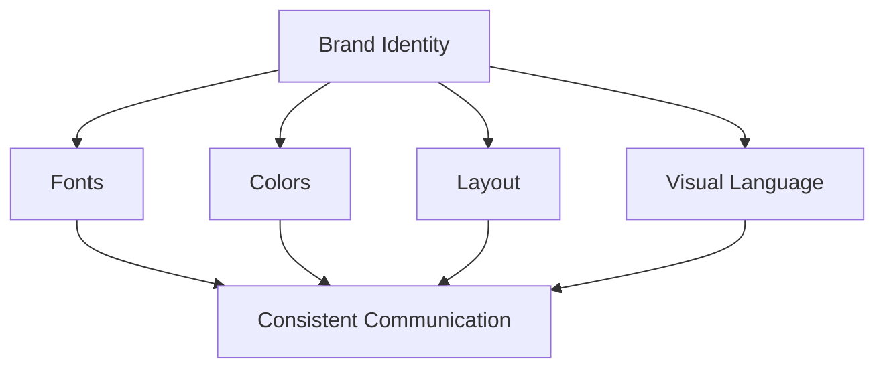
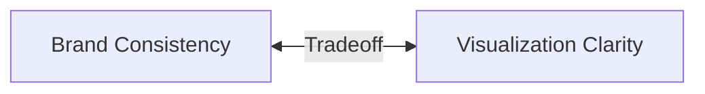
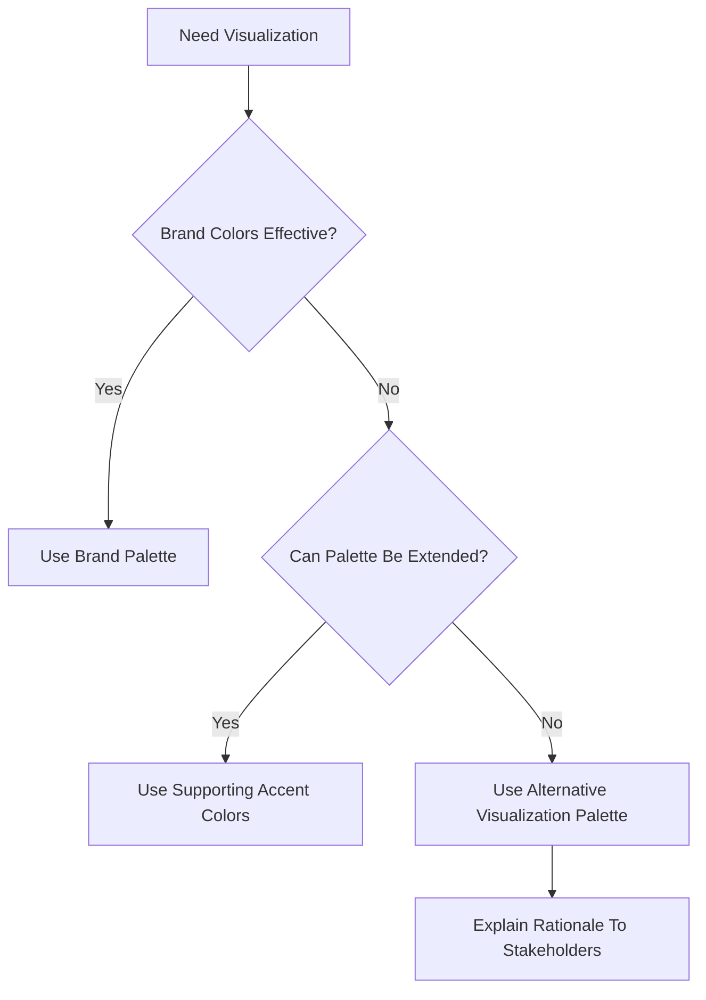
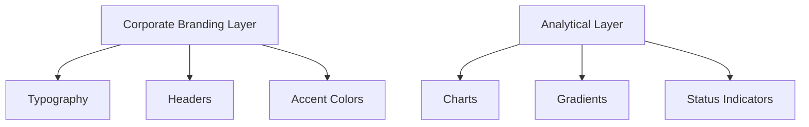
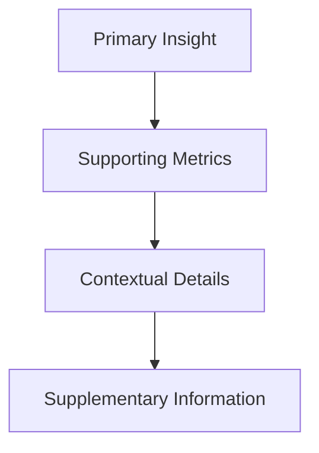
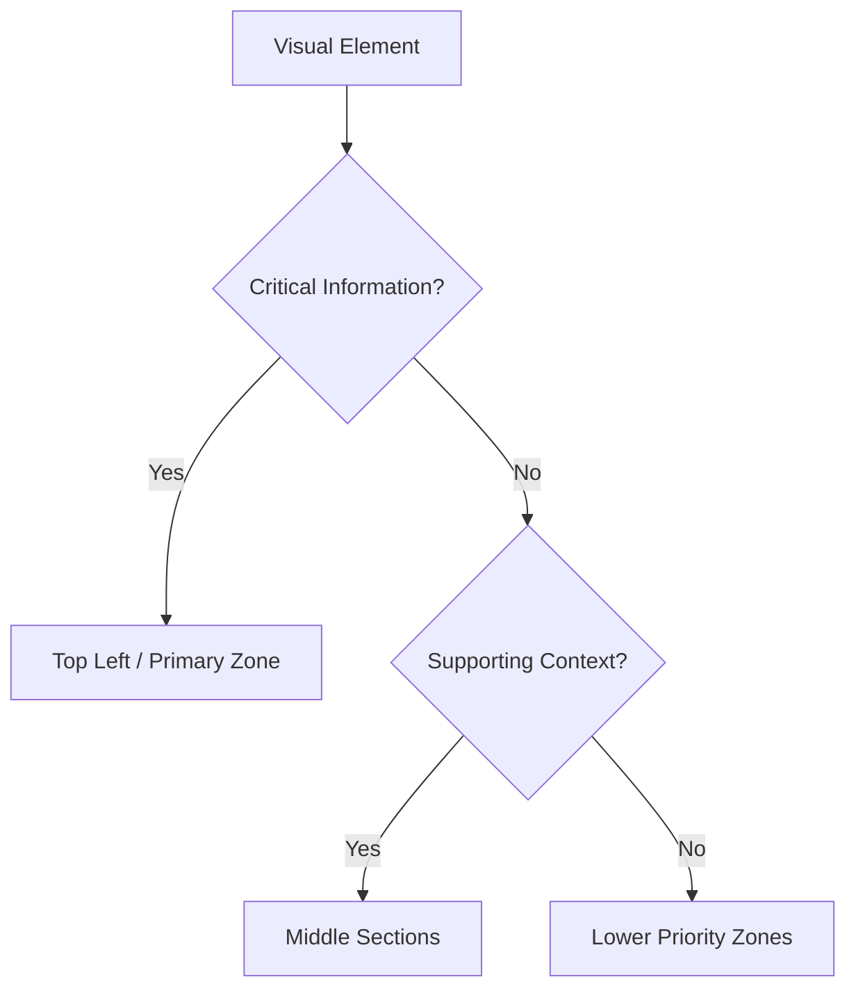
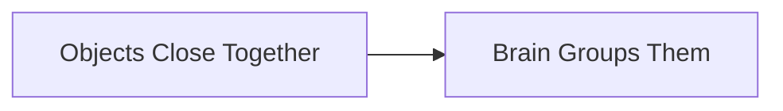
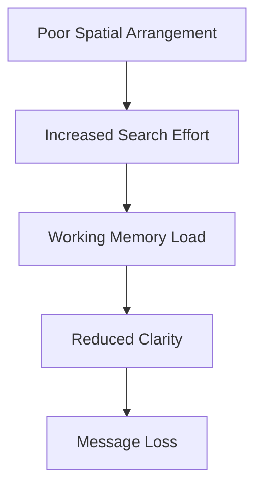
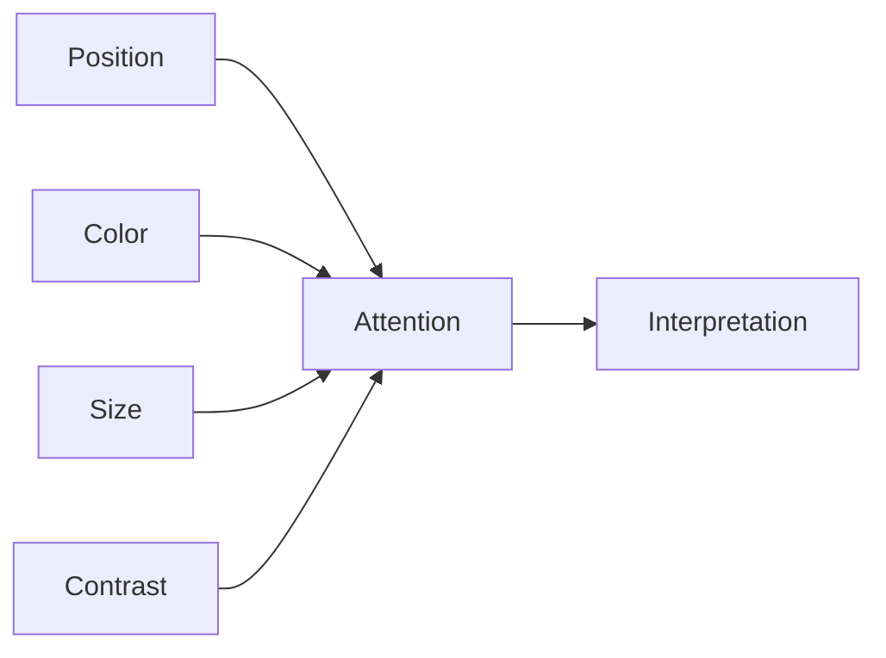
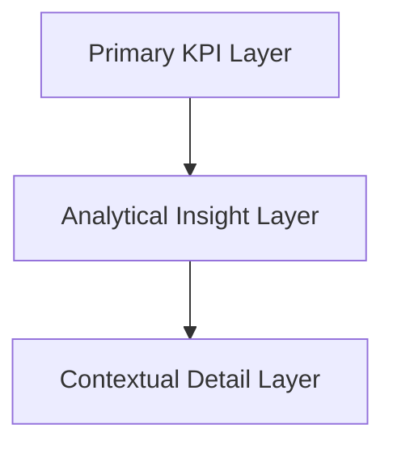

## Strategic Use of Brand Colors and Positioning in Visual Design

This section moves from general visualization principles into a highly practical corporate reality:

```text
How do you balance brand identity with visualization clarity?
```

This is one of the most overlooked tensions in real-world dashboard and presentation design.

Academic visualization theory often assumes:

- ideal color palettes
    
- perfect accessibility
    
- unrestricted design freedom
    

Real organizations do not work like that.

In enterprises:

- brand guidelines exist
    
- font systems are fixed
    
- approved color palettes are enforced
    
- presentation templates are standardized
    

Therefore visualization design becomes a tradeoff between:

- brand consistency
    
- cognitive efficiency
    
- visual clarity
    
- communication effectiveness
    

The transcript introduces this challenge directly.

## The Reality of Corporate Visualization

Most organizations enforce:

- typography standards
    
- brand palettes
    
- logo spacing
    
- presentation layouts
    
- communication guidelines
    

Examples include:

- consulting firms
    
- financial institutions
    
- technology companies
    
- healthcare organizations
    
- government agencies
    

The transcript mentions onboarding processes where employees are taught:

- approved fonts
    
- approved colors
    
- approved document styles
    

This is extremely common in enterprise environments.

## Why Companies Enforce Brand Consistency

Brand systems create:

- recognition
    
- trust
    
- consistency
    
- professionalism
    
- organizational identity
    

## Brand Identity System



## The Visualization Problem

The issue is:

```text
Brand colors are not always optimal for data visualization.
```

This is a critical insight.

A company's marketing palette may work beautifully for:

- websites
    
- logos
    
- advertisements
    

but fail completely in:

- dashboards
    
- heatmaps
    
- analytical charts
    
- dense reporting environments
    

## Example Problem

Imagine a brand palette containing:

- dark navy
    
- muted gray
    
- pale gold
    

Looks elegant for branding.

But terrible for:

- categorical differentiation
    
- heatmaps
    
- contrast-heavy dashboards
    
- accessibility
    

## The Core Tradeoff

The transcript frames visualization design as a strategic compromise.



The analyst must decide:

- when to preserve branding
    
- when to optimize readability
    
- when to introduce alternative colors
    

## Real-World Visualization Decision Tree



## Important Professional Insight

Good analysts are not merely chart creators.

They are:

```text
communication negotiators
```

between:

- branding
    
- usability
    
- cognition
    
- stakeholder expectations
    

## Practical Corporate Design Strategy

## Recommended Approach

Instead of using brand colors everywhere:

## Use Brand Colors For

- titles
    
- headers
    
- accents
    
- key highlights
    
- identity framing
    

## Use Visualization-Optimized Colors For

- categories
    
- gradients
    
- comparisons
    
- heatmaps
    
- analytical layers
    

## Balanced Design Pattern



## Example

## Bad Approach

Force brand palette everywhere.

Result:

- poor contrast
    
- indistinguishable categories
    
- accessibility problems
    
- visual confusion
    

## Better Approach

- use brand blue in headings
    
- use neutral dashboard palette
    
- use analytical colors where necessary
    

Result:

- branding preserved
    
- readability maintained
    

## Important Visualization Principle

```text
Branding should support communication, not damage it.
```

## Stakeholder Communication

The transcript introduces another subtle but critical skill:

Sometimes you must justify visualization choices.

Example:

```text
"This palette improves interpretability and accessibility while remaining aligned with brand aesthetics."
```

This is a real enterprise skill.

Strong analysts often need to defend:

- accessibility decisions
    
- reduced branding saturation
    
- simpler layouts
    
- analytical color scales
    

against marketing or leadership preferences.

## Positioning in Visualization Design

The transcript then shifts into positioning.

This is one of the most important topics in cognitive visualization design.

## What Is Positioning?

Positioning refers to:

```text
The spatial arrangement of visual elements within limited space.
```

Visualization is fundamentally spatial communication.

Every dashboard contains competing elements:

- charts
    
- labels
    
- legends
    
- annotations
    
- KPIs
    
- callouts
    
- filters
    
- whitespace
    

All competing for attention.

## Positioning Is Attention Engineering

The placement of elements determines:

- what users notice first
    
- reading flow
    
- interpretation order
    
- cognitive effort
    

## Human Visual Reading Pattern

The transcript introduces the standard scanning pattern.

Humans generally read:

- top to bottom
    
- left to right
    

creating a Z-pattern.

## Z-Pattern Reading Flow


This is one of the foundational concepts in:

- UX design
    
- dashboard design
    
- web design
    
- slide design
    
- eye-tracking research
    

## Why This Matters

Users naturally allocate attention according to spatial expectations.

Violating these expectations increases:

- cognitive load
    
- scanning effort
    
- interpretation delay
    

## Good Positioning Strategy

Place:

- most important insight first
    
- supporting detail later
    
- contextual information last
    

## Information Hierarchy Model



## Core Principle

```text
Position determines perceived importance.
```

## Examples

## Poor Layout

- critical KPI at bottom-right
    
- legends detached from charts
    
- filters interrupt reading flow
    
- inconsistent spacing
    

Result:

```text
Fragmented cognition
```

## Good Layout

- key metric top-left
    
- logical grouping
    
- aligned visual flow
    
- progressive detail downward
    

Result:

```text
Natural interpretation
```

## Why Top-Left Matters

Eye-tracking research consistently shows:

Users usually begin scanning near the top-left region.

Therefore:

- headlines
    
- primary KPIs
    
- key conclusions
    

should often appear there.

## Dashboard Positioning Decision Tree



## Spatial Relationships Matter

Objects placed close together are perceived as related.

This connects directly to Gestalt principles.

## Gestalt Principle of Proximity



## Example

If:

- revenue chart
    
- revenue KPI
    
- revenue commentary
    

are spatially grouped,

the brain interprets them as one conceptual unit.

## Poor Positioning Creates Cognitive Friction

Examples:

- disconnected legends
    
- scattered metrics
    
- misaligned labels
    
- inconsistent spacing
    

force users to mentally reconstruct relationships.

## Visualization Goal

```text
The layout should explain itself without verbal guidance.
```

The transcript explicitly emphasizes this.

Users should intuitively understand the visualization even when the designer is absent.

## This Is a Huge Professional Insight

A dashboard should not require:

- live explanation
    
- walkthroughs
    
- training sessions
    
- excessive documentation
    

Good positioning reduces explanation dependency.

## Natural vs Counterintuitive Flow

The transcript warns against:

- right-to-left layouts
    
- bottom-to-top hierarchy
    
- unconventional sequencing
    

unless intentionally justified.

## Why Counterintuitive Layouts Fail

Humans possess learned spatial expectations.

Violating them forces:

- additional mental translation
    
- increased processing effort
    
- slower comprehension
    

## Cognitive Cost of Bad Layout



## Positioning + Pre-Attentive Attributes

The transcript finally combines:

- positioning
    
- color
    
- size
    
- hierarchy
    
- attention cues
    

into one integrated design philosophy.

## Integrated Attention Model



## Important Advanced Insight

Position often matters more than color.

Even without strong color:

- top placement
    
- large size
    
- whitespace isolation
    

can strongly direct attention.

## Strategic Dashboard Layout Framework

## Layer 1: Attention Zone

Contains:

- headline insight
    
- key KPI
    
- summary conclusion
    

## Layer 2: Analytical Zone

Contains:

- trends
    
- comparisons
    
- segment analysis
    

## Layer 3: Context Zone

Contains:

- methodology
    
- definitions
    
- supplementary details
    

## Dashboard Structure Model



## Most Important Principle

The transcript ends with one of the strongest visualization principles:

```text
Design visuals that feel natural and intuitive.
```

## Why This Matters

The best visualizations feel:

- obvious
    
- effortless
    
- self-explanatory
    

Users should focus on:

```text
understanding the insight
```

not figuring out the interface.

## Final Mental Model

Think of visualization positioning as:

```text
spatial choreography of attention
```

where every element competes for cognitive bandwidth.

## Final Takeaways

## Brand Colors

- preserve identity
    
- maintain professionalism
    
- require strategic adaptation
    
- should not compromise readability
    

## Positioning

- controls attention flow
    
- determines interpretation order
    
- affects cognitive load
    
- shapes narrative clarity
    

## Best Practice

Combine:

- restrained color usage
    
- logical positioning
    
- pre-attentive attributes
    
- intuitive hierarchy
    

to create:

```text
low-friction cognitive communication
```

Tags: #statistics #machine-learning #data-science #statistical-modelling