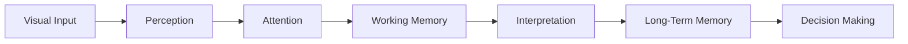

# The Information Processing Pipeline

The transcript indirectly refers to a broader cognitive pipeline.



Every stage has bottlenecks.

The biggest bottleneck is usually:

```text
Working Memory
```
