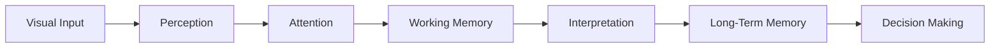
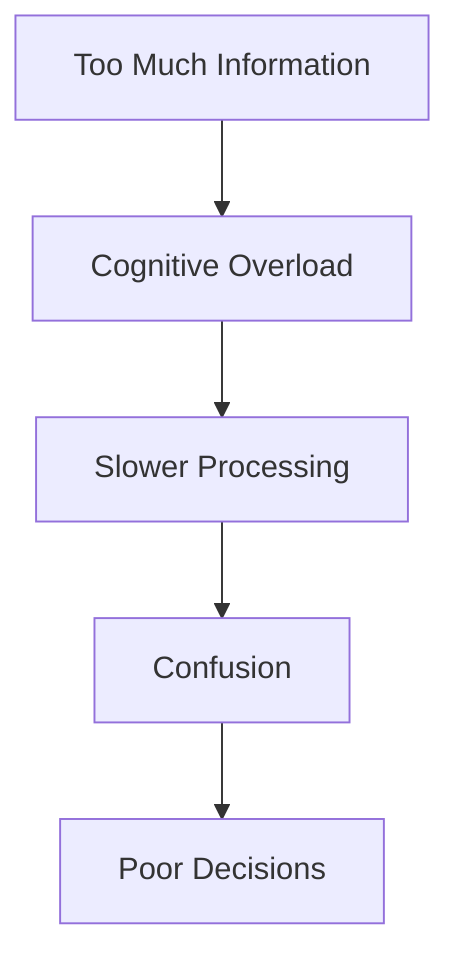
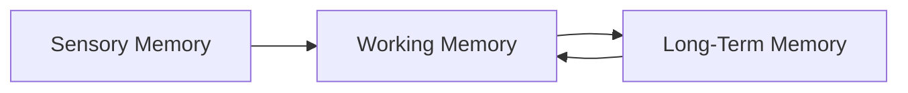
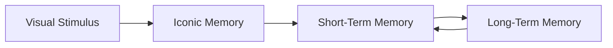
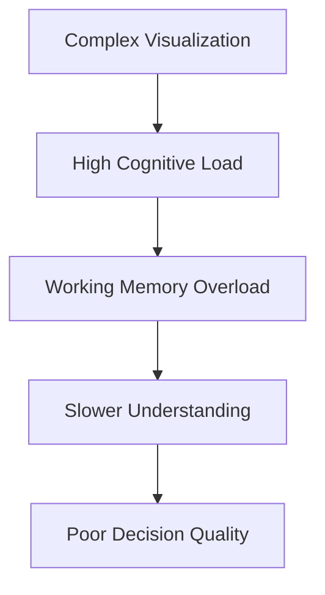

## Types of Memory in Data Visualization

When designing data visualizations, one of the biggest mistakes people make is assuming the audience has unlimited cognitive capacity.

They do not.

A visualization is not just about displaying data. It is about controlling how information moves through the human perceptual and memory system.

This is why effective visualization design is deeply connected to cognitive psychology, especially memory systems.

The transcript introduces a critical idea:

> Good visualizations are audience-centric, not data-centric.

That means:

- We do not design visuals merely to display maximum information
    
- We design visuals according to how humans perceive, process, retain, and recall information
    

The role of memory becomes central because every chart, dashboard, slide, infographic, or report competes against the limitations of human cognition.

## Why Memory Matters in Visualization

A visualization succeeds only if the audience can:

1. Notice important information
    
2. Process it quickly
    
3. Retain it briefly
    
4. Connect it with existing knowledge
    
5. Recall the insight later
    

Poor visual design overloads memory.

Good visual design reduces memory burden.

This is one of the foundational principles of modern UX design, dashboard engineering, cognitive design, and storytelling.

## Core Principle

Human memory is limited.

Therefore:

- Visualizations should minimize unnecessary cognitive effort
    
- Important information should be immediately visible
    
- Users should not be forced to remember too many elements simultaneously
    
- Design should support perception instead of fighting it
    

## The Information Processing Pipeline

The transcript indirectly refers to a broader cognitive pipeline.



Every stage has bottlenecks.

The biggest bottleneck is usually:

```text
Working Memory
```

## Major Types of Memory Relevant to Visualization

There are three primary memory systems relevant here:

|Memory Type|Purpose|Duration|Capacity|
|---|---|---|---|
|Sensory Memory|Holds raw sensory input|Milliseconds to seconds|Very large|
|Working (Short-Term) Memory|Active thinking and processing|Seconds|Very limited|
|Long-Term Memory|Stores learned knowledge|Potentially lifelong|Very large|

## 1. Sensory Memory

## Definition

Sensory memory is the ultra-short-term storage system that briefly holds incoming sensory information.

Before conscious thinking happens, the brain temporarily stores what the eyes see.

This is the first stage of perception.

## In Visualization

When a user first looks at a dashboard:

- colors
    
- shapes
    
- contrast
    
- position
    
- motion
    
- orientation
    

are first registered in sensory memory.

This happens almost instantly.

## Key Characteristics

|Property|Description|
|---|---|
|Duration|Extremely short|
|Processing|Automatic|
|Conscious?|Mostly unconscious|
|Purpose|Initial detection|

## Example

If one bar in a chart is bright cyan while all others are gray:

- sensory memory instantly detects the difference
    
- attention shifts automatically
    

This is where pre-attentive attributes operate.

## Connection to Pre-Attentive Processing

Pre-attentive attributes are visual properties processed automatically before conscious attention.

Examples:

- color
    
- size
    
- orientation
    
- shape
    
- motion
    
- intensity
    
- spatial grouping
    

The transcript introduces this concept because pre-attentive processing helps reduce memory burden.

Instead of forcing users to search consciously, the visualization guides attention automatically.

## Example

## Bad Design

```text
All bars same color
No emphasis
User searches manually
```

## Good Design

```text
One important bar highlighted in cyan
Immediate recognition
Minimal cognitive effort
```

## Sensory Memory Design Implications

## Effective Practices

### Use contrast strategically

Important elements should visually stand apart.

### Use limited highlight colors

Too many colors destroy salience.

### Use whitespace

Clutter interferes with rapid sensory detection.

### Establish hierarchy

The eye should know where to look first.

## 2. Working Memory (Short-Term Memory)

## Definition

Working memory is the system responsible for actively processing information.

This is where thinking happens.

When users compare values, interpret trends, or analyze relationships, they are using working memory.

## Why Working Memory Is Critical

Working memory is extremely limited.

Classic psychology research suggested:

```text
7 ± 2 items
```

Modern research suggests:

```text
Closer to 4 chunks
```

This means humans can only actively process a small amount of information simultaneously.

## This Is the Biggest Constraint in Dashboard Design

Most bad dashboards fail because they overload working memory.

Examples:

- too many charts
    
- too many colors
    
- too many KPIs
    
- excessive labels
    
- complicated legends
    
- dense tables
    
- unnecessary dimensions
    

## Working Memory Overload



## Example of Poor Design

Imagine:

- 12 pie charts
    
- 15 colors
    
- scrolling dashboard
    
- tiny labels
    
- multiple filters
    
- inconsistent formatting
    

The audience must constantly remember:

- what colors mean
    
- previous chart values
    
- legend mappings
    
- filter state
    
- metric definitions
    

This exhausts working memory.

## Example of Good Design

A better dashboard:

- highlights only key metrics
    
- groups related visuals
    
- uses consistent colors
    
- minimizes legends
    
- provides visual hierarchy
    

This reduces mental effort.

## Cognitive Load

Working memory limitations lead directly to the idea of:

```text
Cognitive Load
```

## Types of Cognitive Load

|Type|Meaning|
|---|---|
|Intrinsic Load|Complexity of the content itself|
|Extraneous Load|Unnecessary design difficulty|
|Germane Load|Useful mental effort for learning|

Good visualization design minimizes:

```text
Extraneous Load
```

## Visualization Goal

Do not make the user think harder than necessary.

## Important Design Principle

## Recognition over Recall

Humans recognize information more easily than recalling it from memory.

Therefore:

Good dashboards should avoid forcing users to remember things.

## Example

## Bad

```text
User must remember what blue represented from another chart
```

## Good

```text
Labels appear directly near data
```

This is why:

- direct labeling is superior to legends
    
- grouped layouts are superior to scattered layouts
    
- consistent color encoding matters
    

## Chunking

Working memory improves when information is grouped meaningfully.

This is called:

```text
Chunking
```

## Example

Instead of:

```text
Revenue
Profit
Margin
Growth
Cost
Retention
Churn
```

Group into:

## Financial Metrics

- Revenue
    
- Profit
    
- Margin
    

## Customer Metrics

- Retention
    
- Churn
    

Now the brain processes fewer conceptual chunks.

## Visualization Chunking

Good dashboards often use:

- cards
    
- containers
    
- sections
    
- spacing
    
- alignment
    

to visually chunk information.

## 3. Long-Term Memory

## Definition

Long-term memory stores accumulated knowledge, experiences, patterns, and learned associations.

This is where expertise lives.

## Why Long-Term Memory Matters

Users interpret visualizations using existing knowledge.

A CFO sees a revenue chart differently than a new intern.

Why?

Because prior knowledge changes interpretation.

## Visualization Depends on Learned Conventions

Examples:

|Visual Pattern|Learned Meaning|
|---|---|
|Red|Danger/loss|
|Green|Growth/success|
|Upward trend|Improvement|
|Larger object|Importance|

These interpretations come from long-term memory.

## Mental Models

Users already possess internal expectations about:

- charts
    
- layouts
    
- colors
    
- business metrics
    
- timelines
    

Violating these expectations increases confusion.

## Example

If profit is shown in red and loss in green:

users may misinterpret the chart.

Because long-term memory already associates:

```text
Green = positive
Red = negative
```

## Pattern Recognition

Experts use long-term memory to identify patterns rapidly.

Experienced analysts instantly notice:

- anomalies
    
- seasonality
    
- outliers
    
- correlations
    

because their memory stores prior patterns.

## Storytelling and Long-Term Memory

Good visual storytelling helps information move into long-term memory.

This happens when:

- insights are emotionally meaningful
    
- visuals are simple
    
- patterns are obvious
    
- narratives are coherent
    

## Why Simplicity Improves Retention

Complex visuals are harder to encode into long-term memory.

Simple visuals:

- reduce processing effort
    
- improve comprehension
    
- improve recall
    

## Relationship Between Memory Systems



Important insight:

Long-term memory also assists working memory.

Experts process information faster because prior knowledge reduces cognitive load.

## Audience-Centric Visualization

The transcript repeatedly emphasizes audience-centric design.

This means designing based on:

|Audience Factor|Design Impact|
|---|---|
|Domain knowledge|Complexity level|
|Memory limitations|Amount of information|
|Familiarity|Labeling needs|
|Expertise|Visualization choice|
|Attention span|Layout simplicity|

## Data-Centric vs Audience-Centric Design

|Data-Centric|Audience-Centric|
|---|---|
|Show everything|Show what matters|
|Maximum detail|Maximum clarity|
|Complex visuals|Intuitive visuals|
|Dense information|Cognitive efficiency|
|Designer-focused|User-focused|

## Pre-Attentive Attributes and Memory

Pre-attentive attributes reduce memory burden by guiding attention automatically.

Instead of:

```text
Search -> Compare -> Remember
```

the user experiences:

```text
Instant Detection
```

## Example

## Without Pre-Attentive Design

User must:

- scan chart
    
- compare bars
    
- locate anomaly
    
- remember categories
    

## With Pre-Attentive Design

Highlighted anomaly instantly stands out.

Minimal working memory required.

## Important Visualization Principle

The best visualization is not the one with the most information.

It is the one that minimizes cognitive effort while maximizing insight.

## Real Dashboard Implications

## Bad Dashboard Characteristics

- cluttered
    
- inconsistent colors
    
- too many charts
    
- overloaded tables
    
- poor spacing
    
- complex legends
    
- no hierarchy
    

## Good Dashboard Characteristics

- clear hierarchy
    
- strong contrast
    
- grouped information
    
- minimal clutter
    
- direct labeling
    
- focused attention
    
- progressive disclosure
    

## Progressive Disclosure

An advanced UX principle.

Do not show everything immediately.

Reveal complexity gradually.

Example:

```text
High-level KPI
↓
Expandable detail
↓
Drill-down analysis
```

This protects working memory.

## Connection to Data Storytelling

Good storytelling aligns with memory systems.

Effective stories:

- reduce cognitive load
    
- create emotional anchors
    
- simplify structure
    
- guide attention sequentially
    

## Important Hidden Insight

Humans do not perceive visuals objectively.

They perceive through:

- attention
    
- memory
    
- expectation
    
- prior experience
    
- cognitive limitations
    

Visualization design is therefore psychological engineering.

## Final Takeaways

## Core Ideas

- Visualizations must account for human memory limitations
    
- Sensory memory handles rapid visual detection
    
- Working memory is the main bottleneck
    
- Long-term memory shapes interpretation
    
- Pre-attentive attributes reduce cognitive effort
    
- Good design minimizes unnecessary mental processing
    

## Most Important Principle

```text
Do not make users remember what the visualization can show directly.
```

## Practical Rules

## Use

- visual hierarchy
    
- contrast
    
- chunking
    
- whitespace
    
- direct labeling
    
- grouping
    
- progressive disclosure
    

## Avoid

- clutter
    
- excessive colors
    
- too many dimensions
    
- legend dependence
    
- unnecessary complexity
    
- dense layouts
    

## Mental Model

Think of visualization as:

```text
Memory-efficient communication
```

not merely graphical representation of data.

## Interview-Style Insight

A strong visualization designer is not merely designing charts.

They are designing:

```text
attention flow
+
cognitive load
+
memory interaction
+
decision efficiency
```

## Types of Human Memory in Data Visualization

The transcript now moves deeper into the relationship between cognition and visualization design by introducing the three major categories of human memory:

1. Iconic Memory
    
2. Short-Term Memory
    
3. Long-Term Memory
    

This is one of the most important cognitive foundations in visualization design because every chart, dashboard, infographic, report, or presentation interacts with these memory systems differently.

The central idea is:

> Different memory systems process information differently, at different speeds, with different capacities.

Therefore:

```text
Different visualization techniques target different memory systems.
```

This is why effective visualization design is fundamentally cognitive engineering.

## The Three Types of Memory



Each stage has:

- different processing speed
    
- different capacity
    
- different purpose
    
- different visualization implications
    

## 1. Iconic Memory

## Definition

Iconic memory is the visual sensory memory system.

It is the very first cognitive stage that interacts with a visualization.

Before conscious thinking happens, the brain briefly stores a raw visual snapshot.

This snapshot exists for only a fraction of a second.

The transcript describes iconic memory as:

> The first thing the audience uses to perceive your visual.

## Key Characteristics of Iconic Memory

|Property|Description|
|---|---|
|Duration|Fraction of a second|
|Capacity|Very large|
|Processing Type|Unconscious|
|Primary Input|Visual stimuli|
|Speed|Extremely fast|
|Purpose|Detect immediate changes and patterns|

## Important Insight

Iconic memory has:

- huge visual intake capacity
    
- but extremely short lifespan
    

It captures visual impressions rapidly before conscious analysis begins.

## Why Iconic Memory Matters

This is where:

- pre-attentive processing
    
- visual salience
    
- contrast detection
    
- color differentiation
    
- motion detection
    

operate.

The transcript directly connects iconic memory with pre-attentive attributes.

## What Iconic Memory Detects Instantly

Humans automatically notice:

- bright colors
    
- movement
    
- large objects
    
- orientation differences
    
- contrast
    
- anomalies
    
- highlighted regions
    

without conscious effort.

## Example

Imagine a dashboard:

## Case 1

All bars are gray.

The user must consciously search.

## Case 2

One bar is bright cyan.

The eye immediately jumps to it.

That immediate recognition is iconic memory at work.

## Traffic Signal Example

The transcript gives an excellent real-world analogy:

```text
Red traffic light → immediate stop
```

This is iconic memory.

No conscious reading is required.

Now compare:

```text
A written "STOP" instruction
```

This requires:

- reading
    
- language processing
    
- conscious interpretation
    

which takes longer.

## Why Visual Signals Beat Text

Visual cues bypass heavy cognitive processing.

This is one of the reasons dashboards rely heavily on:

- color coding
    
- alert indicators
    
- status icons
    
- KPI highlights
    
- anomaly colors
    

instead of paragraphs.

## Visualization Principle

```text
Humans perceive visual differences faster than textual explanations.
```

## Design Strategies for Iconic Memory

## Use Strong Contrast

Important information should visually stand apart.

## Use Highlighting

Highlighting directs instant attention.

## Use Minimal Clutter

Clutter weakens salience detection.

## Use Motion Carefully

Movement automatically attracts attention.

## Use Color Sparingly

Too many highlight colors destroy focus.

## Important Warning

Overusing visual emphasis destroys emphasis itself.

If everything is highlighted:

```text
Nothing feels important.
```

## 2. Short-Term Memory

## Definition

Short-term memory, often called working memory, temporarily stores and processes small amounts of information.

Unlike iconic memory:

- processing becomes conscious
    
- active thinking occurs
    
- comparison begins
    

The transcript states:

> Small amounts of data can be stored in short-term memory.

## Key Characteristics

|Property|Description|
|---|---|
|Duration|Few seconds|
|Capacity|Small|
|Processing Type|Conscious|
|Purpose|Temporary holding and processing|

## Critical Limitation

Short-term memory is extremely constrained.

Humans cannot actively process large amounts of information simultaneously.

Modern cognitive research suggests:

```text
~4 meaningful chunks
```

rather than the older:

```text
7 ± 2 rule
```

## Why This Matters in Dashboards

Most poor dashboards overload short-term memory.

Examples:

- too many KPIs
    
- too many filters
    
- dense tables
    
- excessive colors
    
- complicated legends
    
- scattered layouts
    

Users are forced to remember:

- category mappings
    
- previous chart values
    
- legend meanings
    
- filter conditions
    
- metric definitions
    

This creates cognitive overload.

## Cognitive Load



## The Transcript's Key Recommendation

To optimize short-term memory:

```text
Avoid clutter
```

## Why Clutter Is Dangerous

Clutter competes for attention.

It increases:

- scanning effort
    
- comparison effort
    
- interpretation effort
    
- memory burden
    

## Good Visualization Reduces Mental Work

The audience should not struggle to:

- locate information
    
- interpret hierarchy
    
- compare values
    
- understand meaning
    

## Example

## Poor Design

- 15 colors
    
- tiny labels
    
- dense tables
    
- inconsistent formatting
    
- multiple legends
    

## Good Design

- grouped sections
    
- whitespace
    
- direct labels
    
- visual hierarchy
    
- selective highlighting
    

## Recognition vs Recall

One of the most important UX principles.

Humans recognize information faster than recalling it from memory.

Therefore:

```text
Do not force users to remember information unnecessarily.
```

## Example

## Bad

Legend placed far away from chart.

Users constantly look back and forth.

## Good

Labels appear directly beside data.

No memory burden.

## Chunking

Short-term memory improves when information is grouped meaningfully.

This is called:

```text
Chunking
```

## Example

Instead of:

- Revenue
    
- Margin
    
- Profit
    
- Retention
    
- Churn
    
- CAC
    

Group them into:

## Financial Metrics

- Revenue
    
- Margin
    
- Profit
    

## Customer Metrics

- Retention
    
- Churn
    
- CAC
    

Now the brain processes conceptual groups rather than isolated items.

## Visualization Techniques Supporting Short-Term Memory

|Technique|Benefit|
|---|---|
|Whitespace|Reduces overload|
|Containers|Groups information|
|Alignment|Improves scanning|
|Consistent colors|Reduces confusion|
|Direct labeling|Minimizes recall burden|
|Progressive disclosure|Prevents overload|

## 3. Long-Term Memory

## Definition

Long-term memory stores:

- knowledge
    
- experiences
    
- patterns
    
- learned associations
    
- expertise
    

Potentially for life.

The transcript describes long-term memory as:

> Storage of patterns and experience.

## Key Characteristics

|Property|Description|
|---|---|
|Duration|Minutes to lifetime|
|Capacity|Essentially unlimited|
|Processing Type|Conscious + unconscious|
|Content Type|Visual + verbal|

## Long-Term Memory Shapes Interpretation

Humans do not interpret visuals objectively.

Interpretation depends on:

- prior knowledge
    
- learned conventions
    
- experience
    
- expectations
    

## Example

Users already associate:

|Color|Meaning|
|---|---|
|Red|Danger/loss|
|Green|Positive/growth|

These are long-term memory associations.

If a dashboard violates them:

- confusion increases
    
- interpretation slows
    
- mistakes happen
    

## Experts vs Beginners

Long-term memory explains why experts read charts faster.

Experienced analysts already recognize:

- patterns
    
- seasonality
    
- anomalies
    
- trend behaviors
    

because prior patterns are stored in memory.

## Mental Models

Long-term memory creates internal expectations.

Example expectations:

- time flows left to right
    
- bigger objects imply importance
    
- upward trends imply growth
    
- grouped colors imply categories
    

Violating these expectations increases cognitive friction.

## Storytelling and Long-Term Memory

Good data storytelling improves memory retention.

Strong stories:

- create emotional anchors
    
- simplify interpretation
    
- improve recall
    
- reinforce patterns
    

## Why Simplicity Improves Retention

Simple visuals encode into memory more effectively.

Complex visuals require excessive cognitive effort.

This is why elite dashboards are often visually minimal.

## Comparative Summary of Memory Types

|Characteristic|Iconic Memory|Short-Term Memory|Long-Term Memory|
|---|---|---|---|
|Duration|Fraction of second|Few seconds|Minutes to lifetime|
|Capacity|Very large|Small|Very large|
|Processing|Unconscious|Conscious|Mixed|
|Primary Role|Immediate detection|Temporary processing|Knowledge storage|
|Visualization Focus|Salience|Clarity|Meaning|
|Best Design Tool|Contrast|Simplicity|Storytelling|

## Relationship Between Memory and Pre-Attentive Attributes

The transcript strongly emphasizes:

```text
Pre-attentive attributes primarily target iconic memory.
```

## Why Pre-Attentive Attributes Work

Humans instinctively notice visual differences.

Examples:

- orientation
    
- shape
    
- thickness
    
- size
    
- hue
    
- intensity
    
- enclosure
    
- motion
    

The brain processes these differences automatically.

## Example from Transcript

## Counting the Number 3s

### Version 1

All numbers look identical.

User must consciously scan.

### Version 2

All 3s are highlighted.

User immediately identifies them.

This drastically reduces cognitive effort.

## Core Cognitive Principle

Humans notice:

```text
Difference before detail
```

## Pre-Attentive Attributes Explained

## 1. Orientation

One slanted line among straight lines immediately stands out.


## 2. Shape

Different shapes create instant grouping.

## 3. Size

Larger objects imply greater importance.

## 4. Thickness

Thicker lines appear more dominant.

The transcript references campaign fundraising examples where current-year lines were thicker than historical lines.

## 5. Enclosure

Bounding or circling elements creates focus.

## 6. Hue (Color)

Different colors imply categories.

The transcript connects this directly with Gestalt principles.

## Gestalt Principle of Similarity

Humans automatically group visually similar objects.

Example:

Scatter plot with:

- blue points
    
- yellow points
    
- red points
    

The brain immediately perceives three groups.

## 7. Intensity

Dark vs light contrast creates hierarchy.

## 8. Spatial Position

Objects placed differently imply separation or importance.

## 9. Motion

Movement instantly attracts attention.

This is heavily used in animation and alerts.

## Important Warning About Pre-Attentive Attributes

The transcript ends with a critical caution:

> Do not overuse pre-attentive attributes.

## Why Overuse Is Dangerous

Too much emphasis causes:

- visual noise
    
- distraction
    
- confusion
    
- hierarchy collapse
    

## Example

If:

- every KPI is red
    
- every chart is animated
    
- every label is bold
    
- every region is highlighted
    

then nothing stands out.

## Good Design Principle

```text
Use emphasis selectively and intentionally.
```

## Final Visualization Insight

Visualization design is not merely aesthetics.

It is optimization of:

- attention
    
- memory
    
- perception
    
- cognition
    
- decision speed
    

## Most Important Takeaway

Each memory system requires different visualization strategies.

|Memory Type|Best Design Strategy|
|---|---|
|Iconic Memory|Strong visual salience|
|Short-Term Memory|Simplicity and clarity|
|Long-Term Memory|Meaningful storytelling and patterns|

## Final Mental Model

Think of visualization design as:

```text
Engineering information for human memory systems
```

rather than merely drawing charts.

Tags: #statistics #machine-learning #data-science #statistical-modelling
