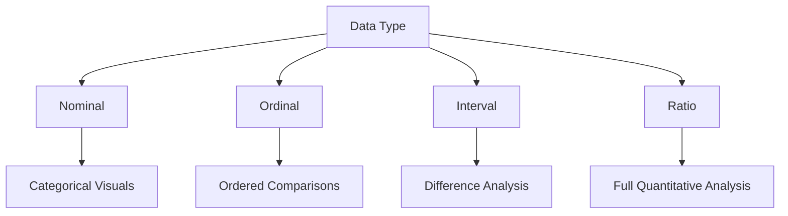

# Data Type → Visualization Mapping

```mermaid
flowchart TD
    A[Data Type]
    
    A --> B[Nominal]
    A --> C[Ordinal]
    A --> D[Interval]
    A --> E[Ratio]
    
    B --> F[Categorical Visuals]
    C --> G[Ordered Comparisons]
    D --> H[Difference Analysis]
    E --> I[Full Quantitative Analysis]
```
