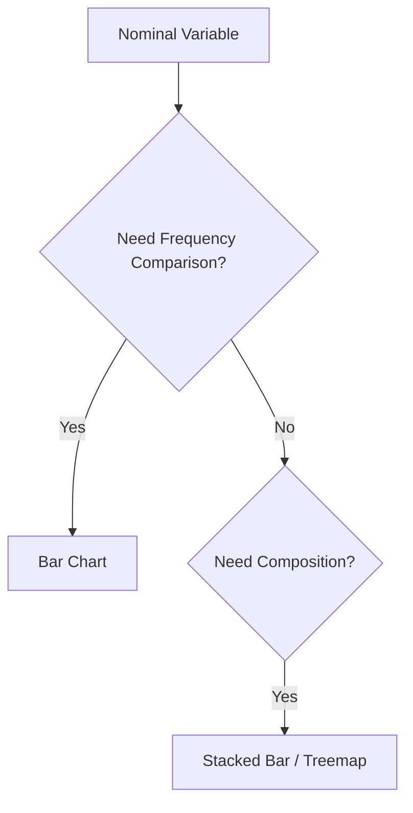

# Nominal Data Decision Tree

```mermaid
flowchart TD
    A[Nominal Variable]
    
    A --> B{Need Frequency Comparison?}
    
    B -->|Yes| C[Bar Chart]
    
    B -->|No| D{Need Composition?}
    
    D -->|Yes| E[Stacked Bar / Treemap]
```
