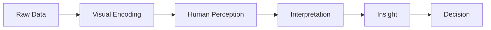

# The Visualization Pipeline

Every stage can fail.

Most failures occur because:

- wrong encoding is chosen
    
- perception becomes inefficient
    
- cognitive load increases
    
- comparisons become difficult
