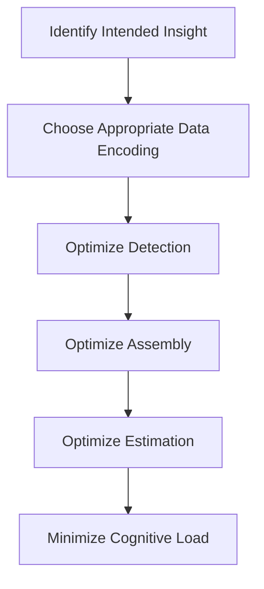

# Visualization Design Decision Process

```mermaid
flowchart TD
    A[Identify Intended Insight]
    
    A --> B[Choose Appropriate Data Encoding]
    
    B --> C[Optimize Detection]
    
    C --> D[Optimize Assembly]
    
    D --> E[Optimize Estimation]
    
    E --> F[Minimize Cognitive Load]
```
