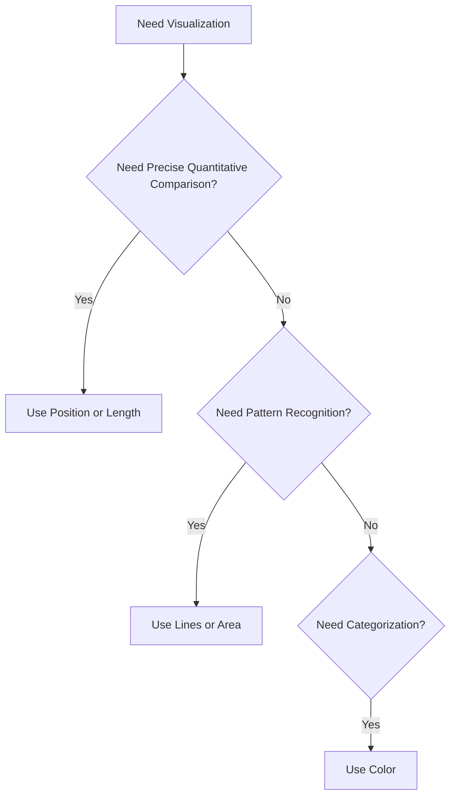

# Decision Tree for Choosing Encodings

```mermaid
flowchart TD
    A[Need Visualization]
    
    A --> B{Need Precise Quantitative Comparison?}
    
    B -->|Yes| C[Use Position or Length]
    
    B -->|No| D{Need Pattern Recognition?}
    
    D -->|Yes| E[Use Lines or Area]
    
    D -->|No| F{Need Categorization?}
    
    F -->|Yes| G[Use Color]
```
