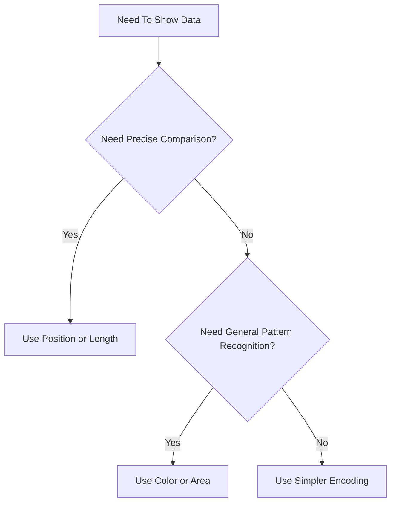

# Encoding Decision Framework

```mermaid
flowchart TD
    A[Need To Show Data]
    
    A --> B{Need Precise Comparison?}
    
    B -->|Yes| C[Use Position or Length]
    
    B -->|No| D{Need General Pattern Recognition?}
    
    D -->|Yes| E[Use Color or Area]
    
    D -->|No| F[Use Simpler Encoding]
```
