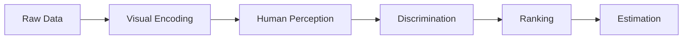

# The Visualization Goal

```mermaid
flowchart LR
    A[Raw Data]
    --> B[Visual Encoding]
    --> C[Human Perception]
    --> D[Discrimination]
    --> E[Ranking]
    --> F[Estimation]
```

The encoding determines how efficiently perception occurs.
