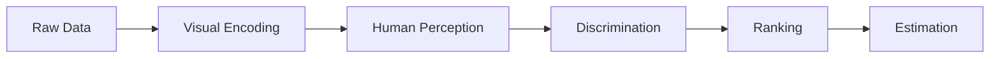
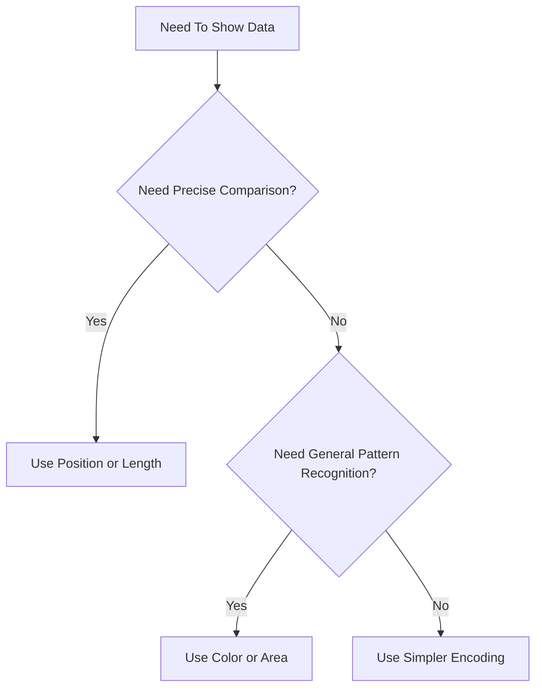
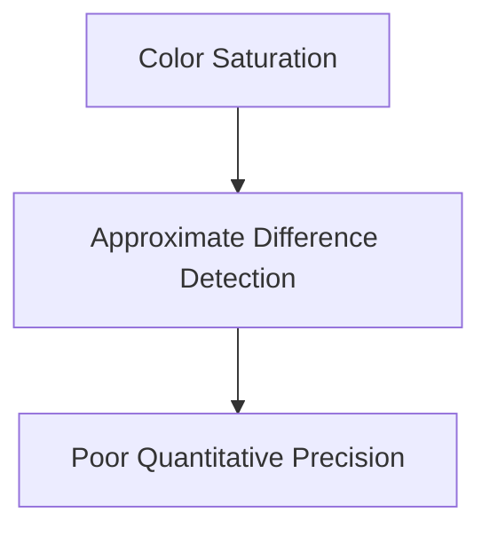
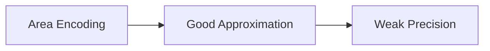
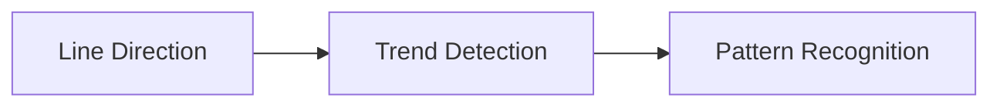
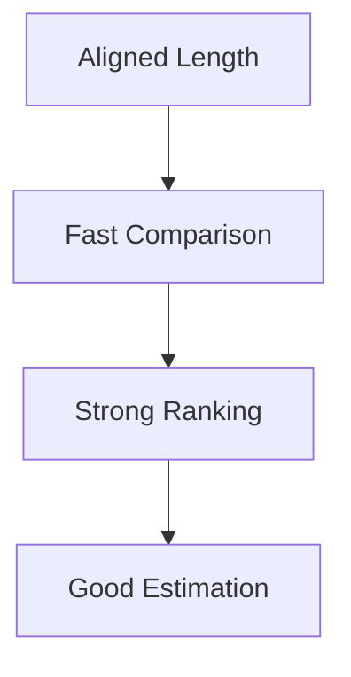
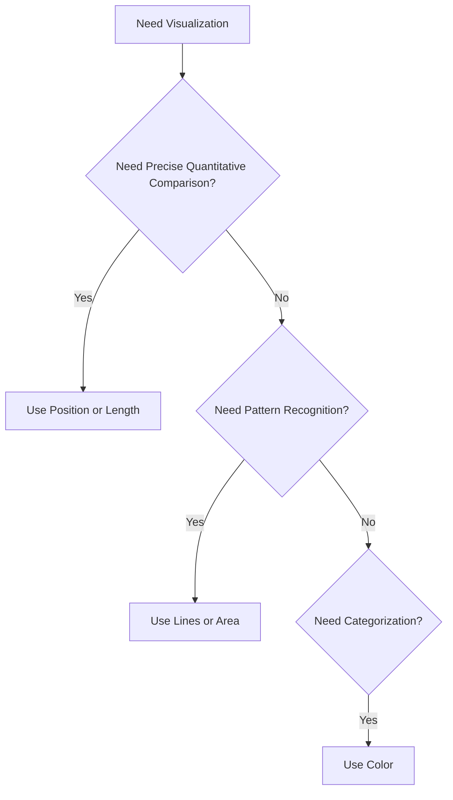
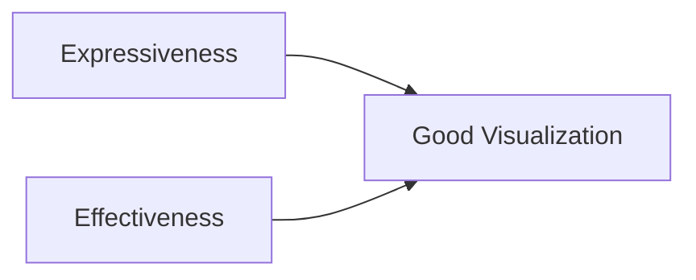

## Conversion of Data into Visualizations to Draw Valuable Insights

This section introduces one of the most foundational frameworks in visualization theory:

> Encoding features determine how effectively humans perceive data.

The transcript moves beyond aesthetics and enters a much more rigorous idea:

```text
Not all visual encodings are equally effective.
```

Some encodings help users:

- discriminate differences
    
- rank values
    
- estimate magnitudes
    

better than others.

This is one of the central principles behind modern visualization research, especially the work pioneered by:

- Cleveland & McGill
    
- Edward Tufte
    
- Jacques Bertin
    
- Colin Ware
    

The transcript essentially introduces a hierarchy of perceptual effectiveness.

## The Three Core Tasks of Visualization

According to the lecture, a good visualization should enable users to perform three cognitive tasks:

|Task|Meaning|
|---|---|
|Discriminate|Identify differences|
|Rank|Determine ordering|
|Estimate|Judge magnitude precisely|

These three tasks define visualization effectiveness.

## Why These Three Tasks Matter

Every chart ultimately exists to help users answer questions like:

- Which is bigger?
    
- Which is smaller?
    
- By how much?
    
- What changed?
    
- What stands out?
    
- What is the trend?
    
- How do categories compare?
    

A visualization fails if users struggle to answer these efficiently.

## The Visualization Goal



The encoding determines how efficiently perception occurs.

## Core Principle

> Different visual encodings have different perceptual strengths.

Some are:

- intuitive
    
- precise
    
- fast
    

Others are:

- ambiguous
    
- cognitively expensive
    
- difficult to compare
    

## The Hierarchy of Encoding Features

The transcript introduces encoding features in decreasing order of perceptual effectiveness.

The hierarchy roughly progresses from:

```text
least precise → most precise
```

## General Encoding Hierarchy

|Encoding Type|Effectiveness|
|---|---|
|Color|Low|
|Volume / Area|Moderate|
|Angle / Slope|Better|
|Length|Strong|
|Position on Common Scale|Best|

This hierarchy is extremely important in professional dashboard design.

## Why Position Is Superior

Humans are exceptionally good at comparing aligned positions.

We naturally perceive distance very accurately.

This is why:

- bar charts
    
- scatter plots
    
- aligned dot plots
    

are often more effective than:

- pie charts
    
- bubble charts
    
- decorative infographics
    

## Encoding Decision Framework



## 1. Color Encoding

## The Weakest Encoding

The lecture starts with color because it is perceptually weak for quantitative comparison.

This is a very important and often misunderstood point.

## Why Color Is Weak

Color helps users:

- notice differences
    
- detect categories
    
- identify highlights
    

But color performs poorly for:

- exact comparison
    
- ranking
    
- quantitative estimation
    

## What Color Can Do Well

## Discrimination

Humans quickly detect visual differences in color.

Example:

- dark brown vs light brown
    
- cyan vs gray
    

This allows immediate separation.

## What Color Does Poorly

## Ranking

Users struggle to precisely rank saturation levels.

## Estimation

Users cannot accurately estimate magnitude using color intensity alone.

## Transcript Example

The lecture uses:

```text
2019 Lok Sabha election winning margins
```

displayed through color saturation.

Darker color = higher margin.

Lighter color = lower margin.

## What Users Can Understand

Users can roughly identify:

- highest
    
- lowest
    
- general differences
    

## What Users Cannot Easily Understand

Users struggle to answer:

- How much larger?
    
- By what factor?
    
- What is the precise ranking?
    

## Why This Happens

Humans do not perceive color intensity linearly.

Small saturation differences are difficult to compare precisely.

## Cognitive Failure of Color Encoding



## Important Visualization Principle

```text
Color is excellent for attention, weak for measurement.
```

## When To Use Color

## Good Uses

- highlighting
    
- categorization
    
- alerts
    
- segmentation
    
- emphasis
    

## Bad Uses

- precise comparison
    
- accurate ranking
    
- exact estimation
    

## 2. Volume / Area Encoding

## Bubble Charts and Circle Size

The lecture then moves to volume-based encoding.

Example:

- bubble charts
    
- proportional circles
    
- area scaling
    

Here:

```text
size represents magnitude
```

## Why Area Is Better Than Color

Humans compare physical size more effectively than color intensity.

This improves:

- discrimination
    
- rough ranking
    

## But Area Still Has Problems

Humans are poor at estimating area accurately.

Especially with circles.

## Why Bubble Charts Are Difficult

The brain struggles to compare:

- radius
    
- area
    
- volume
    

simultaneously.

## Example Problem

Users can tell:

```text
This bubble is larger
```

But struggle to determine:

```text
How much larger?
```

## Perceptual Weakness of Area



## Transcript Insight

The lecture mentions:

Users can say:

- slightly larger
    
- almost equal
    
- much bigger
    

but not:

- exact ratio
    
- exact difference
    

## Important Principle

```text
Area supports comparison better than color, but worse than length.
```

## When Bubble Charts Work

## Good For

- broad magnitude patterns
    
- approximate comparisons
    
- exploratory visuals
    

## Poor For

- exact ranking
    
- precision analysis
    
- detailed quantitative decisions
    

## 3. Angle and Slope Encoding

## Line Charts

The transcript next discusses:

- angles
    
- slopes
    
- directional movement
    

through line charts.

## Why Line Charts Are Powerful

Humans are highly sensitive to:

- directional changes
    
- slope variation
    
- trend movement
    

This makes line charts excellent for:

- trends
    
- temporal evolution
    
- growth patterns
    
- rate changes
    

## What Line Charts Communicate Well

## Trend Direction

- increase
    
- decrease
    
- acceleration
    
- deceleration
    

## Relative Ranking

Users can compare general positions.

## What They Communicate Poorly

Exact estimation.

Especially when:

- scales vary
    
- slopes overlap
    
- differences are subtle
    

## Transcript Example

The lecture discusses constituencies:

- Tirupati
    
- Vijayawada
    
- Visakhapatnam
    

across election years.

Users can immediately see:

- upward trends
    
- downward trends
    
- relative movement
    

## Why Slope Is Powerful

The human visual system instinctively detects directional change.



## Important Limitation

Line charts often reveal:

```text
qualitative movement
```

better than:

```text
precise quantitative comparison
```

## Key Design Insight

If the goal is:

## Trend Analysis

Use line charts.

If the goal is:

## Exact Magnitude Comparison

Use bars or aligned positions.

## 4. Length Encoding

## Bar Charts

The lecture now arrives at one of the strongest encodings:

```text
Length
```

This is why bar charts are so effective.

## Why Humans Compare Length Well

Humans perceive aligned lengths very accurately.

Especially when sharing:

- common baseline
    
- common axis
    
- consistent orientation
    

## Why Bar Charts Work

Users can immediately:

- discriminate
    
- rank
    
- estimate
    

all three tasks effectively.

## Cognitive Strength of Length



## Transcript Example

The lecture compares constituencies through horizontal bars.

Users instantly see:

- Kadapa highest
    
- Guddu lowest
    
- Anantapur ≈ Hindupur
    

This is vastly more efficient than color or area.

## Why Bars Beat Bubbles

Comparing:

- two lengths
    

is cognitively easier than comparing:

- two areas
    

## Important Design Principle

```text
Aligned length is one of the most efficient quantitative encodings.
```

## 5. Position on Common Scale

## The Most Effective Encoding

The lecture finally introduces the strongest encoding:

```text
Position on a common aligned scale
```

This is the gold standard.

## Why Position Is Best

Humans naturally compare position extremely accurately.

Examples:

- scatter plots
    
- dot plots
    
- aligned points
    
- common-axis charts
    

## Why Position Beats Length

Length still requires processing object size.

Position requires only distance comparison.

This reduces cognitive effort further.

## Perceptual Superiority of Position


## Transcript Insight

Users can easily compare:

- Faridabad
    
- Ambala
    

through aligned positions on the same scale.

## The Core Visualization Hierarchy

## Weak Encodings

- color
    
- saturation
    
- area
    
- volume
    

## Strong Encodings

- length
    
- aligned position
    

## Why This Matters in Dashboard Design

Many poor dashboards use:

- gauges
    
- donuts
    
- bubbles
    
- decorative infographics
    

when simple bars would communicate better.

## Decision Tree for Choosing Encodings



## Expressiveness vs Effectiveness

The transcript ends with a very important distinction.

## Expressiveness

## Definition

How completely the visualization represents the data.

Question:

```text
Does the visualization capture the important information?
```

## Effectiveness

## Definition

How efficiently users perceive the information.

Question:

```text
Can users understand it optimally?
```

## Relationship Between the Two



You need both.

## Common Failure Modes

## High Expressiveness, Low Effectiveness

- too much information
    
- cluttered dashboards
    
- overloaded visuals
    

## High Effectiveness, Low Expressiveness

- oversimplified charts
    
- missing context
    
- incomplete information
    

## Final Design Goal

The best visualization:

- captures the important information
    
- communicates it with minimal cognitive effort
    

## Final Mental Model

Think of encoding features as:

```text
compression algorithms for human cognition
```

Some compress information more efficiently than others.

## Most Important Visualization Insight

```text
The best chart is not the most decorative.
The best chart is the one humans perceive most accurately.
```

Tags: #statistics #machine-learning #data-science #statistical-modelling