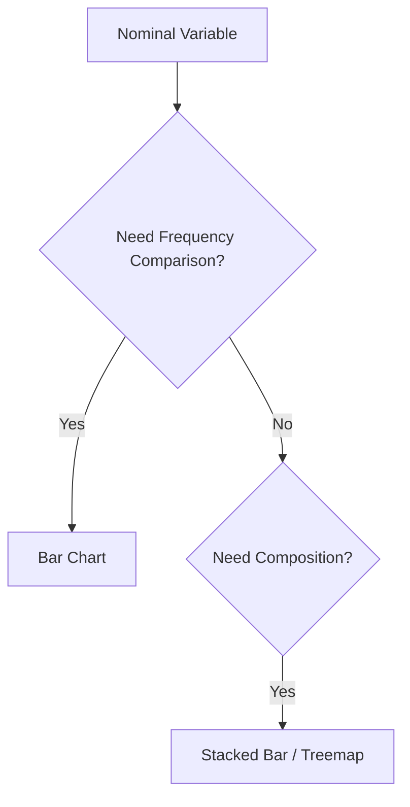
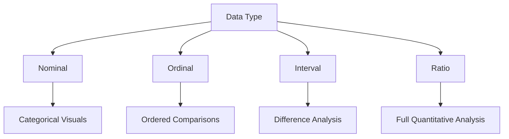
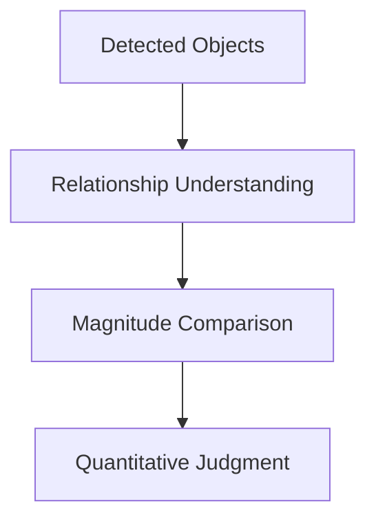
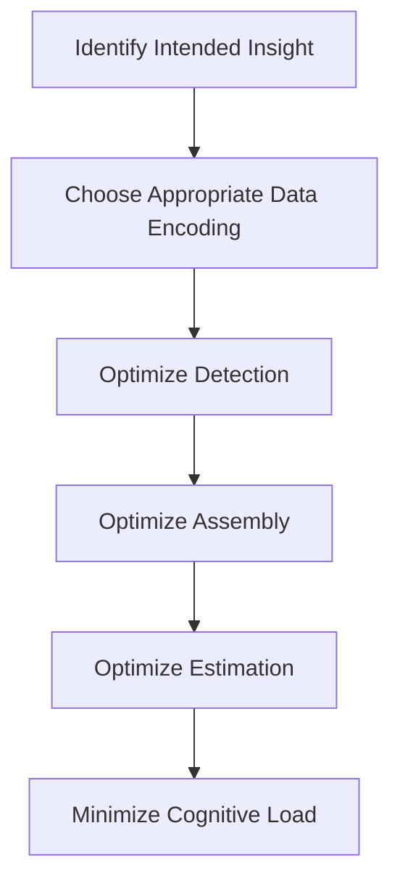
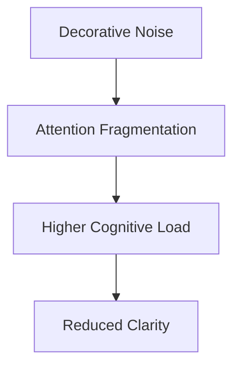

## Designing Visuals for Human Perception

This section introduces one of the most important intellectual foundations in data visualization:

> Visualizations succeed or fail based on how efficiently humans perceive information.

Edward Tufte’s work fundamentally changed visualization design by shifting focus from:

- decorative graphics
    
- aesthetic presentation
    
- artistic charts
    

toward:

- cognitive efficiency
    
- perceptual accuracy
    
- information density
    
- truthful communication
    

The transcript introduces two major concepts:

1. Understanding data types
    
2. Understanding human visual decoding processes
    

Both are essential because:

```text
A visualization is a translation layer between data structure and human perception.
```

## Why Tufte’s Principles Matter

Before Tufte, many graphics focused heavily on visual decoration.

Tufte argued that:

- graphics should maximize information clarity
    
- unnecessary visual elements reduce understanding
    
- perception efficiency matters more than ornamentation
    

This eventually led to concepts like:

- data-ink ratio
    
- chartjunk reduction
    
- perceptual encoding hierarchy
    
- minimalist dashboards
    
- information-dense design
    

## The Visualization Pipeline


Every stage can fail.

Most failures occur because:

- wrong encoding is chosen
    
- perception becomes inefficient
    
- cognitive load increases
    
- comparisons become difficult
    

## Understanding Data Types

## The Foundation of Correct Visualization

Before designing visuals, the transcript emphasizes:

```text
You must understand the underlying data type.
```

This is critically important because:

Different data types support different operations.

Using the wrong visualization or arithmetic interpretation can produce:

- misleading conclusions
    
- false trends
    
- invalid comparisons
    
- perceptual distortions
    

## The Four Core Data Types

|Data Type|Meaning|Mathematical Operations|
|---|---|---|
|Nominal|Categories only|Equality|
|Ordinal|Ordered categories|Relative ranking|
|Interval|Ordered numeric intervals|Addition/Subtraction|
|Ratio|True quantitative scale|Full arithmetic|

## 1. Nominal Data

## Pure Categorization

Nominal variables represent categories without inherent numerical meaning.

Examples:

- gender
    
- race
    
- department
    
- product category
    
- country
    

The transcript explains:

```text
Numbers assigned to categories are symbolic, not quantitative.
```

Example:

|Category|Code|
|---|---|
|Male|1|
|Female|0|

The numbers themselves have no mathematical meaning.

## Important Constraint

You cannot meaningfully compute:

- averages
    
- ratios
    
- proportions
    

from nominal encodings.

## Appropriate Visualizations

## Good Choices

- bar charts
    
- grouped bars
    
- categorical counts
    
- treemaps
    
- stacked bars
    

## Poor Choices

- line charts implying continuity
    
- arithmetic trend analysis
    
- ratio-based comparisons
    

## Nominal Data Decision Tree



## Key Cognitive Insight

Humans interpret nominal variables through:

- grouping
    
- color
    
- separation
    
- categorical distinction
    

rather than magnitude.

## 2. Ordinal Data

## Ordered Categories

Ordinal variables introduce ranking.

Examples:

- satisfaction ratings
    
- product reviews
    
- education levels
    
- preference scales
    

The transcript gives:

```text
1-star to 5-star product ratings
```

as an example.

## Critical Property

Ordinal variables preserve:

```text
order
```

but not proportional meaning.

## What This Means

You can say:

```text
5 stars > 3 stars
```

But you cannot say:

```text
5 stars = twice as good as 2.5 stars
```

because ordinal intervals are not guaranteed equal.

## Important Statistical Warning

This is where many dashboards become misleading.

Treating ordinal scales as continuous quantitative variables can create false precision.

## Appropriate Visualizations

## Good Choices

- ordered bars
    
- Likert charts
    
- ranked plots
    
- heatmaps
    

## Use Caution With

- averages
    
- linear interpolation
    
- ratio interpretation
    

## Ordinal Encoding Workflow


## 3. Interval Data

## Equal Distances Without True Zero

Interval data introduces meaningful differences between values.

The transcript uses:

```text
temperature in Celsius/Fahrenheit
```

as the canonical example.

## Critical Property

Differences are meaningful.

Ratios are not.

## Example

|City|Temperature|
|---|---|
|Shimla|25°C|
|Hyderabad|50°C|

You can say:

```text
Difference = 25°C
```

But not:

```text
Hyderabad is twice as hot
```

because interval scales lack a true zero.

## Why True Zero Matters

Zero Celsius does not mean:

```text
absence of temperature
```

Therefore proportional reasoning breaks.

## Visualization Implications

Interval data supports:

- trend analysis
    
- difference comparison
    
- temporal movement
    

But proportional claims require caution.

## 4. Ratio Data

## True Quantitative Measurement

Ratio variables support full mathematical operations.

Examples:

- revenue
    
- sales
    
- population
    
- distance
    
- profit
    
- weight
    

The transcript identifies these as the most common business variables.

## Key Property

Ratio scales possess:

```text
true zero
```

This enables:

- ratios
    
- percentages
    
- proportional comparisons
    
- multiplicative reasoning
    

## Example

|Product A|₹100|
|---|---|
|Product B|₹200|

Now it is valid to say:

```text
Product B is twice Product A
```

## Why Data Types Matter in Visualization

Different variable types require different visual treatments.

## Data Type → Visualization Mapping



## The Hidden Risk

One of the biggest causes of misleading dashboards is:

```text
Applying inappropriate arithmetic interpretation to the wrong variable type.
```

## Transition Into Visual Encoding

After discussing data types, the transcript moves into:

```text
how humans decode visualizations
```

This is where Tufte’s ideas become deeply cognitive.

## Human Visual Decoding Process

The transcript identifies three perception stages:

1. Detection
    
2. Assembly
    
3. Estimation
    

These form the core perceptual workflow.

## Perceptual Decoding Pipeline


## 1. Detection

## Recognizing Visual Objects

Detection is the brain’s ability to identify geometric representations.

Examples:

- bars
    
- circles
    
- lines
    
- points
    
- segments
    

The brain first asks:

```text
What objects exist in this visual?
```

## Examples

## Bar Chart

Detection focuses on:

- bar lengths
    
- category labels
    
- alignment
    

## Pie Chart

Detection focuses on:

- segment areas
    
- angular separation
    

## Important Insight

Different chart types create different detection difficulty.

## Easy Detection

- bars
    
- aligned positions
    
- dots
    

## Hard Detection

- 3D charts
    
- overlapping bubbles
    
- radial layouts
    

## Detection Efficiency Principle

```text
The easier the object detection, the lower the cognitive load.
```

## 2. Assembly

## Understanding Relationships

After detection, the brain attempts to organize visual objects into relationships.

The transcript connects this with:

```text
Gestalt continuity principles
```

## What Assembly Means

The brain asks:

- What belongs together?
    
- What sequence exists?
    
- Is there a trend?
    
- Is there continuity?
    

## Example

If bars are sorted descending:

users instantly infer ranking.

If points form a line:

users infer trend continuity.

## Assembly Creates Narrative


## Why Ordering Matters

The transcript emphasizes:

Logical arrangement improves interpretation speed.

Example:

Descending order of voter margins immediately reveals hierarchy.

## Important Visualization Principle

```text
Ordering creates meaning.
```

Unordered visuals increase interpretation effort.

## 3. Estimation

## Quantitative Comparison

After detection and assembly, the brain estimates magnitude.

This includes questions like:

- How much larger?
    
- How different?
    
- What changed?
    
- By what factor?
    

## Estimation Is the Hardest Stage

Humans estimate some encodings much better than others.

## Strong Estimation Encodings

- aligned position
    
- length
    

## Weak Estimation Encodings

- color
    
- area
    
- angle
    
- volume
    

## Estimation Workflow



## The Core Design Question

The transcript ends with one of the most important questions in visualization design:

```text
What information do you want the audience to notice first?
```

Everything follows from this.

## Visualization Design Decision Process



## Tufte’s Core Philosophy

Good visualization design is not artistic decoration.

It is:

- perceptual engineering
    
- cognitive optimization
    
- information compression
    
- communication design
    

## Advanced Insight

## Why Minimalism Works

Minimalist dashboards are effective because they improve:

- detection clarity
    
- assembly efficiency
    
- estimation precision
    

Every unnecessary element competes for cognitive resources.

This is the origin of Tufte’s famous criticism of:

```text
chartjunk
```

## Chartjunk

Chartjunk refers to visual elements that:

- do not improve understanding
    
- increase distraction
    
- reduce perceptual efficiency
    

Examples:

- excessive gradients
    
- 3D effects
    
- unnecessary icons
    
- decorative textures
    
- visual clutter
    

## Cognitive Cost of Chartjunk



## Final Design Principles

## A good visualization should:

- support fast detection
    
- improve assembly
    
- enable precise estimation
    
- reduce cognitive effort
    
- preserve truthful representation
    

## A poor visualization:

- obscures comparison
    
- overloads perception
    
- creates ambiguity
    
- increases interpretation effort
    

## Final Mental Model

Think of visualization as:

```text
a perceptual interface between data and cognition
```

not merely a graphical output.

## References and Influential Foundations

The ideas discussed in this lecture strongly connect with foundational work from:

- Edward Tufte, _The Visual Display of Quantitative Information_
    
- Cleveland & McGill’s research on graphical perception
    
- Gestalt psychology principles
    
- Colin Ware’s work on visual cognition
    
- Jacques Bertin’s visual variables theory
    

These works collectively established modern visualization science.

Tags: #statistics #machine-learning #data-science #statistical-modelling
