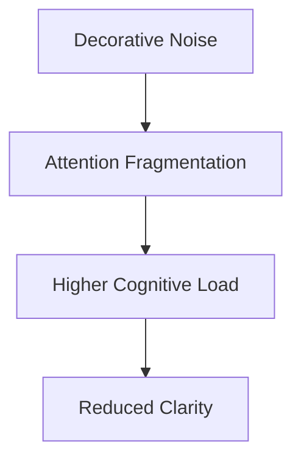
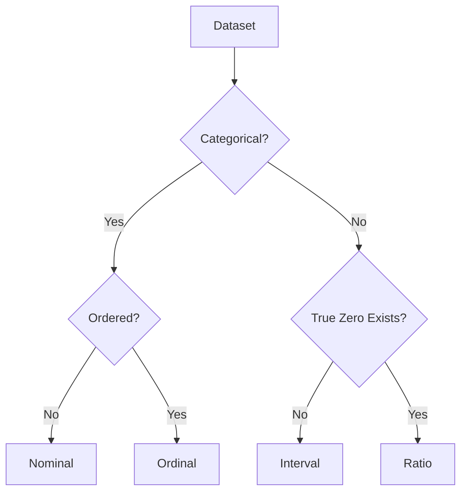
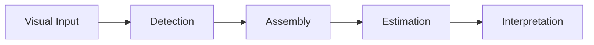
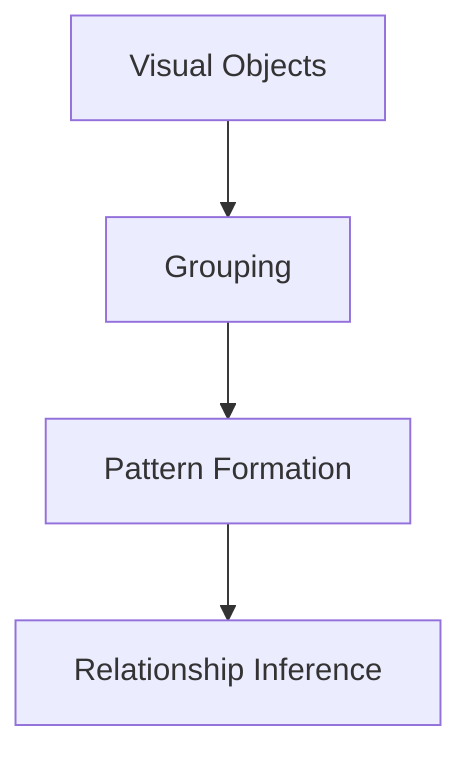
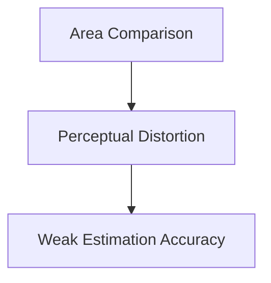
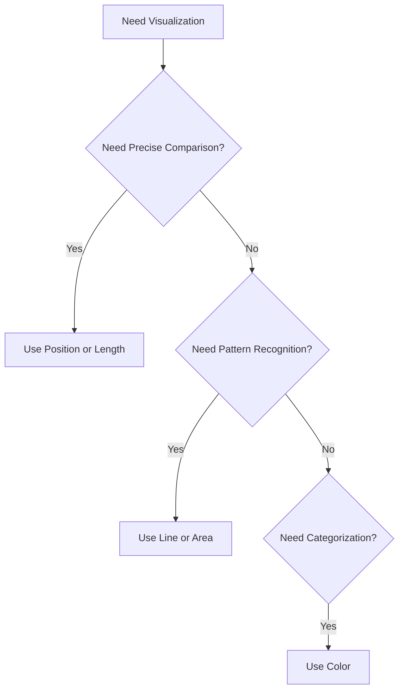
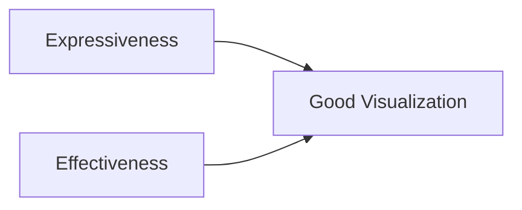

## Lesson 11: Designing Visuals

## Visual Encoding, Perception, and Effective Data Communication

Lesson 11 forms the conceptual backbone of modern data visualization.

It combines:

- cognitive psychology
    
- perception science
    
- visual encoding theory
    
- statistical communication
    
- information design
    

into one integrated framework.

At its core, the lesson attempts to answer one fundamental question:

```text
How do humans efficiently convert visual patterns into insight?
```

This is the central problem of data visualization.

A visualization is not merely:

- a graph
    
- a dashboard
    
- a chart
    
- a report
    

It is:

```text
a cognitive interface between data and human perception
```

The lesson draws heavily from the foundational works of:

- Edward Tufte
    
- William Cleveland
    
- Robert McGill
    
- Gestalt psychologists
    
- Stephen Few
    
- Cole Nussbaumer Knaflic
    

## 1. Designing Visuals

## The Goal of Visualization

The lesson begins with visualization best practices.

The key emphasis is:

> Clarity and effectiveness matter more than decoration.

This sounds simple, but it fundamentally changes how dashboards should be designed.

## Traditional Mistake

Many people treat visualization as:

- graphic design
    
- artistic presentation
    
- aesthetic decoration
    

This produces:

- visually attractive dashboards
    
- but cognitively inefficient communication
    

## Actual Goal of Visualization

Visualization exists to:

- reduce cognitive effort
    
- reveal patterns
    
- accelerate comparison
    
- support decisions
    
- compress complexity
    

## Visualization Pipeline


Every stage introduces possible failure points.

## Good Visualization Design Must Optimize

- perceptual clarity
    
- comparison efficiency
    
- cognitive load
    
- attention flow
    
- information hierarchy
    

## Core Principle

```text
A chart succeeds when interpretation becomes effortless.
```

## Edward Tufte’s Contribution

## Information-Centric Visualization

Edward Tufte fundamentally changed visualization philosophy.

Before Tufte:

- decorative charts were common
    
- heavy gradients
    
- 3D effects
    
- ornamental graphics
    
- excessive styling
    

After Tufte:

Focus shifted toward:

- information density
    
- precision
    
- minimalism
    
- perceptual efficiency
    

## Tufte’s Core Philosophy

```text
Remove everything that does not improve understanding.
```

This led to concepts such as:

- chartjunk
    
- data-ink ratio
    
- graphical integrity
    
- minimal cognitive friction
    

## Data-Ink Ratio

Tufte proposed:

Most ink in a chart should represent actual data.

## Bad Visualization

- heavy borders
    
- shadows
    
- decorative gradients
    
- unnecessary icons
    
- excessive background styling
    

## Good Visualization

- minimal non-data elements
    
- emphasis on comparisons
    
- restrained styling
    
- high signal-to-noise ratio
    

## Chartjunk Problem



## Important Insight

Humans possess limited attentional bandwidth.

Every unnecessary visual element competes for cognition.

## 2. Understanding Data Types

## The Foundation of Correct Visualization

One of the strongest sections in the lesson is the explanation of data types.

This is critical because:

```text
Incorrect data interpretation leads to misleading visualization.
```

The lesson identifies four major data types:

|Data Type|Nature|Mathematical Meaning|
|---|---|---|
|Nominal|Categorical|Equality only|
|Ordinal|Ordered categories|Relative comparison|
|Interval|Equal intervals|Addition/Subtraction|
|Ratio|Full quantitative|All arithmetic|

## Why Data Types Matter

Different data types support different operations.

Therefore:

Different visualizations become appropriate.

## Data Type Decision Tree



## Nominal Data

## Pure Categories

Examples:

- gender
    
- blood group
    
- department
    
- city names
    

Properties:

- categories only
    
- no inherent order
    
- arithmetic meaningless
    

## Appropriate Operations

Only:

- equality
    
- inequality
    

## Appropriate Visualizations

- bar charts
    
- grouped categories
    
- treemaps
    
- categorical heatmaps
    

## Poor Choices

- line charts implying continuity
    
- averages
    
- proportional comparisons
    

## Ordinal Data

## Ordered Categories

Examples:

- customer ratings
    
- satisfaction scores
    
- education levels
    

Key property:

```text
Order exists, but proportional meaning does not.
```

## Example

5 stars > 3 stars

Valid.

But:

```text
5 stars is NOT "twice as good" as 2.5 stars
```

because intervals are not guaranteed equal.

## Important Analytical Mistake

Many dashboards incorrectly treat ordinal scales as continuous quantitative variables.

This creates:

- false precision
    
- misleading averages
    
- invalid proportional claims
    

## Ordinal Visualization Techniques

- ordered bars
    
- Likert charts
    
- rank visualizations
    
- heatmaps
    

## Interval Data

## Equal Distances Without True Zero

Examples:

- Celsius temperature
    
- IQ scores
    

Key property:

Differences are meaningful.

Ratios are not.

## Example

50°C is not twice as hot as 25°C.

But:

```text
Difference = 25°C
```

is valid.

## Ratio Data

## True Quantitative Scale

Examples:

- sales
    
- revenue
    
- distance
    
- weight
    
- profit
    

Properties:

- true zero exists
    
- full arithmetic valid
    
- proportional reasoning valid
    

## Why Ratio Data Dominates Business Dashboards

Most enterprise KPIs are ratio variables:

- revenue
    
- growth
    
- margin
    
- sales
    
- conversion rate
    

This is why:

- bar charts
    
- line charts
    
- scatter plots
    

dominate business intelligence systems.

## 3. Human Visual Perception

## Cleveland’s Three Operations

The lesson references William Cleveland’s work on graphical perception.

Humans perform three operations when reading visuals:

1. Detection
    
2. Assembly
    
3. Estimation
    

## Perceptual Decoding Pipeline



## Detection

## Identifying Visual Objects

The brain first identifies:

- bars
    
- points
    
- lines
    
- shapes
    
- geometric structures
    

This is object recognition.

## Detection Quality Depends On

- contrast
    
- spacing
    
- salience
    
- clutter reduction
    
- alignment
    

## Good Detection

```text
Clear bars
Strong contrast
Minimal clutter
```

## Poor Detection

```text
Overlapping objects
3D distortion
Low contrast
Visual noise
```

## Assembly

## Grouping Relationships

After detection, the brain seeks relationships.

Examples:

- continuity
    
- grouping
    
- sequence
    
- trend
    
- alignment
    

This directly connects to Gestalt laws.

## Gestalt Law of Continuity

Humans naturally assume:

continuous patterns imply relationships.

## Example

Sorted bars imply ranking.

Connected lines imply trends.

## Assembly Process



## Estimation

## Magnitude Comparison

The final stage is quantitative judgment.

Questions include:

- Which is larger?
    
- By how much?
    
- What changed?
    
- What is the difference?
    

## Important Insight

Some visual encodings support estimation better than others.

This leads into:

```text
visual encoding hierarchy
```

## 4. Types of Visual Encodings

## Perceptual Hierarchy

The lesson introduces one of the most important principles in visualization science:

> Not all visual encodings are equally effective.

Some encodings allow humans to compare values very accurately.

Others do not.

## Encoding Effectiveness Hierarchy

|Encoding|Precision|
|---|---|
|Position on common scale|Highest|
|Length|Very high|
|Angle|Moderate|
|Area / Volume|Weak|
|Color|Weakest|

This hierarchy originates largely from:

- Cleveland & McGill
    
- perceptual psychology experiments
    

## Why Position Is Best

Humans compare aligned positions extremely accurately.

Example:

- scatter plots
    
- aligned dot plots
    
- bar charts
    

## Position Encoding Workflow


## Why Color Is Weak

Color supports:

- categorization
    
- discrimination
    
- highlighting
    

But performs poorly for:

- exact estimation
    
- precise ranking
    

## Color Encoding Failure

Humans cannot reliably estimate:

- saturation magnitude
    
- hue intervals
    
- precise differences
    

## Important Principle

```text
Color is for attention, not precision.
```

## Length Encoding

## Why Bar Charts Work So Well

Humans compare lengths accurately because:

- alignment reduces ambiguity
    
- baselines remain consistent
    
- distances become measurable
    

This is why bar charts dominate analytics systems.

## Angle Encoding

## Pie Charts and Slopes

Angles are harder to compare.

Humans struggle with:

- segment comparison
    
- proportional estimation
    
- radial interpretation
    

This is why pie charts become problematic with many categories.

## Area and Volume Problems

Bubble charts and treemaps often appear attractive but suffer perceptually.

Humans poorly estimate:

- circle area
    
- sphere volume
    
- irregular shapes
    

## Bubble Chart Problem



## 5. Data Encoding Techniques

## Strategic Use of Visual Variables

The lesson discusses several encoding techniques.

Each has different cognitive strengths.

## Color

## Best For

- grouping
    
- categorization
    
- highlighting
    

## Poor For

- exact comparison
    
- estimation
    
- ranking
    

## Important Practical Rule

The lesson recommends:

```text
Avoid using more than six colors in a single chart.
```

Too many colors increase:

- cognitive load
    
- confusion
    
- visual fragmentation
    

## Volume

## Best For

- approximate comparison
    
- visual emphasis
    

## Weakness

Poor precision estimation.

## Angle

## Best For

- trend direction
    
- rate of change
    
- slope comparison
    

## Weakness

Precise quantitative judgment.

## Length and Position

These are the strongest encodings.

Best for:

- comparison
    
- ranking
    
- quantitative analysis
    
- BI dashboards
    

## Visualization Encoding Decision Tree



## 6. Expressiveness vs Effectiveness

This distinction is extremely important.

## Expressiveness

Measures:

```text
How much information the visualization captures.
```

## Effectiveness

Measures:

```text
How easily humans perceive the information.
```

## Relationship Between Them



You need both simultaneously.

## Common Failure Modes

## High Expressiveness, Low Effectiveness

Examples:

- overloaded dashboards
    
- excessive KPIs
    
- cluttered reports
    

## High Effectiveness, Low Expressiveness

Examples:

- oversimplified summaries
    
- missing context
    
- incomplete analysis
    

## Goal

The ideal visualization:

- captures meaningful information
    
- minimizes cognitive effort
    

## Advanced Insight

## Visualization Is Cognitive Compression

A dashboard compresses:

- thousands of rows
    
- statistical relationships
    
- temporal changes
    
- categorical interactions
    

into:

```text
perceptually efficient visual patterns
```

## Cognitive Load Perspective

Bad dashboards force users to:

- search excessively
    
- mentally reconstruct patterns
    
- remember mappings
    
- compare inefficiently
    

Good dashboards reduce mental work.

## Final Design Philosophy

A strong visualization should:

- optimize perception
    
- reduce ambiguity
    
- minimize cognitive friction
    
- improve comparison efficiency
    
- support rapid insight extraction
    

## Final Mental Model

Think of visualization design as:

```text
engineering human perception under cognitive constraints
```

not merely producing charts.

## References and Foundational Literature

The concepts in this lesson strongly align with the foundational works of:

- Edward Tufte, _The Visual Display of Quantitative Information_
    
- William Cleveland & Robert McGill, _Graphical Perception Research_
    
- Stephen Few, _Information Dashboard Design_
    
- Cole Nussbaumer Knaflic, _Storytelling with Data_
    
- Andy Kirk, _Data Visualization: A Successful Design Process_
    
- Gestalt psychology research on perception and grouping

Tags: #statistics #machine-learning #data-science #statistical-modelling
