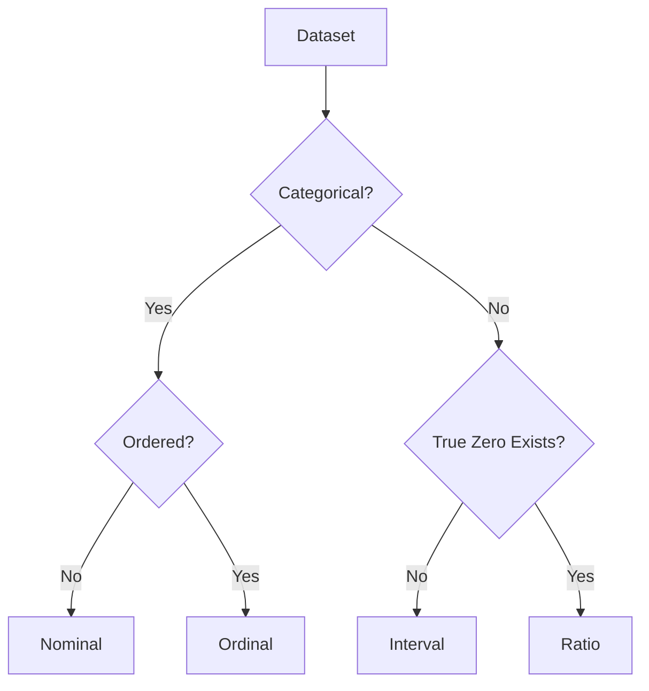

# Data Type Decision Tree

```mermaid
flowchart TD
    A[Dataset]
    
    A --> B{Categorical?}
    
    B -->|Yes| C{Ordered?}
    
    C -->|No| D[Nominal]
    C -->|Yes| E[Ordinal]
    
    B -->|No| F{True Zero Exists?}
    
    F -->|No| G[Interval]
    F -->|Yes| H[Ratio]
```
