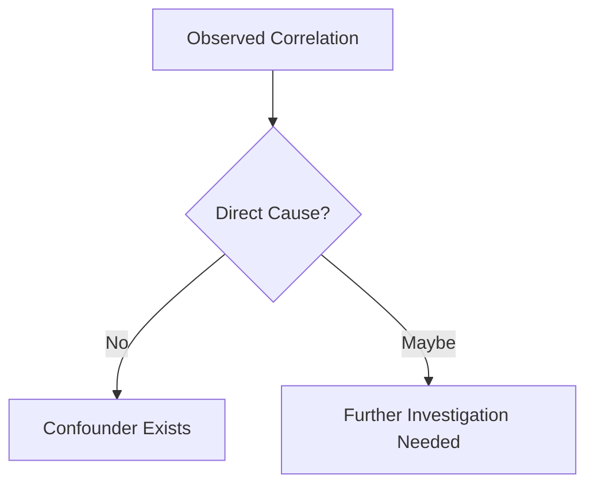

# Causation Failure Model

```mermaid
flowchart TD
    A[Observed Correlation]
    
    A --> B{Direct Cause?}
    
    B -->|No| C[Confounder Exists]
    
    B -->|Maybe| D[Further Investigation Needed]
```
