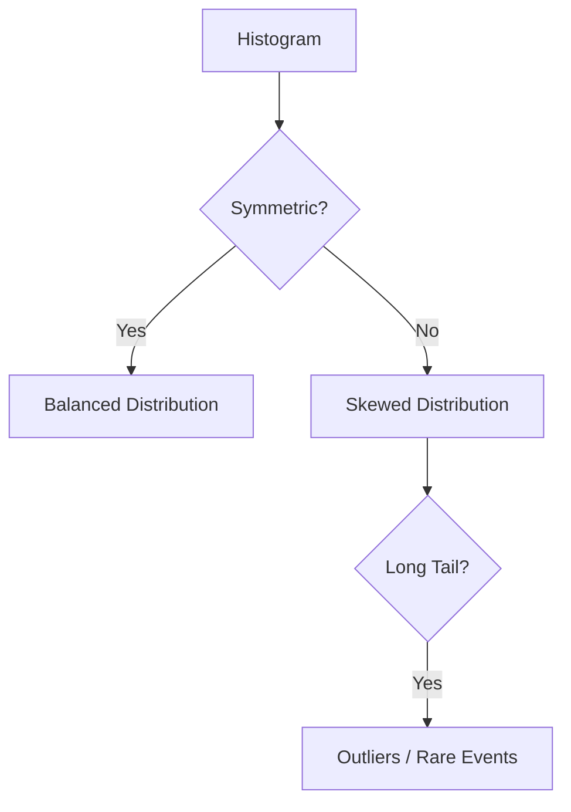

# Histogram Interpretation Framework

```mermaid
flowchart TD
    A[Histogram]
    
    A --> B{Symmetric?}
    
    B -->|Yes| C[Balanced Distribution]
    
    B -->|No| D[Skewed Distribution]
    
    D --> E{Long Tail?}
    
    E -->|Yes| F[Outliers / Rare Events]
```

![[Box Plot Analysis.png]]
