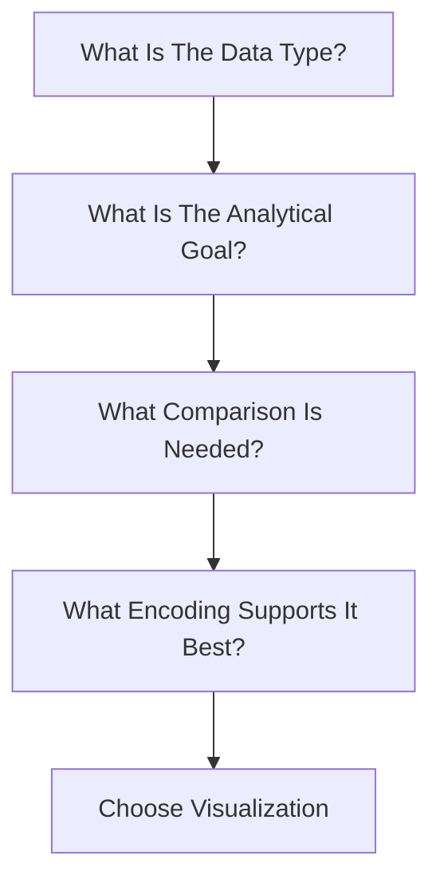

# The Central Visualization Problem

Every visualization task fundamentally asks:

```mermaid
flowchart TD
    A[What Is The Data Type?]
    --> B[What Is The Analytical Goal?]
    --> C[What Comparison Is Needed?]
    --> D[What Encoding Supports It Best?]
    --> E[Choose Visualization]
```

This framework is far more important than memorizing chart types.
