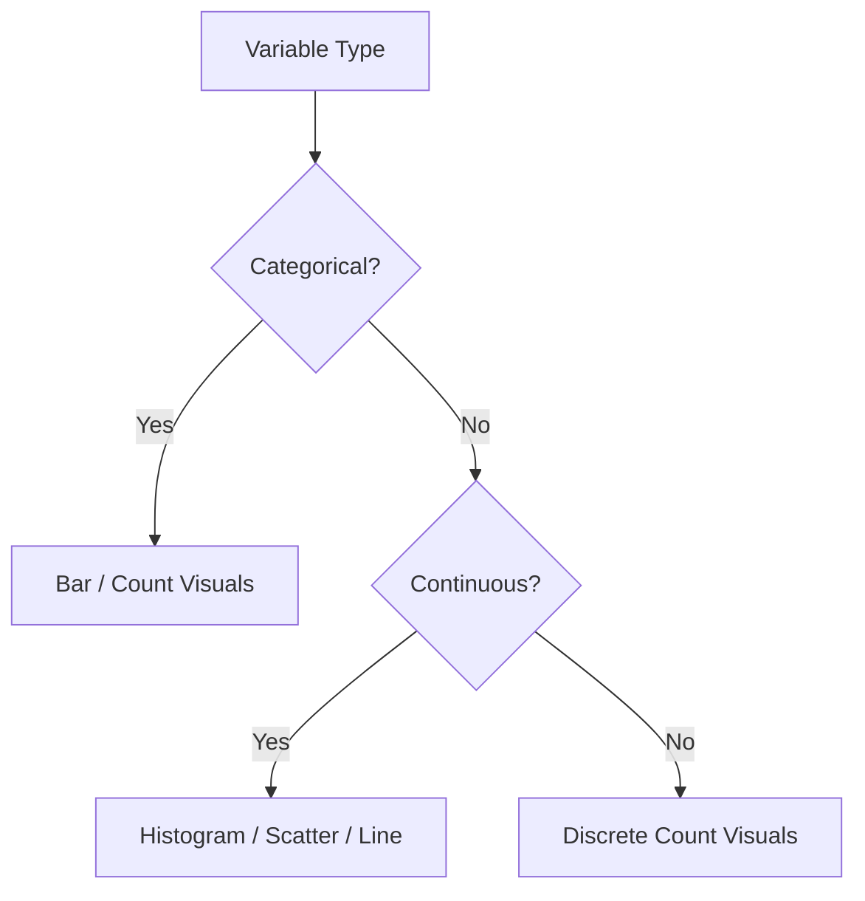

# Visualization Decision Tree

```mermaid
flowchart TD
    A[Variable Type]
    
    A --> B{Categorical?}
    
    B -->|Yes| C[Bar / Count Visuals]
    
    B -->|No| D{Continuous?}
    
    D -->|Yes| E[Histogram / Scatter / Line]
    
    D -->|No| F[Discrete Count Visuals]
```
