# Lesson 12
![[L12 - Designing Analytical Visualizations.png]]

Lesson 12 transitions from:

- perception theory
    
- visual encoding principles
    
- cognitive psychology
    

into:

```text
practical analytical visualization design
```

This is where visualization becomes operational.

The lesson now asks:

> Given a particular data structure and analytical objective, what is the correct visualization strategy?

This is one of the most important skills in:

- business intelligence
    
- analytics engineering
    
- dashboard design
    
- machine learning EDA
    
- data storytelling
    

because:

```text
A chart is not chosen based on aesthetics.
A chart is chosen based on analytical intent.
```

The lesson focuses heavily on:

- variable types
    
- univariate analysis
    
- multivariate analysis
    
- chart selection
    
- relationship interpretation
    
- distribution analysis
    
- trend analysis
    

These form the backbone of exploratory data analysis (EDA).

# The Central Visualization Problem

Every visualization task fundamentally asks:

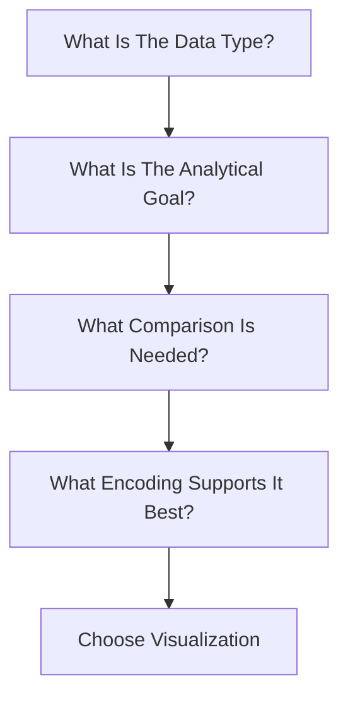

This framework is far more important than memorizing chart types.

# 1. Designing Visuals

# Visualization as Analytical Translation

The lesson begins by emphasizing:

> Selecting the right chart type is critical.

This sounds obvious, but most visualization failures happen because:

```text
The chart type does not match the analytical question.
```

# Why Chart Selection Matters

A chart determines:

- perceptual efficiency
    
- comparison accuracy
    
- cognitive load
    
- narrative clarity
    
- interpretability
    

Bad chart selection creates:

- misleading conclusions
    
- false trends
    
- visual clutter
    
- analytical ambiguity
    

# Visualization Is Structured Reasoning

A visualization is essentially:

```text
a visual query language
```

for human cognition.

# Structured Data Visualization

The lesson specifically references:

```text
structured datasets
```

This usually refers to:

- rows and columns
    
- tabular business data
    
- transactional systems
    
- analytical datasets
    

Examples:

|CustomerID|Revenue|Region|Conversion|
|---|---|---|---|
|1001|2500|West|Yes|

Structured data dominates:

- SQL systems
    
- warehouses
    
- BI tools
    
- analytics pipelines
    
![[L12 - Why Structured Data Needs Careful Visualization.png]]
# Why Structured Data Requires Careful Visualization

Structured datasets often contain:

- mixed variable types
    
- high dimensionality
    
- hidden relationships
    
- noisy patterns
    

Visualization helps compress this complexity.

# Data → Visualization Compression

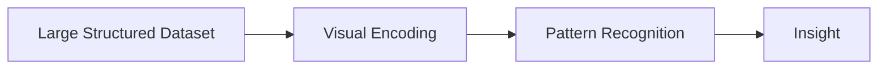

# 2. Understanding Variable Types

# The Foundation of Correct Analysis

The lesson categorizes variables into:

- categorical
    
- binary
    
- ordinal
    
- numerical continuous
    
- numerical discrete
    

This is extremely important because:

```text
Variable type determines valid visualization choices.
```

# Variable Type Framework

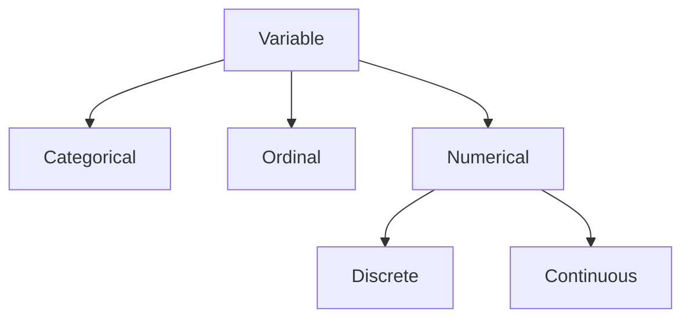

# Categorical Data

Examples:

- gender
    
- race
    
- country
    
- product category
    

Properties:

- labels only
    
- no numerical magnitude
    
- grouping-focused
    

# Best Visualizations

- bar charts
    
- stacked bars
    
- treemaps
    

# Poor Choices

- line charts
    
- continuous interpolation
    

# Binary Data

A special categorical case with only two outcomes.

Examples:

- Pass / Fail
    
- Bought / Did not buy
    
- Yes / No
    

# Why Binary Variables Matter

Binary outcomes dominate:

- classification systems
    
- churn models
    
- conversion analytics
    
- fraud detection
    

# Best Visualizations

- proportion bars
    
- KPI cards
    
- confusion matrices
    
- conversion funnels
    

# Ordinal Data

Examples:

- High / Medium / Low
    
- Ratings
    
- Satisfaction scores
    

Key property:

```text
Order exists without proportional meaning.
```

# Numerical Continuous Data

Examples:

- revenue
    
- temperature
    
- page duration
    

Properties:

- infinitely measurable range
    
- supports arithmetic operations
    

# Best Visualizations

- histograms
    
- density plots
    
- scatter plots
    
- line charts
    

# Numerical Discrete Data

Examples:

- number of customers
    
- count of vehicles
    
- transactions
    

Properties:

- countable integers
    
- non-continuous
    

# Important Insight

Discrete variables often appear continuous in large datasets.

# Visualization Decision Tree

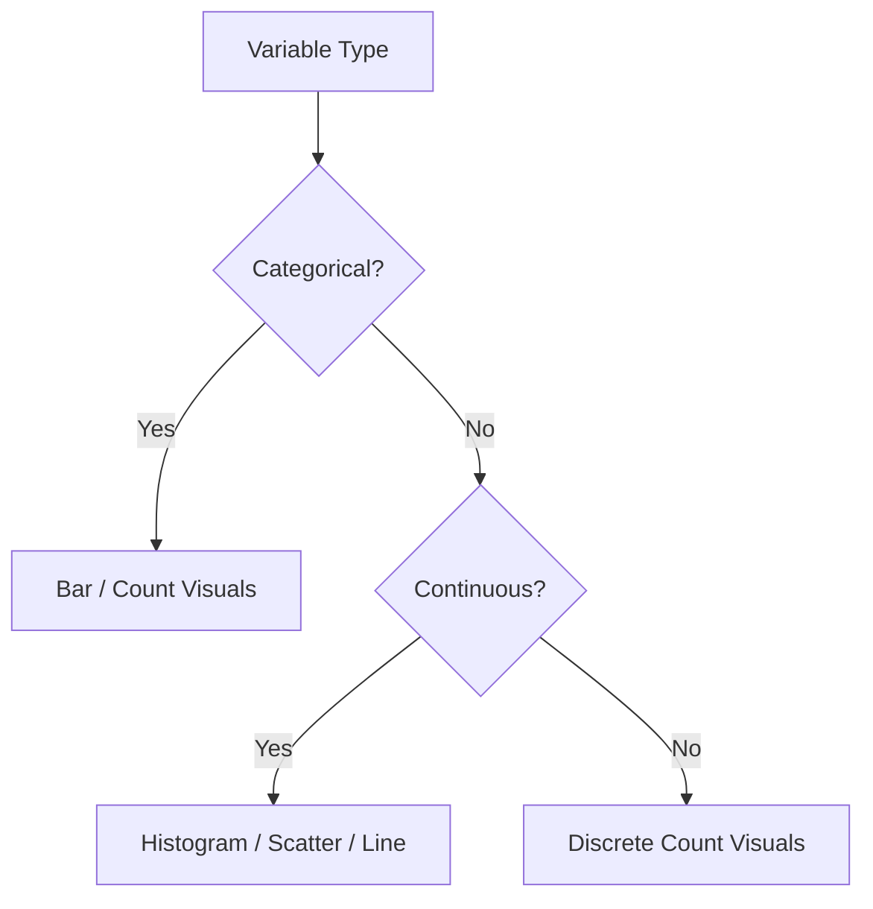

# 3. Univariate Analysis

# Understanding One Variable at a Time

Univariate analysis studies:

```text
a single variable independently
```

This is the foundation of:

- exploratory data analysis
    
- anomaly detection
    
- distribution understanding
    
- feature engineering
    
![[Univariate Analysis.png]]
# Univariate Workflow


# Why Univariate Analysis Matters

Before analyzing relationships:

you must understand the variable itself.

Questions include:

- Is the distribution skewed?
    
- Are there outliers?
    
- Are categories imbalanced?
    
- Is the variable noisy?
    
- Does it contain anomalies?
    

# Common Univariate Visualizations

|Visualization|Purpose|
|---|---|
|Bar Chart|Categorical frequencies|
|Histogram|Numerical distribution|
|Big Number|KPI emphasis|
|Pie/Donut|Composition|
|Box Plot|Spread and outliers|

# Bar Charts

# Best for Categorical Frequency

Example:

- shopping day preference
    
- visitor type distribution
    
- region analysis
    

# Why Bar Charts Work

Humans compare aligned lengths extremely accurately.

# Bar Chart Perception Pipeline


# Big Number Visuals

# KPI Emphasis

Big numbers isolate:

- revenue
    
- conversion rate
    
- churn
    
- customer count
    

# Why Big Numbers Work

They reduce cognitive complexity by emphasizing:

```text
single-metric salience
```

# Pie and Donut Charts

# Composition Visualization

Used for:

- percentage share
    
- category contribution
    
- composition analysis
    

# Important Limitation

Humans poorly estimate angles.

Therefore pie charts become weak when:

- many categories exist
    
- precise comparison is required
    

# Better Alternative

Often:

```text
sorted bar charts outperform pie charts
```
![[Univariate Distribution Analysis.png]]
# 4. Univariate Distribution Analysis

# Histograms

Histograms represent:

```text
frequency distribution
```

across numerical ranges.

# Why Histograms Matter

Distributions reveal:

- skewness
    
- concentration
    
- modality
    
- outliers
    
- tails
    

# Histogram Structure

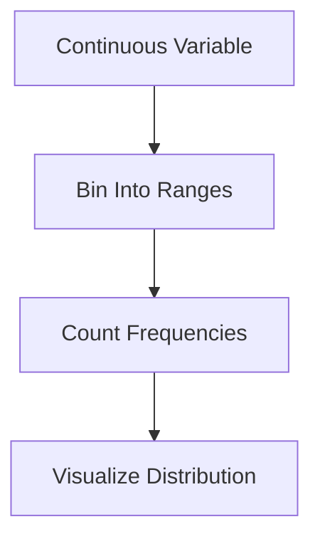

# Example: Bounce Rates

The lesson notes:

Most bounce rates cluster near:

```text
0.000 - 0.050
```

with some outliers.

This immediately reveals:

- concentration
    
- skewness
    
- anomalous sessions
    

# Business Insight

Visualization helps identify:

```text
where normal behavior ends and abnormal behavior begins
```

# Conversion Timing Insight

The lesson references Nielsen (2005):

Conversions often occur within:

```text
first 28 minutes
```

after initial click.

This is extremely important analytically because:

it suggests:

- user intent decays rapidly
    
- engagement windows matter
    
- marketing latency matters
    

# Histogram Interpretation Framework

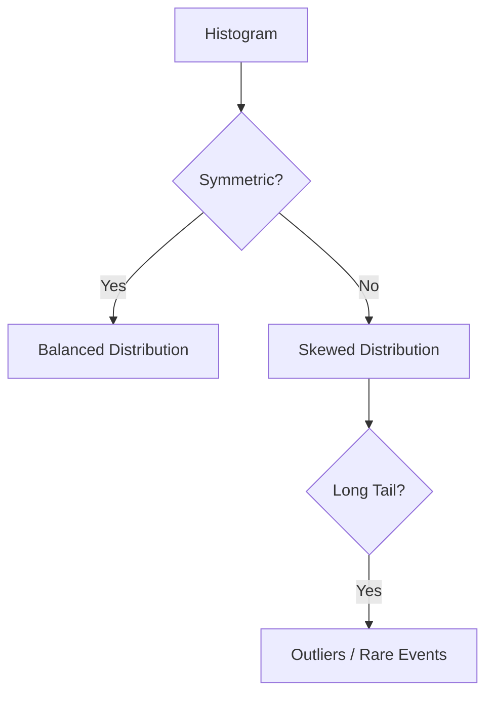

![[Box Plot Analysis.png]]
# 5. Box Plot Analysis

# Understanding Distribution Geometry

The box plot is one of the most information-dense visualizations.

It summarizes:

- median
    
- quartiles
    
- spread
    
- skewness
    
- outliers
    

simultaneously.

# Box Plot Components

|Component|Meaning|
|---|---|
|Median|Central tendency|
|IQR|Middle 50% spread|
|Whiskers|Typical range|
|Outliers|Extreme values|

# Box Plot Structure


# Interquartile Range (IQR)

Defined as:

IQR = Q_3 - Q_1

# Why IQR Matters

IQR measures:

```text
spread of the central 50% of data
```

This makes it resistant to outliers.

# Whiskers

Whiskers usually extend:

1.5 \times IQR

beyond quartiles.

Points outside become outliers.

# Why Box Plots Are Powerful

They simultaneously show:

- spread
    
- symmetry
    
- skewness
    
- anomalies
    

with minimal space.

# Distribution Shape Analysis

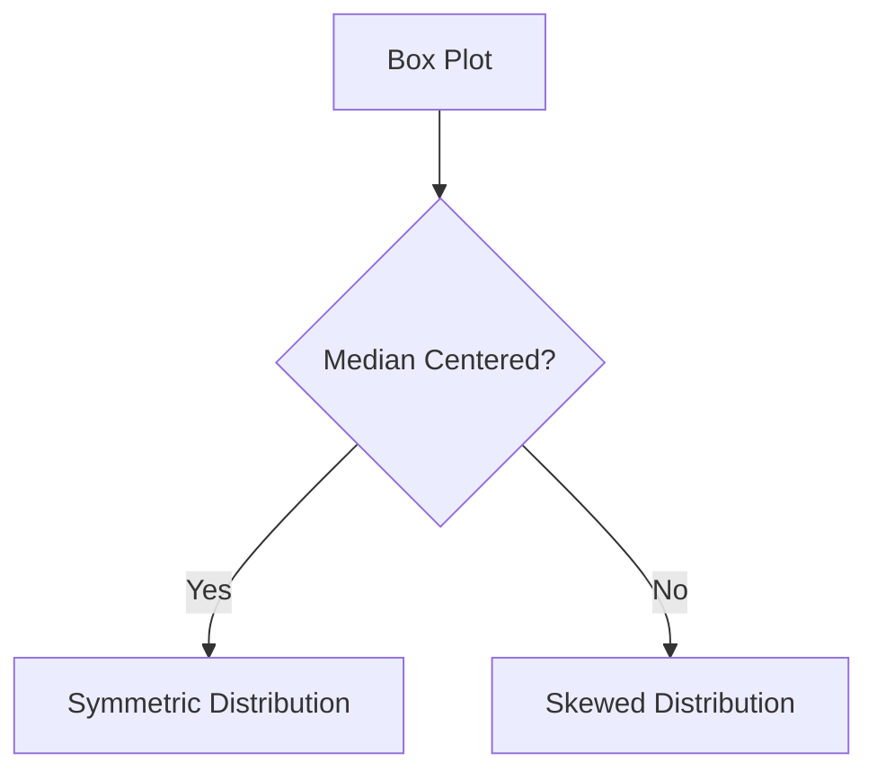

# Business Insight

The lesson mentions:

Lower bounce rates improve conversions.

Visualization enables detection of:

- behavioral quality
    
- user engagement patterns
    
- funnel efficiency
    

# 6. Multivariate Analysis

# Understanding Relationships Between Variables

Multivariate analysis examines:

```text
two or more variables simultaneously
```

This is where analytics becomes truly powerful.

# Multivariate Goals

|Goal|Visualization|
|---|---|
|Comparison|Stacked bars|
|Relationship|Scatter plots|
|Trend|Line charts|
|Correlation|Heat maps|

# Multivariate Analysis Framework

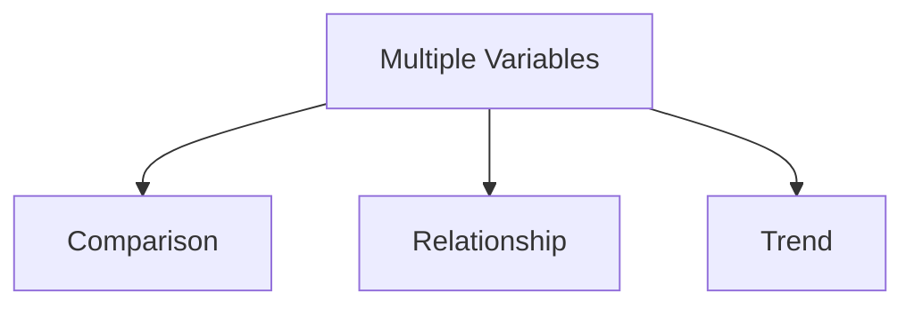

# Comparison Analysis

The lesson compares:

- weekday conversions
    
- weekend conversions
    

Example:

|Day Type|Conversion|
|---|---|
|Weekday|15%|
|Weekend|17%|

Visualization immediately exposes:

```text
behavioral differences across categories
```

# Important Business Insight

Customers visiting administration pages convert more.

This suggests:

- higher intent users
    
- deeper engagement
    
- stronger purchase readiness
    
![[Relationship Analysis.png]]
# 7. Relationship Analysis

# Scatter Plots

Scatter plots visualize relationships between variables.

# Example

- exit rate
    
- bounce rate
    
- page value
    

# Scatter Plot Strength

They reveal:

- clusters
    
- trends
    
- anomalies
    
- correlations
    

# Scatter Plot Pipeline

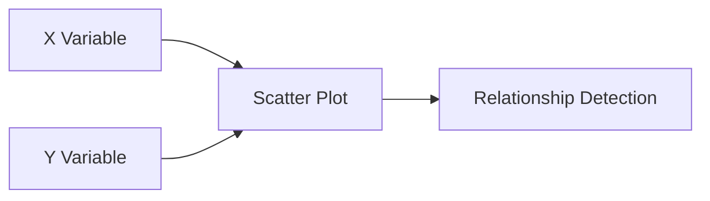

![[Correlation is not Causation.png]]
# Correlation vs Causation

# One of the Most Important Analytical Warnings

The lesson correctly warns:

```text
Correlation does not imply causation.
```

Two variables may correlate because of:

- hidden variables
    
- confounding effects
    
- selection bias
    
- temporal coincidence
    

# Causation Failure Model

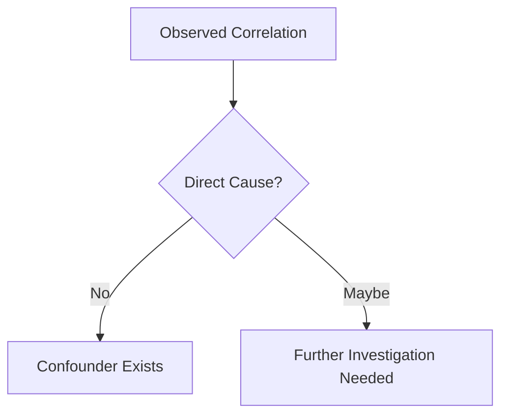

# Heat Maps

# Correlation Visualization

Heat maps compress many pairwise relationships.

Useful for:

- feature selection
    
- multicollinearity detection
    
- exploratory analysis
    
![[See Relationships at a Glance.png]]
# Heat Map Workflow

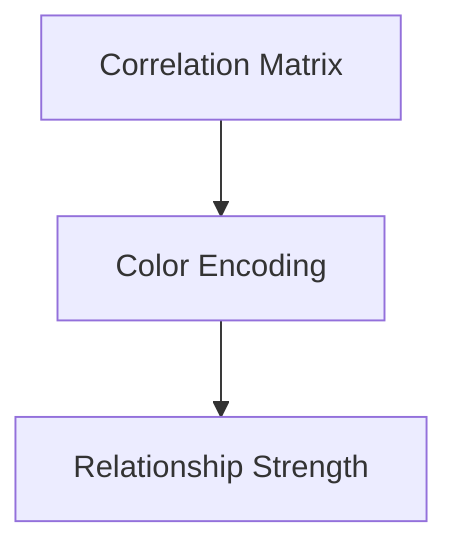

# Parallel Coordinates

# High-Dimensional Visualization

Parallel coordinates allow visualization of many variables simultaneously.

Each axis represents a variable.

# Why They Are Powerful

They reveal:

- clusters
    
- group separation
    
- multivariate structure
    

# Major Limitation

Scaling becomes critical.

Improper scaling creates misleading interpretations.

# Parallel Coordinates Pipeline

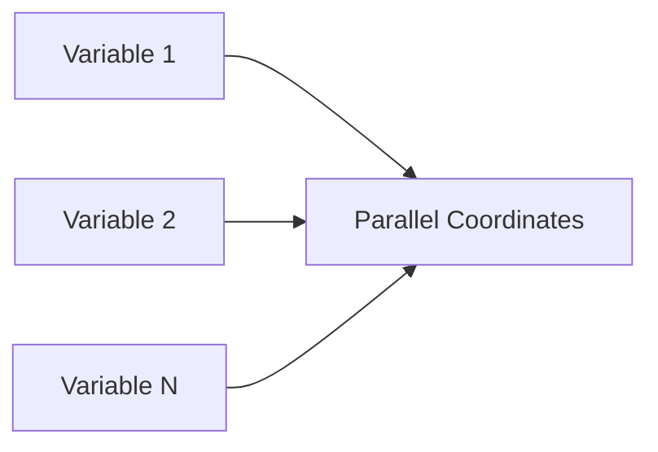

# 8. Trend Analysis

# Line Charts

Line charts dominate trend analysis because humans perceive continuity naturally.

Best for:

- time series
    
- sequential movement
    
- growth patterns
    

# Trend Detection Model


# Dual-Axis Charts

# Powerful but Dangerous

The lesson references dual-axis charts.

These can show relationships like:

- visitors vs sales
    

But dual axes can also distort perception.

# Major Risk

Different scales may imply false relationships.

# Dual Axis Warning

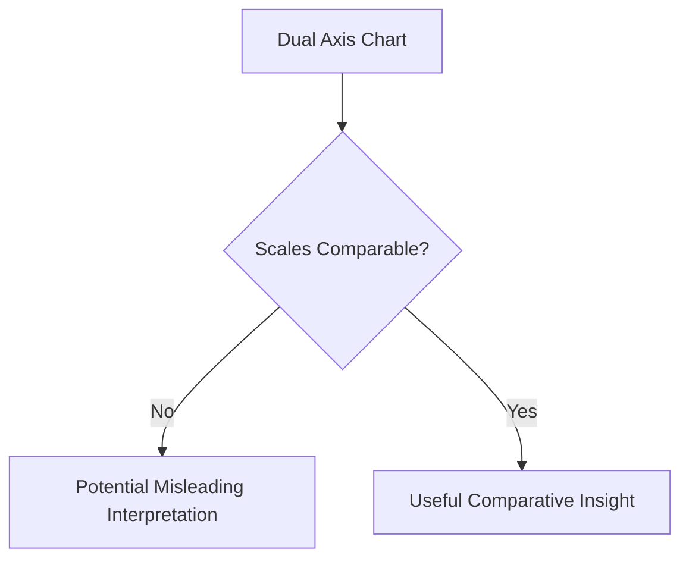

# Final Visualization Philosophy

Lesson 12 fundamentally teaches:

```text
Visualization design is analytical reasoning translated into perceptual form.
```

# Final Mental Model

Think of chart selection as:

```text
matching human perceptual strengths to analytical objectives
```

rather than choosing visually attractive graphics.