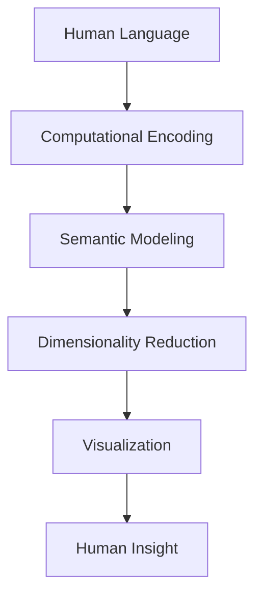

# End-to-End NLP Visualization Pipeline

```mermaid
flowchart TD
    A[Human Language]
    
    A --> B[Computational Encoding]
    --> C[Semantic Modeling]
    --> D[Dimensionality Reduction]
    --> E[Visualization]
    --> F[Human Insight]
```
