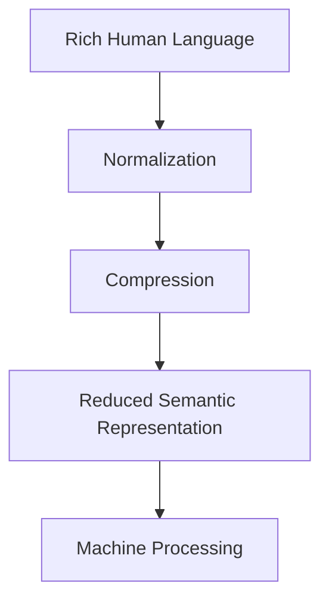

# NLP Compression Pipeline

```mermaid
flowchart TD
    A[Rich Human Language]
    
    A --> B[Normalization]
    --> C[Compression]
    --> D[Reduced Semantic Representation]
    --> E[Machine Processing]
```
