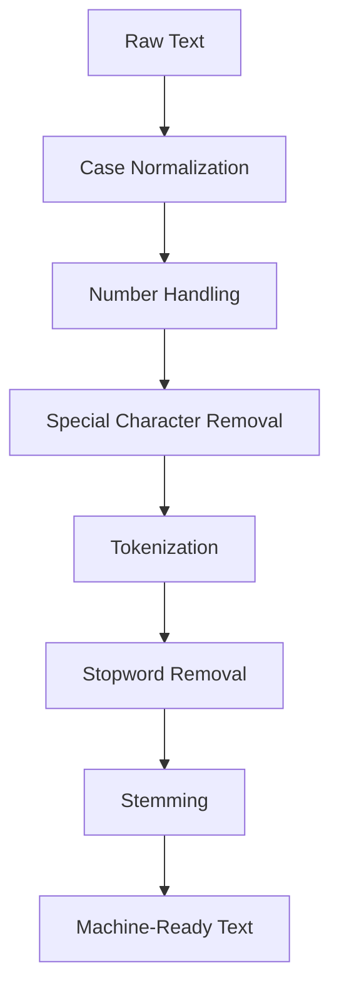

# NLP Preprocessing Pipeline

```mermaid
flowchart TD
    A[Raw Text]
    
    A --> B[Case Normalization]
    --> C[Number Handling]
    --> D[Special Character Removal]
    --> E[Tokenization]
    --> F[Stopword Removal]
    --> G[Stemming]
    --> H[Machine-Ready Text]
```

This pipeline dramatically improves:

- computational efficiency
    
- semantic consistency
    
- visualization quality
    
- model performance
