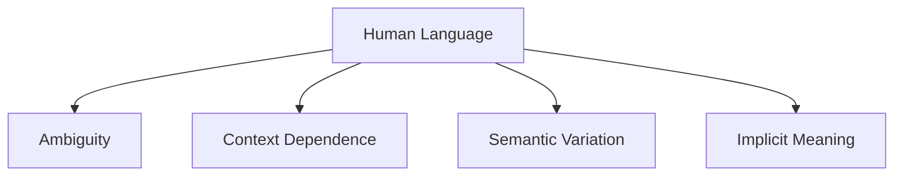

# Textual Complexity Model

```mermaid
flowchart TD
    A[Human Language]
    
    A --> B[Ambiguity]
    A --> C[Context Dependence]
    A --> D[Semantic Variation]
    A --> E[Implicit Meaning]
```

This creates enormous computational challenges.
