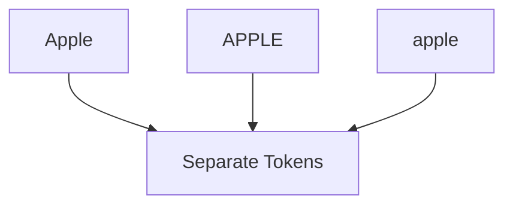

# Vocabulary Explosion Problem

```mermaid
flowchart TD
    A[Apple]
    --> B[Separate Tokens]
    
    C[APPLE]
    --> B
    
    D[apple]
    --> B
```

This unnecessarily increases:

- dimensionality
    
- memory usage
    
- computational cost
