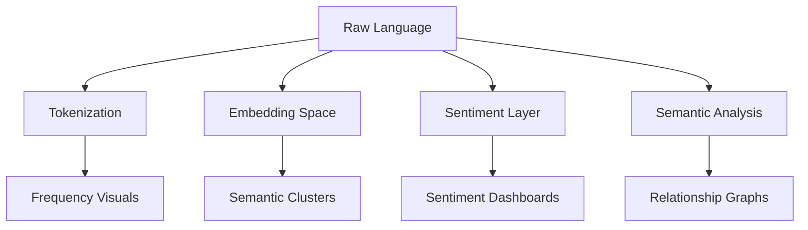

# Advanced NLP Architecture

```mermaid
flowchart TD
    A[Raw Language]
    
    A --> B[Tokenization]
    A --> C[Embedding Space]
    A --> D[Sentiment Layer]
    A --> E[Semantic Analysis]
    
    B --> F[Frequency Visuals]
    C --> G[Semantic Clusters]
    D --> H[Sentiment Dashboards]
    E --> I[Relationship Graphs]
```
