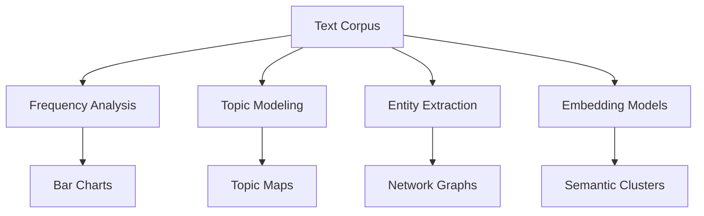

# Advanced NLP Visualization Pipeline

```mermaid
flowchart TD
    A[Text Corpus]
    
    A --> B[Frequency Analysis]
    A --> C[Topic Modeling]
    A --> D[Entity Extraction]
    A --> E[Embedding Models]
    
    B --> F[Bar Charts]
    C --> G[Topic Maps]
    D --> H[Network Graphs]
    E --> I[Semantic Clusters]
```
