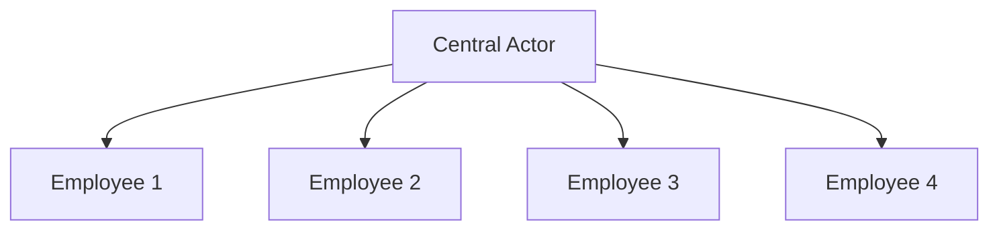

# Centrality Concept

```mermaid
flowchart TD
    A[Central Actor]
    
    A --> B[Employee 1]
    A --> C[Employee 2]
    A --> D[Employee 3]
    A --> E[Employee 4]
```

Highly connected nodes often represent:

- executives
    
- coordinators
    
- influencers
    
- information hubs
