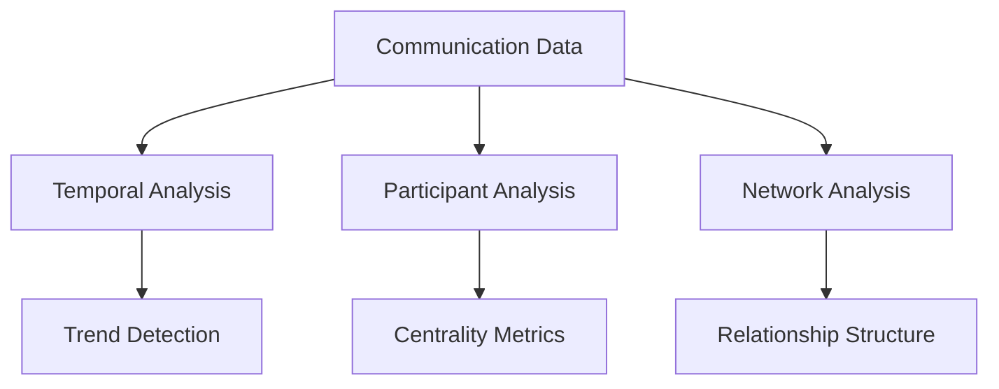

# Communication Analytics Architecture

```mermaid
flowchart TD
    A[Communication Data]
    
    A --> B[Temporal Analysis]
    A --> C[Participant Analysis]
    A --> D[Network Analysis]
    
    B --> E[Trend Detection]
    C --> F[Centrality Metrics]
    D --> G[Relationship Structure]
```
